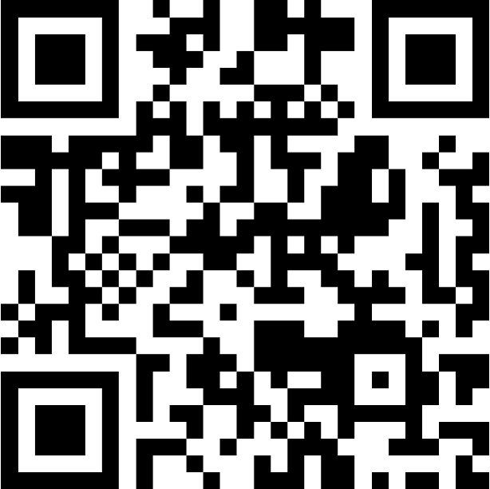

# Conclusion

Thank you for participating in this lab! We hope you have enjoyed the experience and gained valuable insights into the Webex Developer Ecosystem — from APIs and OAuth integrations to bots, service apps, and Webex MCP servers.

## Share your experience!

Scan the QR code for the post-session survey:

{ width="150" style="display: block; margin: 0 auto; border: 1px solid lightgray; border-radius: 8px;"}

## Sandbox

To continue experimenting after the event, create your own developer sandbox:

- [Sandbox Guide](https://developer.webex.com/create/docs/developer-sandbox-guide/){:target="_blank"}
