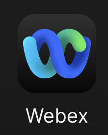
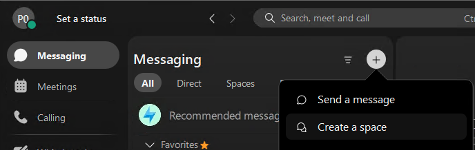
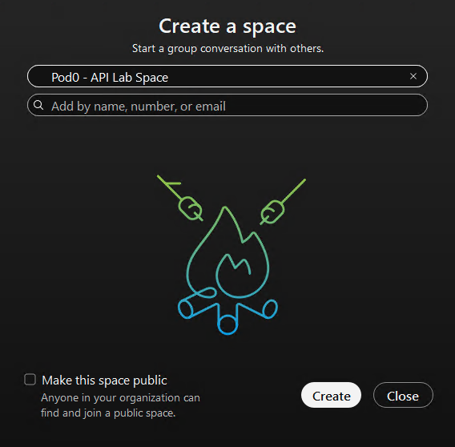
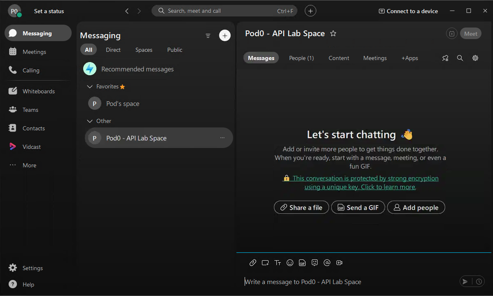
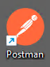
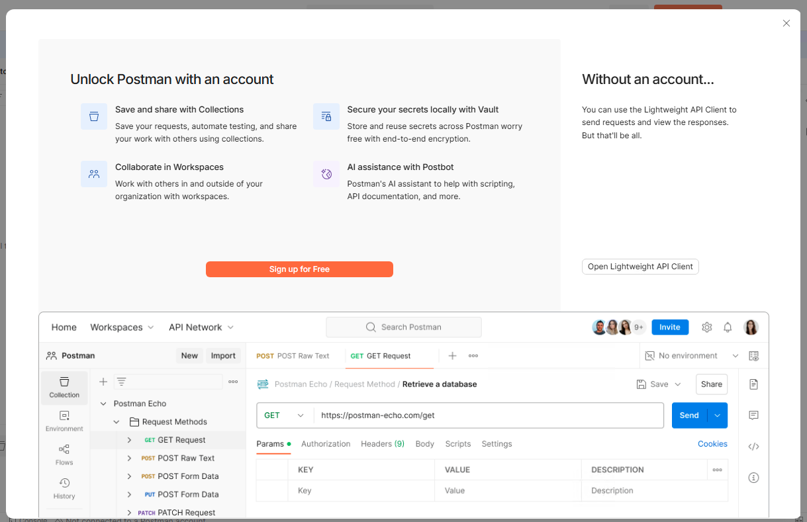
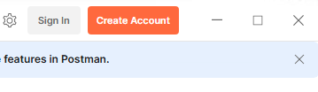
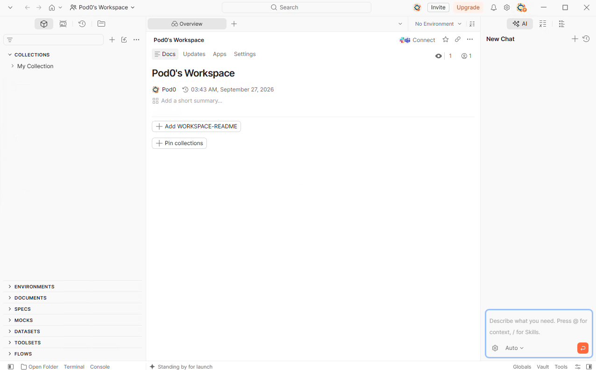
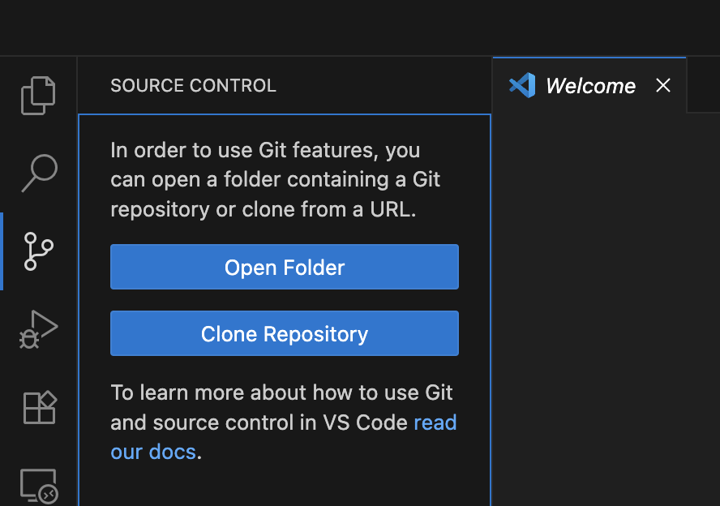
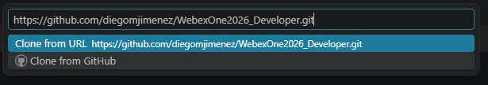

# Getting Started

Welcome to the **Exploring the Webex Developer Ecosystem** lab! In this session, you will explore how Webex APIs, integrations, bots, service apps, agentic apps, and MCP servers can be used to automate workflows and build real-world solutions.

This section will guide you through setting up your environment and logging into the tools you will use throughout the lab.

## Join the conversation!

Scan the QR code to be added to the Webex space for Q&A and more.

{ width="300" style="display: block; margin: 0 auto; border: 1px solid lightgray; border-radius: 8px;"}

## Tools used in this lab

- **Webex Client** — Interact with your bot and verify API responses.
- **Visual Studio Code** — Review, edit and run code.
- **Webex for Developers** — Create bots, Webex MCP tokens, service apps, and review API documentation.
- **Postman** — Call Webex REST APIs.

## Webex lab credentials

These are your Webex credentials for this lab:

| Item | Value |
| --- | --- |
| Username | `podX@webexone-developer.wbx.ai` (replace X with your pod number) |
| Password | `WebexOne2026!` |

## Log into the Webex Client

To begin, you'll log into your dedicated Webex lab account. This will allow you to see the results of your API calls in real-time and interact with your Webex environment.

1. **Open the Webex Client:** Launch the Webex Desktop App on your lab workstation:

    { width="150" style="display: block; margin: 0 auto; border: 1px solid lightgray; border-radius: 8px;"}
    
2. **Enter Lab Credentials:** When prompted, enter the **Webex email address and password** provided to you.

### Create Your Personal Webex Space

We'll create a dedicated Webex space (known as a "room" in the API world) that you can use for testing your API requests, bots, and integrations.

1. **Start a New Space:** In the Webex client, click the **"+"** icon (or "Create a space" button) to start a new space:

    { width="650" style="display: block; margin: 0 auto; border: 1px solid lightgray; border-radius: 8px;"}
    
2. **Name Your Space:** Give your space a clear, unique name, such as `[Your Name/ID] - API Lab Space` (e.g., `Pod0 - API Lab Space`).
3. **Create Space:** Click "Create" or "Done" to finalize the space creation.

    { width="500" style="display: block; margin: 0 auto; border: 1px solid lightgray; border-radius: 8px;"}
    
4. **Confirm:** You should now see your newly created space in your Webex client's space list:

    { width="900" style="display: block; margin: 0 auto; border: 1px solid lightgray; border-radius: 8px;"}

## Log into Webex for Developers

Use the same lab credentials you just used for the Webex Client.

1. Open [Webex for Developers](https://developer.webex.com/){:target="_blank"} in a browser.
2. Sign in with the **Webex email address and password** provided to you.

## Log into Postman

Postman will be our primary tool for making API requests and working with OAuth 2.0 integrations. You'll log into a Postman account that has access to the Webex Public Workspace.

1. **Open Postman:** Launch the Postman Desktop App on your lab workstation:

    { width="100" style="display: block; margin: 0 auto; border: 1px solid lightgray; border-radius: 8px;"}

2. Close the first window if it appears, and then click on **Sign in**:

    { width="750" style="display: block; margin: 0 auto; border: 1px solid lightgray; border-radius: 8px;"}
    
    { width="350" style="display: block; margin: 0 auto; border: 1px solid lightgray; border-radius: 8px;"}

3. You will get re-directed to a website, enter the **Postman email address and password**. Your account will be linked to your Pod number:

    | Username | Email | Password |
    | --- | --- | --- |
    | PodX-Developer | `podX@webexone-developer.wbx.ai` | `WebexOne2026!` |

4. Once logged in, it will open the Postman application again, and you should see your Postman workspace.

    { width="950" style="display: block; margin: 0 auto; border: 1px solid lightgray; border-radius: 8px;"}

## Visual Studio Code

Visual Studio Code will be used for Python-based bot development, service app configuration, and use cases exercises.

1. Open Visual Studio Code from the desktop:

    { width="150" style="display: block; margin: 0 auto; border: 1px solid lightgray; border-radius: 8px;"}

### Clone the lab repository

1. Go to the **Source Control** tab and click **Clone Repository**:

    { width="500" style="display: block; margin: 0 auto; border: 1px solid lightgray; border-radius: 8px;"}

2. Enter the following URL:

    `https://github.com/diegomjimenez/WebexOne2026_Developer.git`

    { width="700" style="display: block; margin: 0 auto; border: 1px solid lightgray; border-radius: 8px;"}

3. Select a directory to save the project.
4. Click **Yes, I trust the authors** if a pop-up appears.

### Virtual Environment

1. Click **Terminal > New Terminal** from the top menu bar.
2. Create a virtual environment and install dependencies:

    ```bash
    python -m venv webexone
    .\webexone\Scripts\Activate.ps1
    pip install -r requirements.txt
    ```

3. Copy the environment template and fill in your values:

    ```bash
    cp .env.example .env
    ```
