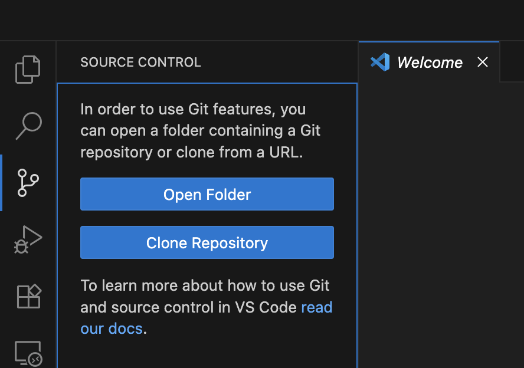
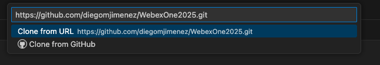

# Getting Started

Welcome to the **Exploring the Webex Developer Ecosystem** lab! In this session, you will explore how Webex APIs, integrations, bots, service apps, agentic apps, and MCP servers can be used to automate workflows and build real-world solutions.

This section will guide you through setting up your environment and logging into the tools you will use throughout the lab.

Please use the specific lab credentials provided to you for all logins. To successfully complete this lab, you will be working with:

- Webex Client
- Postman
- Webex for Developers
- Visual Studio Code

## Webex Credentials

Password will be the same for all users:

- dCloud2856!

Your username will be formatted based on your Pod number:

| User | Username |
| --- | --- |
| Pod X | podx@cb127.dc-02.com |

## Postman Credentials

| Username | Email | Password |
| --- | --- | --- |
| PodX | podX@webexone26devs.wbx.ai | WebexOne2026! |

Once you have identified your credentials you can continue.

## Log into the Webex Client

To begin, you'll log into your dedicated Webex lab account. This will allow you to see the results of your API calls in real-time and interact with your Webex environment.

1. **Open the Webex Client:** Launch the Webex Desktop App on your lab workstation, or navigate to [web.webex.com](https://web.webex.com){:target="_blank"} in your browser.
2. **Enter Lab Credentials:** When prompted, enter the **Webex email address and password** provided to you by the lab instructors.
3. **Verify Login:** Once logged in, you should see your Webex home screen. Take a moment to familiarize yourself with the interface.

### Create Your Personal Webex Space

We'll create a dedicated Webex space (known as a "room" in the API world) that you can use for testing your API requests, bots, and integrations.

1. **Start a New Space:** In the Webex client, click the **"+"** icon (or "Create a space" button) to start a new space.
2. **Name Your Space:** Give your space a clear, unique name, such as **[Your Name/ID] - API Lab Space** (e.g., JaneDoe-API Lab Space).
3. **Create Space:** Click "Create" or "Done" to finalize the space creation.
4. **Confirm:** You should now see your newly created space in your Webex client's space list.

## Log into Postman

Postman will be our primary tool for making API requests and working with OAuth 2.0 integrations. You'll log into a Postman account that has access to the Webex Public Workspace.

1. **Open Postman:** Launch the Postman Desktop App on your lab workstation.
2. **Enter Lab Credentials:** When prompted, enter the **Postman email address and password** provided to you by the lab instructors.
3. **Verify Login:** Once logged in, you should see your Postman workspace. If you see a prompt to join a team, follow the lab instructor's guidance.

## Log into Webex for Developers

Navigate to: 

- [Webex for Developers](https://developer.webex.com/){:target="_blank"}

Use the same Webex credentials provided for the lab. You will use the Developer Portal to create integrations, bots, and service apps in later sections.

## Visual Studio Code

Visual Studio Code will be used for Python-based bot development, service app configuration, and the agentic app and MCP server exercises.

Open Visual Studio Code from the desktop:

{ width="150" style="display: block; margin: 0 auto; border: 1px solid lightgray; border-radius: 8px;"}

1. Go to the **Source Control** tab and click **Clone Repository**:

    { width="500" style="display: block; margin: 0 auto; border: 1px solid lightgray; border-radius: 8px;"}

2. Type the following:

    - https://github.com/diegomjimenez/WebexOne2026.git

    { width="700" style="display: block; margin: 0 auto; border: 1px solid lightgray; border-radius: 8px;"}

3. Select a directory to save the project.
4. Click on **Yes, I trust the authors** if a pop-up appears.
5. From the top bar, click on **Terminal** > **New terminal**.
6. Create a virtual environment:

    - python -m venv webexone2026
    - .\webexone2026\Scripts\activate.ps1

7. Install the requirements:

    - pip install -r requirements.txt

## Lab flow

| Section | Focus |
| --- | --- |
| Lab 1 | Webex API concepts and your first API requests |
| Lab 2 | Secure integrations with OAuth 2.0 |
| Lab 3 | Interactive bots with Python and Adaptive Cards |
| Lab 4 | Service apps for administrative automation |
| Lab 5 | Real-world use cases |
| Lab 6 | Agentic Apps |
| Lab 7 | Webex MCP Servers |
