# Lab 2 – Creating an Integration

In Lab 1, you used a temporary developer token for quick API tests. While convenient, this isn't how real-world applications securely access user data. This lab introduces **Webex Integrations** and the **OAuth 2.0 Authorization Code Flow**, the standard for third-party applications to get secure, user-consented access to Webex APIs. You'll create your own integration, perform a manual OAuth flow, and then configure Postman to handle it seamlessly.

Upon completion of this lab, you will be able to:

1. Create a Webex Integration.
2. Perform a manual OAuth 2.0 authorization flow.
3. Configure OAuth 2.0 authentication in Postman.
4. Make API requests with the obtained token in Postman.
5. Use your integration from a simple web app.

## Step 2.1: Create Your Webex Integration on the Developer Portal

First, you need to register your "application" (in this case, our Postman setup) with Webex. This process gives you a Client ID and Client Secret, which are essential for the OAuth flow.

1. **Navigate to "My Apps" on the Developer Portal:**
    * Open your browser and go to [My Apps](https://developer.webex.com/my-apps){:target="_blank"}.

        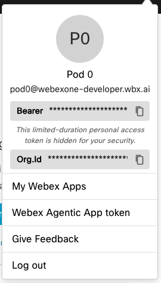{ width="350" style="display: block; margin: 0 auto; border: 1px solid lightgray; border-radius: 8px;"}
    
2. **Create a New Integration:**
    * Click the **"Create an Integration"** button.

        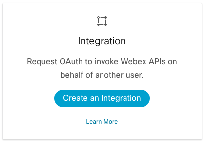{ width="350" style="display: block; margin: 0 auto; border: 1px solid lightgray; border-radius: 8px;"}
    
3. **Fill in Integration Details:**
    * **Integration Name:** `[Your Name/ID] - Lab Integration` (e.g., JaneDoe - Lab Integration)
    * **Icon:** Pick your favorite color icon.
    * **App Hub Description:** “Postman Integration for the Webex One 2026 Lab”
    * **Redirect URI(s):** This is critical! For Postman's built-in OAuth helper, we'll use a specific callback URL. Enter: `https://oauth.pstmn.io/v1/callback`
    * **Scopes:** These define what permissions your integration will request from the user. Check the following boxes:
        * `spark:messages_write`
        * `spark:messages_read`
        * `spark:people_read`
        * `spark:rooms_read`
    * Click **"Add Integration"**:

        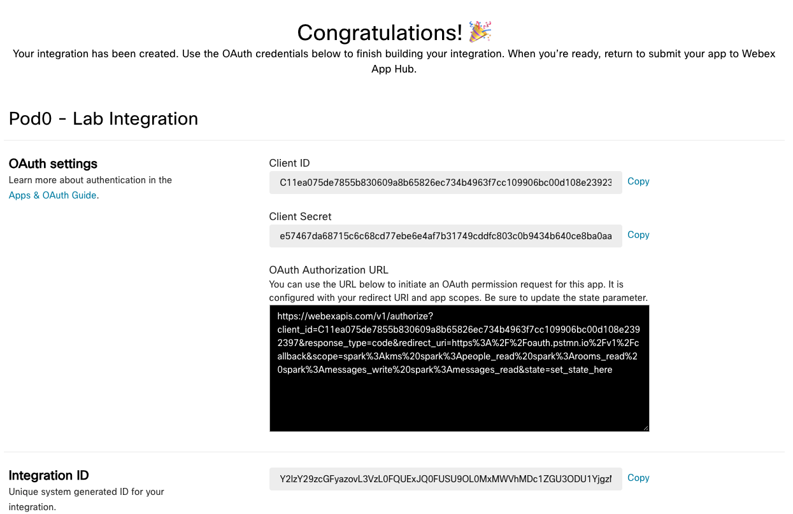{ width="850" style="display: block; margin: 0 auto; border: 1px solid lightgray; border-radius: 8px;"}
    
4. **Record Your Client ID and Client Secret:**
    * After creation, you'll see your integration's details. 
    
        !!! Warning "Important"
            Copy and save your Client ID, Client Secret, and OAuth Authorization URL to a temporary text file or notepad. 
            
            These are sensitive credentials and will be needed shortly.
            
            For best results, leave this page open for the rest of the lab.
    
        !!! Note
            The Client Secret is only shown once. If you lose it, you'll have to regenerate it.

## Step 2.2: Manual OAuth 2.0 Authorization Code Flow (Browser + API Call)

Now, let's manually walk through the steps a user and an application would take to get an access token using the Authorization Code flow. This will help you understand the underlying mechanics.

1. **Use the Authorization URL:**
    * Copy the **“OAuth Authorization URL”** from the Integration Details page:
   
        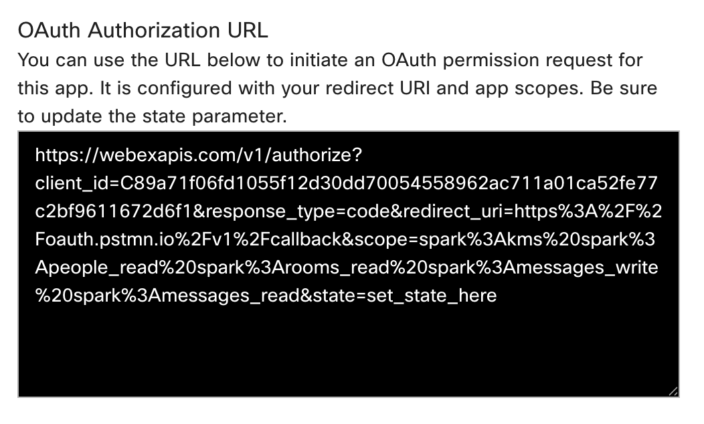{ width="750" style="display: block; margin: 0 auto; border: 1px solid lightgray; border-radius: 8px;" }
   
    !!! Tip "Query Params Explanation"
        These are the parameters in the URL:
        
        * `response_type=code`: We want an authorization code.
        * `client_id`: Your integration's unique ID.
        * `redirect_uri`: Where Webex sends the user back after authorization. Must match what you registered.
        * `scope`: The permissions we're requesting.
        * `state`: An optional parameter for security, usually a random string.
    
2. **Authorize the Integration (User Consent):**
    * Paste this URL into your browser's address bar and press **Enter** to navigate to the constructed URL:

        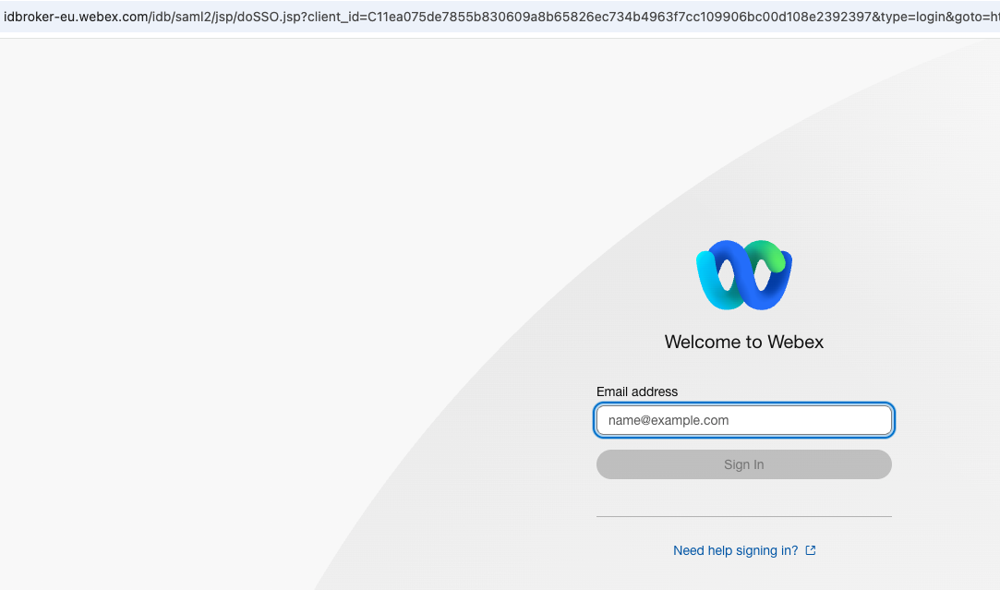{ width="850" style="display: block; margin: 0 auto; border: 1px solid lightgray; border-radius: 8px;"}
        
    * You'll be prompted to log in to Webex (if not already) and then asked to grant permission to your `[Your Name/ID] - Lab Integration` for the requested scopes:
   
        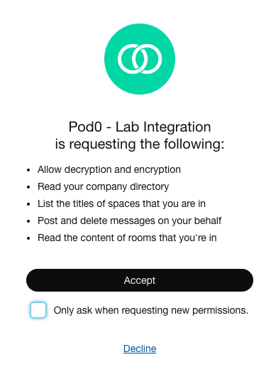{ width="450" style="display: block; margin: 0 auto; border: 1px solid lightgray; border-radius: 8px;" }
   
    * Uncheck the **“Only ask when requesting new permissions”** checkbox. This way, when we authorize again later, we will see the same dialog.
    * Click **"Accept"**.
    
3. **Capture the Authorization Code:**
    * Webex will redirect your browser to `https://oauth.pstmn.io/v1/callback?code=YOUR_AUTHORIZATION_CODE&state=set_by_app`.
    * **Copy the authorization code value** from the URL in your browser's address bar. This is your temporary authorization code:

        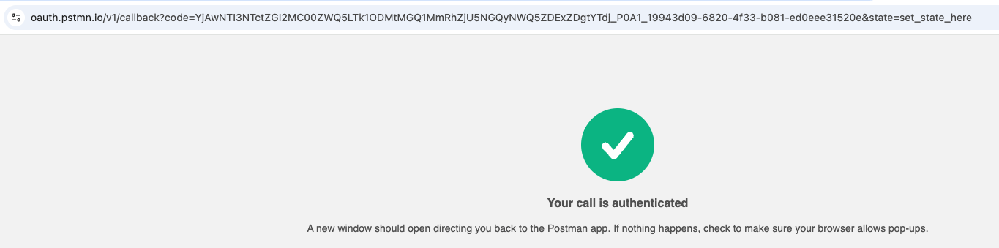{ width="850" style="display: block; margin: 0 auto; border: 1px solid lightgray; border-radius: 8px;"}
    
4. **Exchange the Code for an Access Token (Postman API Call):**
    * Open Postman.
    * Create a new HTTP Request (click the `+` tab).
    * If it doesn’t say “HTTP”, you will need to change the type.
   
        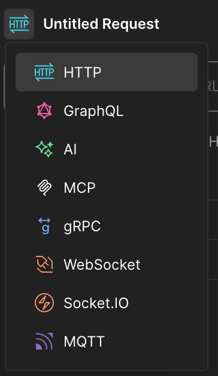{ width="250" style="display: block; margin: 0 auto; border: 1px solid lightgray; border-radius: 8px;" }
   
    * Set the request method type to **POST**.
   
        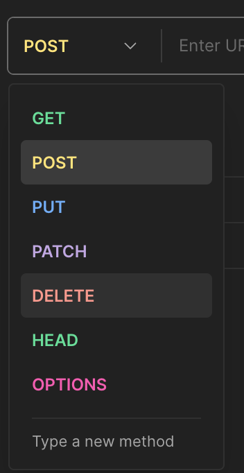{ width="250" style="display: block; margin: 0 auto; border: 1px solid lightgray; border-radius: 8px;" }
   
    * Set the URL to: `https://webexapis.com/v1/access_token`
    * Go to the **"Body"** tab, select **x-www-form-urlencoded**.
    * Add the following key-value pairs:
        * **Grant Type**
            * **KEY:** `grant_type`
            * **VALUE:** `authorization_code`
        * **Client ID**
            * **KEY:** `client_id`
            * **VALUE:** `YOUR_CLIENT_ID` (Paste your Client ID)
        * **Client Secret**
            * **KEY:** `client_secret`
            * **VALUE:** `YOUR_CLIENT_SECRET` (Paste your Client Secret)
        * **Auth Code**
            * **KEY:** `code`
            * **VALUE:** `YOUR_AUTHORIZATION_CODE` (Paste the code you captured in step 3)
        * **Redirect**
            * **KEY:** `redirect_uri`
            * **VALUE:** `https://oauth.pstmn.io/v1/callback`

        !!! Warning
            Be careful with extra spaces, as the call will fail.
            
    * Click **"Send"**:

        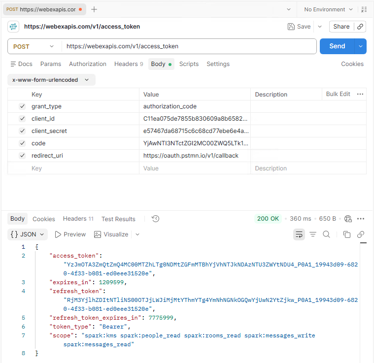{ width="850" style="display: block; margin: 0 auto; border: 1px solid lightgray; border-radius: 8px;"}
    
5. **Observe the Token Response:**
    * You should receive a `200 OK` response containing your `access_token`, `refresh_token`, `expires_in` (how long the access token is valid), and `scope`.
    * **Copy your new `access_token`**. This token was generated via your integration and user consent, making it a more secure way to access Webex APIs on behalf of a user.

6. **Update Postman Collection with New Token:**
    * In your personal Postman workspace, navigate to your forked **"Webex Messaging"** collection.
    * Click on the collection name in the left sidebar, then select the **"Variables"** tab in the main window.
    * Find the `webex_token` variable you created in Lab 1.
    * Paste the `access_token` you just copied from step 5 into the **"Current Value"** column for `webex_token`:

        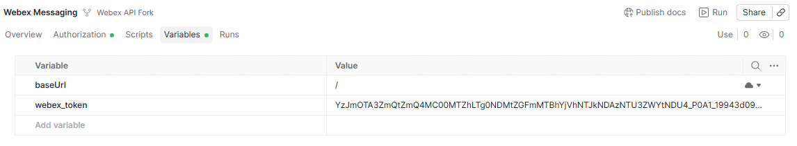{ width="750" style="display: block; margin: 0 auto; border: 1px solid lightgray; border-radius: 8px;"}
    
7. **Make an API Call with the Integration Token (List Rooms):**
    * In your forked "Webex Messaging" collection, expand the **"Rooms"** folder.
    * Click on the **GET List Rooms** request (which corresponds to `GET /v1/rooms`).
    * Uncheck all **Query Params**.
    * Click the blue **"Send"** button:

        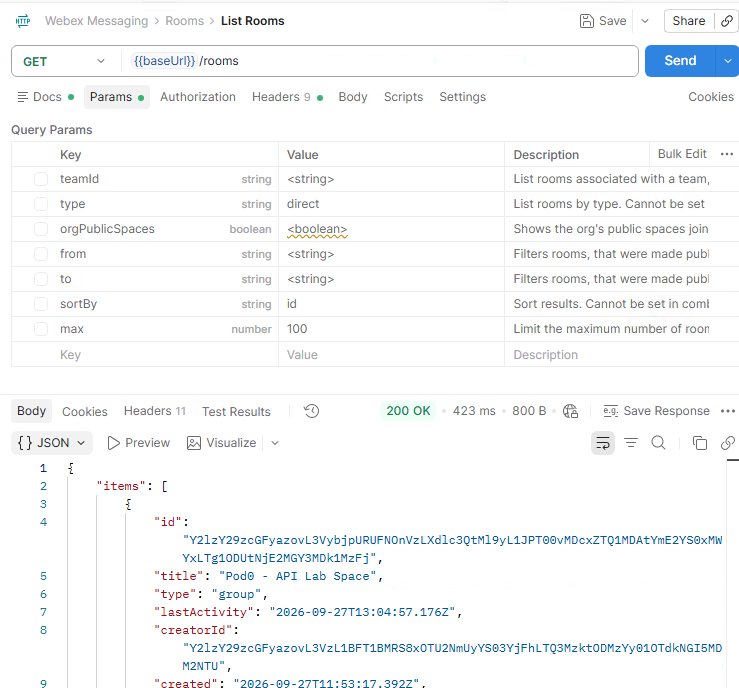{ width="750" style="display: block; margin: 0 auto; border: 1px solid lightgray; border-radius: 8px;"}
    
    You should receive a `200 OK` response. Verify that the rooms listed are correct for your lab account. This call was made using the `access_token` obtained through your integration!

## Step 2.3: Configure OAuth 2.0 in Postman for Your Integration

Manually performing the OAuth flow is cumbersome. Postman has built-in support to automate much of this. Let's configure your forked "Webex Messaging" collection to use your new integration.

1. **Open Your Forked "Webex Messaging" Collection:**
    * In your personal Postman workspace, navigate to your forked "Webex Messaging" collection.
2. **Access Collection Authorization Settings:**
    * Click on your forked **"Webex Messaging"** collection in the left sidebar.
    * In the main Postman window, click the **"Authorization"** tab.
3. **Configure OAuth 2.0:**
    * For the **TYPE**, select **"OAuth 2.0"**:
    
        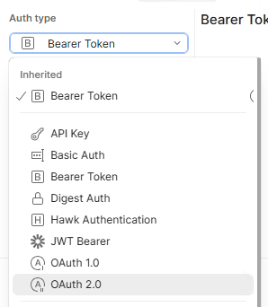{ width="350" style="display: block; margin: 0 auto; border: 1px solid lightgray; border-radius: 8px;"}
        
    * Scroll down a bit and fill in the following details in the **Configure New Token** window:
        * **Token Name:** Webex Lab Integration Token
        * **Grant Type:** Authorization Code
        * **Callback URL:** `https://oauth.pstmn.io/v1/callback` (This must match your registered Redirect URI)
        * **Auth URL:** `https://webexapis.com/v1/authorize`
        * **Access Token URL:** `https://webexapis.com/v1/access_token`
        * **Client ID:** `YOUR_CLIENT_ID` (Paste your Client ID from 2.1.4)
        * **Client Secret:** `YOUR_CLIENT_SECRET` (Paste your Client Secret from 2.1.4)
        * **Scope:** `spark:people_read spark:rooms_read spark:messages_write spark:messages_read` (Ensure these match what you registered, separated by spaces)
        * **Client Authentication:** Send client credentials in body

        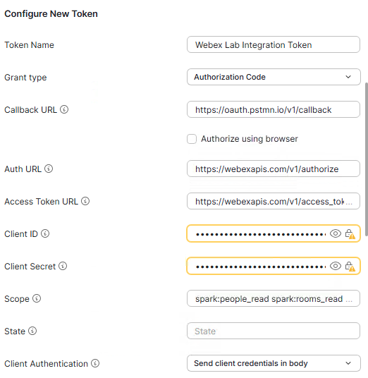{ width="550" style="display: block; margin: 0 auto; border: 1px solid lightgray; border-radius: 8px;"}

        !!! Warning
            Be careful with extra spaces when copy and pasting.
            
    * Scroll down and click **"Get New Access Token"**.

4. **Authorize in Browser:**
    * Postman will open a browser window. You'll be prompted to log in to Webex (if necessary) and grant permission to your `[Your Name/ID] - Lab Integration`:

        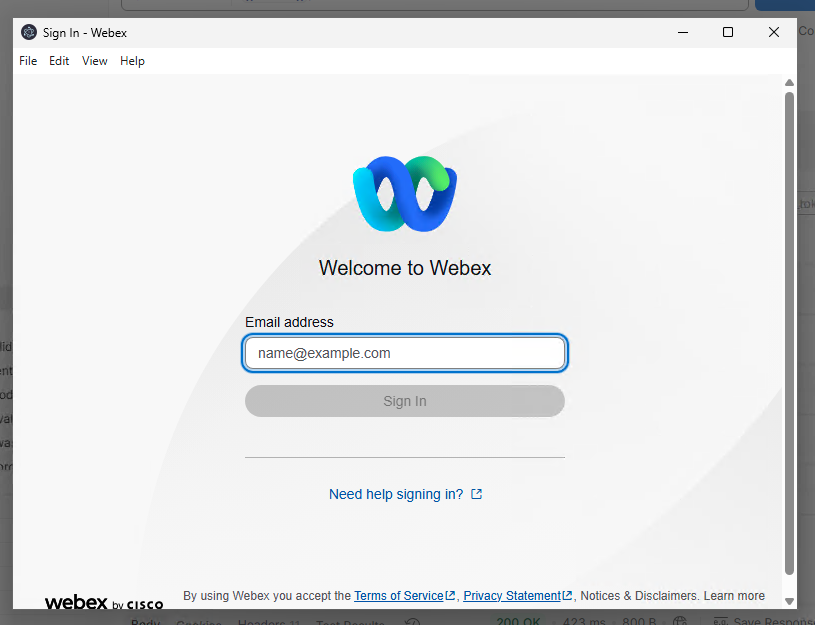{ width="550" style="display: block; margin: 0 auto; border: 1px solid lightgray; border-radius: 8px;"}
    
    * Log in, and click **"Accept"** or **"Authorize"** if prompted.
    
5. **Postman Retrieves Token:**
    * The browser will redirect, and Postman will automatically capture the authorization code and exchange it for an access token.
    * In the "MANAGE ACCESS TOKENS" window, you should see your `Webex Lab Integration Token` listed:

        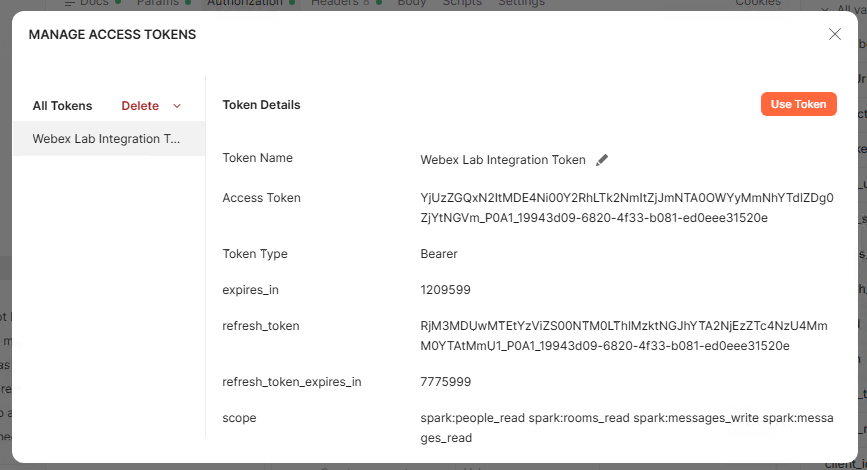{ width="650" style="display: block; margin: 0 auto; border: 1px solid lightgray; border-radius: 8px;"}
    
    * Click **"Use Token"**.
6. **Verify Collection Authorization:**
    * Back in the collection's "Authorization" tab, the "Token" field should now show your `Webex Lab Integration Token` selected.
    * Click **"Save"** for the collection.

        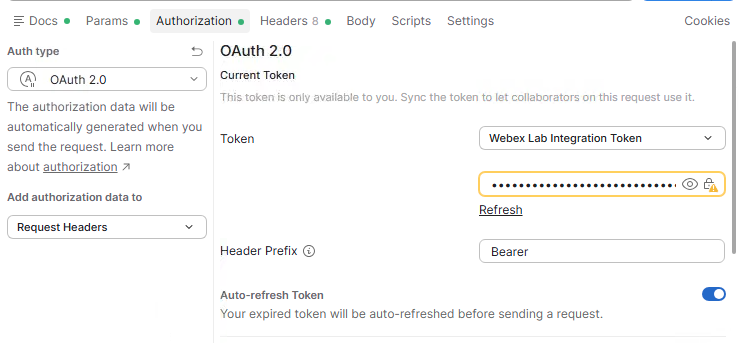{ width="650" style="display: block; margin: 0 auto; border: 1px solid lightgray; border-radius: 8px;"}

## Step 2.4: Make API Requests with Your Integration Token

Now that your Postman collection is configured to use the OAuth 2.0 flow, all requests within it will automatically use the access token obtained through your integration.

1. **Retrieve Your Own User Details (GET /v1/people/me):**
    * In your forked “Webex Messaging” collection, expand the **“People API”** folder.
    * Click on the **GET Get My Own Details** request.
    * In the main request window, ensure the “Authorization” tab shows “Inherit auth from parent” or “Bearer Token” with the `Webex Lab Integration Token` selected:
    
        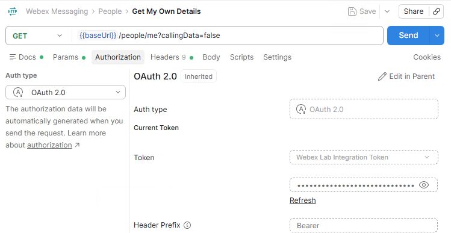{ width="450" style="display: block; margin: 0 auto; border: 1px solid lightgray; border-radius: 8px;"}
        
    * Click the blue **“Send”** button.
    * You should receive a `200 OK` response with your user details. This time, the token came from your integration!
2. **Send a Message to Your Lab Space (POST Create a Message):**
    * In your forked “Webex Messaging” collection, expand the **“Messages API”** folder.
    * Click on the **POST Create a Message** request.
    * In the “Body” tab, replace `{{roomId}}` with the `id` of your lab space (you can get this from the `GET List Rooms` request if you don’t have it handy from Lab 1).
    * Change the `text` field to: `"text": "Hello from my Webex Integration via Postman!"`.
    * Click the blue **“Send”** button:

        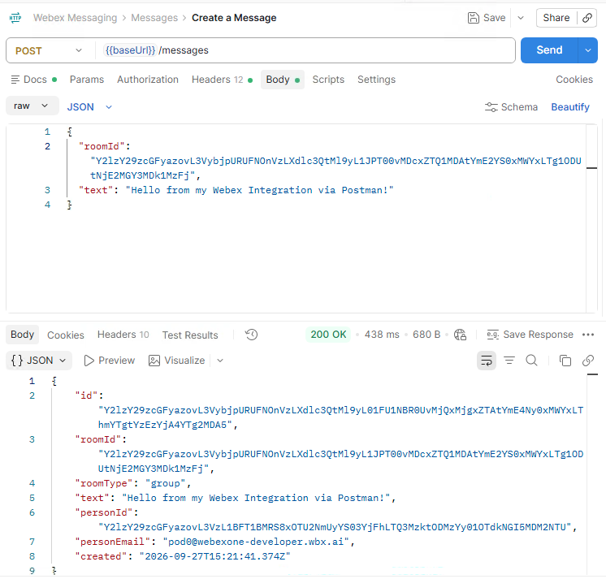{ width="650" style="display: block; margin: 0 auto; border: 1px solid lightgray; border-radius: 8px;"}
        
    * Check your Webex client – the message should appear, sent using your integration’s permissions:

        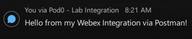{ width="450" style="display: block; margin: 0 auto; border: 1px solid lightgray; border-radius: 8px;"}

## Step 2.5: Exercise - A Simple Web App Integration

To see your integration in action, let's use it from a small web application. This demonstrates how a real third-party app uses the same OAuth 2.0 Authorization Code flow you just performed manually: the user logs in and grants consent, and the app then lists their rooms and sends a message on their behalf.

The app runs on your laptop as a tiny Python web server. The server exchanges the authorization code for a token and calls the Webex APIs, so your Client Secret never reaches the browser.

1. **Add a Redirect URI to Your Integration:**
    * Go back to your integration on the [Webex Developer Portal](https://developer.webex.com/my-apps){:target="_blank"}.
    * Under **Redirect URI(s)**, add a new URI for the local web app: `http://localhost:3000`:

        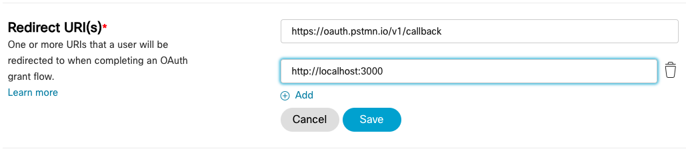{ width="650" style="display: block; margin: 0 auto; border: 1px solid lightgray; border-radius: 8px;"}
        
    * Click **Save** at the bottom of the page.

2. **Add Your Integration Credentials to `.env`:**
    * In VS Code, open the `.env` file in the root of the lab repository.
    * Add the Client ID and Client Secret you saved in Step 2.1:

    ```bash
    CLIENT_ID=YOUR_CLIENT_ID
    CLIENT_SECRET=YOUR_CLIENT_SECRET
    ```

    * Save the file.

3. **Run the Web App:**
   * In the VS Code terminal, make sure you are in the right folder:
   
        - cd 02-integration
        
    * Run the following command:
    
        - python app.py
        
    * Open your web browser and go to `http://localhost:3000`:
    
        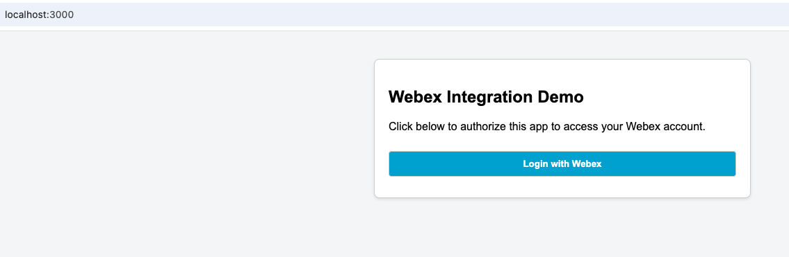{ width="550" style="display: block; margin: 0 auto; border: 1px solid lightgray; border-radius: 8px;"}

4. **Test the Integration:**
    * Click **"Login with Webex"**.
    * You will be redirected to Webex to log in and authorize the app. Click **"Accept"**.
    * Webex redirects you back to the app, which shows your name, a dropdown with your rooms, and a message box.
    * Select a room, type a message, and click **"Send Message"**:

        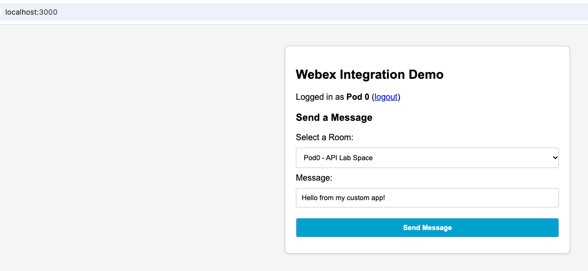{ width="750" style="display: block; margin: 0 auto; border: 1px solid lightgray; border-radius: 8px;"}
        
    * Check your Webex client: the message was sent on your behalf by your own web application:

        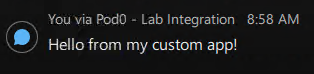{ width="450" style="display: block; margin: 0 auto; border: 1px solid lightgray; border-radius: 8px;"}

    !!! Note
        When you are done, stop the app with `Ctrl+C` in the terminal.

---

Congratulations! You've successfully created a Webex Integration, understood the OAuth 2.0 flow, and used it to securely make API requests. This is a fundamental concept for building robust Webex applications.
