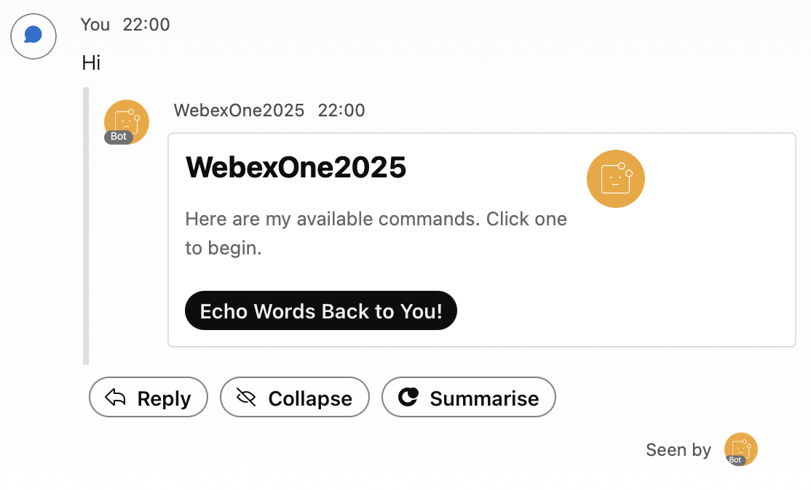
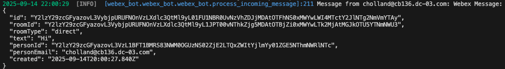
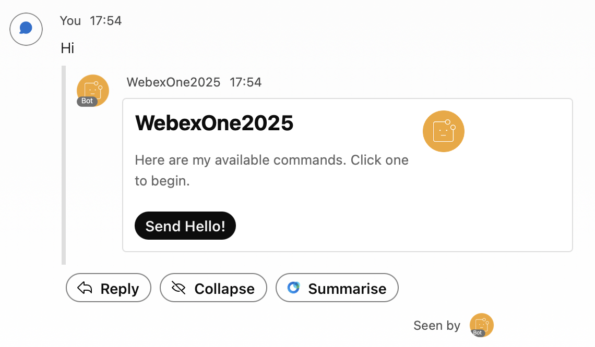
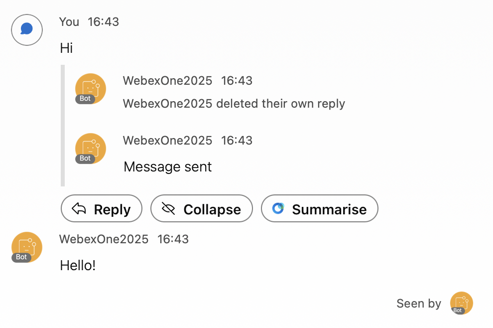
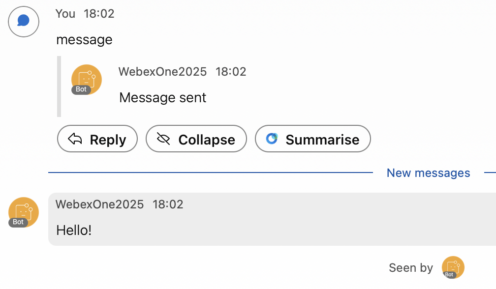
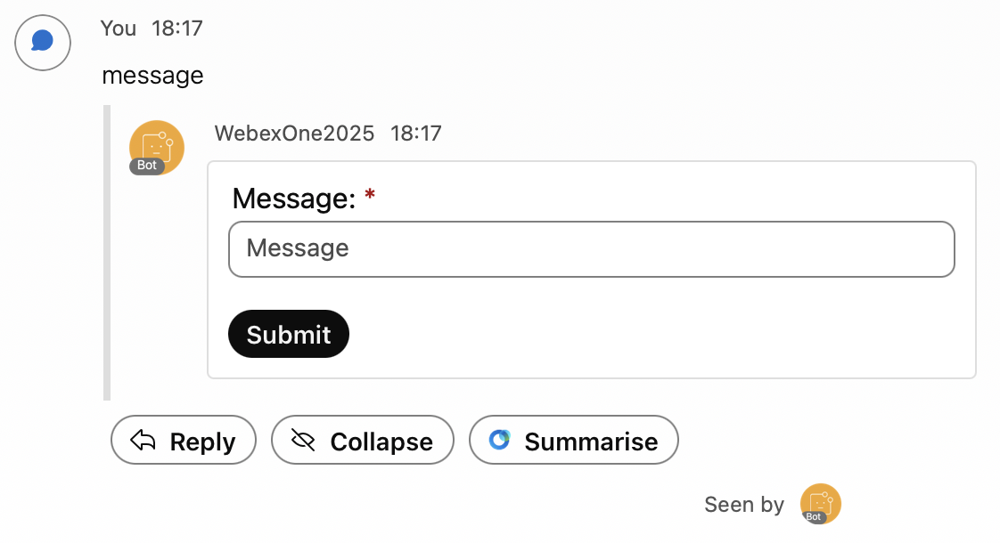
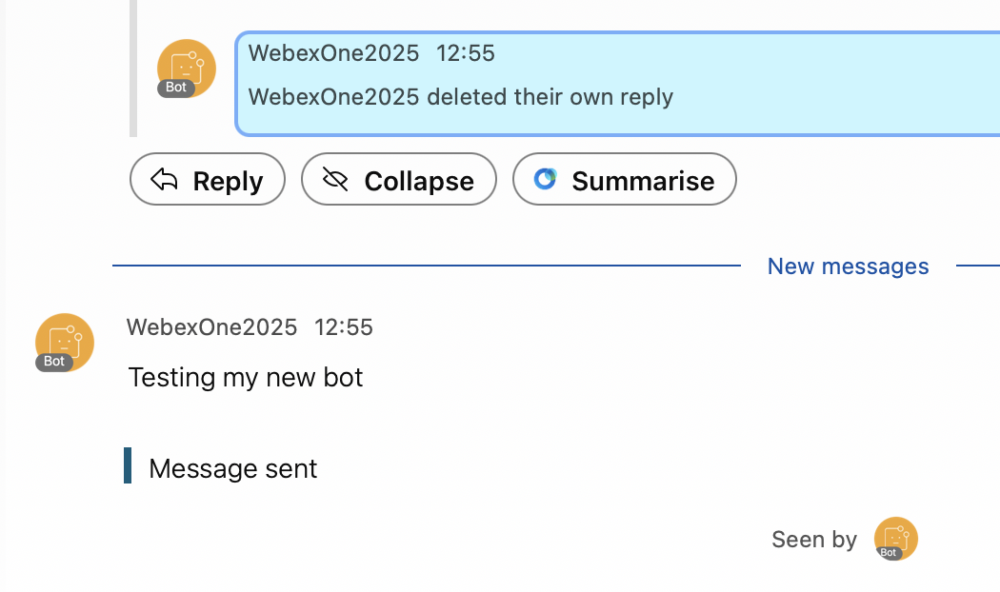

# Lab 3 – Building a Bot

In this section, you will create a Webex bot and build it into an interactive assistant using Python. You will register the bot, send messages, create rooms, work with Adaptive Cards, and connect to Webex Mercury to receive and respond to events in real time.

Upon completion of this section, you will be able to:

1. Create a **Bot** in Webex.
2. Send a message and find people using the Bot using Python.
3. Create a room and add a person using the Bot using Python.
4. Create and send an Adaptive Card.
5. Build an interactive bot that receives and responds to events in real time.

## Step 3.1: Create a Bot

First you need to create your bot:

1. In the [Webex for Developers](https://developer.webex.com/){:target="_blank"} portal, on the top right corner of the page, click your avatar and then select **[My Webex Apps]**(https://developer.webex.com/my-apps){:target="_blank"}.
2. Click **Create a New App**, and in that page, find the Bot card and click the **Create a Bot** button.

    { width="850" style="display: block; margin: 0 auto; border: 1px solid lightgray; border-radius: 8px;" }

4. Fill out the webform to register a new bot.

    1. **Bot Name:** WebexOne-*USERNAME*
    2. **Bot Username:** webexone-*USERNAME*
    3. **Icon:** Select any color icon
    4. **Description:** Bot for WebexOne

    { width="850" style="display: block; margin: 0 auto; border: 1px solid lightgray; border-radius: 8px;" }

!!! Warning
    Copy your **Bot access token** in your `.env` file as **BOT_TOKEN**.

## Step 3.2: Send a message to yourself

In this step, you will send your first 1:1 message using the bot you just created.

1. In VS Code navigate to your `.env` file, and make sure to fill and save the following variables:

    - `BOT_TOKEN`
    - `EMAIL`
    - `DOMAIN`

2. Navigate to `03-bots/01_people.py` and review the code. You will notice that there are two functions **find_people** and **all_people**.

    !!! Warning
        **all_people** will not work if you are using a bot token as it requires admin privileges.

    ??? Tip "Python Code"
        ```python
        import os
        from dotenv import load_dotenv
        from webexpythonsdk import WebexAPI # Import the WebexAPI class from the Webex Python SDK
        
        # Load environment variables from the .env file.
        load_dotenv()
        
        # Webex Bot Token for API authentication.
        bot_token = os.getenv("BOT_TOKEN")
        # Email address for user lookup.
        email = os.getenv("EMAIL")
        
        # Initialize the WebexAPI client with the bot token.
        webex = WebexAPI(bot_token)
        
        def all_people():
            """
            Retrieves and prints the display name and email(s) for all people
            accessible by the authenticated Webex bot/user.
            """
            try:
                # List all people in the organization.
                # webex.people.list() returns a GeneratorContainer, which is iterable.
                all_people_iterator = webex.people.list()
                # Iterate through the people and print their details.
                for person in all_people_iterator:
                    print(f"Name: {person.displayName}, Email: {person.emails}")
            except Exception as e:
                # Catch and print any exceptions that occur during the API call.
                print(f"An error occurred while listing all people: {e}")
        
        def find_people(email_address: str):
            """
            Finds and prints the display name and email(s) for a specific person
            based on their email address.
        
            Args:
                email_address (str): The email address of the person to find.
            """
            try:
                # List people, filtering by the provided email address.
                # webex.people.list() returns a GeneratorContainer, which is iterable.
                found_people_iterator = webex.people.list(email=email_address)
                # Iterate through the (potentially single) person found and print their details.
                for person in found_people_iterator:
                    print(f"Name: {person.displayName}, Email: {person.emails}")
            except Exception as e:
                # Catch and print any exceptions that occur during the API call.
                print(f"An error occurred while finding people by email: {e}")
        
        # Call the find_people function using the email loaded from environment variables.
        find_people(email_address=email)
        
        # Call the all_people function to list all accessible users.
        all_people()
        ```

3. Make sure that in your terminal you are in the right folder:

    - cd ../03-bots

4. Run your code with the following command:

    - python 01_people.py

5. You should see something like the following in the console:

    ```terminal
    Name: Pod 0, Email: ['pod0@webexone-developer.wbx.ai']
An error occurred while listing all people: [400] Bad Request - Email, displayName, role, or id list should be specified. [Tracking ID: ROUTERGW_40944853-1355-40da-8e76-7de0f601e18b]
    ```

6. Navigate to `03-bots/02_message.py` and review the code. You will use the function you created earlier to find yourself, so you can send a message to your own account.

    ??? Tip "Python Code"
        ```python
        import os
        from dotenv import load_dotenv
        from webexpythonsdk import WebexAPI # Import the WebexAPI class from the Webex Python SDK
        
        # Load environment variables from the .env file.
        load_dotenv()
        
        # Webex Bot Token for API authentication.
        bot_token = os.getenv("BOT_TOKEN")
        # Email address for user lookup and message recipient.
        email = os.getenv("EMAIL")
        
        # Initialize the main WebexAPI client with the bot token.
        webex = WebexAPI(bot_token)
        
        def send_teams_message(bot_token: str, message: str, person_email: str):
            """
            Sends a direct message to a specified person via Webex Teams.
        
            Args:
                bot_token (str): The authentication token for the Webex bot.
                message (str): The content of the message to send (supports Markdown).
                person_email (str): The email address of the recipient.
            """
            # Initialize a new WebexAPI client for sending messages.
            webexbot = WebexAPI(bot_token)
            # Create a direct message to the specified person's email with the given markdown content.
            webexbot.messages.create(toPersonEmail=person_email, markdown=message)
        
        def find_people(email_address: str):
            """
            Finds a person by their email address using the Webex API.
        
            Args:
                email_address (str): The email address of the person to find.
        
            Returns:
                webexpythonsdk.models.Person: The first person object found, or None if an error occurs or no person is found.
            """
            try:
                # List people, filtering by the provided email address.
                # webex.people.list() returns a GeneratorContainer, so convert it to a list for indexing.
                found_people = list(webex.people.list(email=email_address))
                
                # Return the first person object found.
                if found_people:
                    return found_people[0]
                else:
                    print(f"No person found with email: {email_address}.")
                    return None
            except Exception as e:
                # Catch and print any exceptions that occur during the API call.
                print(f"An error occurred while finding people by email: {e}")
                return None
        
        # Find the person associated with the email loaded from environment variables.
        person = find_people(email_address=email)
        
        # If a person was found, send them a personalized message.
        if person:
            send_teams_message(bot_token, f"Hello {person.displayName}!", person.emails[0])
        else:
            print(f"Could not find a person with email: {email}. Message not sent.")
        ```

7. Run your code with the following command:

    - python 02_message.py

    You should have received the following message:

    { width="850" style="display: block; margin: 0 auto; border: 1px solid lightgray; border-radius: 8px;" }

## Step 3.3: Create a Room and add yourself

In this step, you will create a room with your bot and add your user to it.

1. Navigate to `03-bots/03_rooms.py` and review the code.

    There are two functions, one to create the room **create_webex_room** and another one to add a person to it **add_person_to_room**.

    ??? Tip "Python Code"
        ```python
        import os
        from dotenv import load_dotenv
        from webexpythonsdk import WebexAPI # Import the WebexAPI class from the Webex Python SDK
        
        # Load environment variables from the .env file.
        load_dotenv()
        
        # Webex Bot Token for API authentication.
        bot_token = os.getenv("BOT_TOKEN")
        # Your email address, used to find your user ID.
        email = os.getenv("EMAIL")
        
        # Initialize the WebexAPI client with the bot token.
        webex = WebexAPI(bot_token)
        
        def create_webex_room(room_title: str):
            """
            Creates a new Webex room with the given title.
        
            Args:
                room_title (str): The title for the new Webex room.
        
            Returns:
                webexpythonsdk.models.Room: The created room object if successful, None otherwise.
            """
            try:
                print(f"Attempting to create room with title: '{room_title}'...")
                new_room = webex.rooms.create(title=room_title)
                print(f"Room created successfully! Room ID: {new_room.id}, Title: {new_room.title}")
                return new_room
            except Exception as e:
                print(f"An error occurred while creating the room: {e}")
                return None
        
        def add_person_to_room(room_id: str, person_email: str):
            """
            Finds a person by their email and adds them to a specified Webex room.
        
            Args:
                room_id (str): The ID of the room to add the person to.
                person_email (str): The email address of the person to add.
        
            Returns:
                webexpythonsdk.models.Membership: The membership object if successful, None otherwise.
            """
            try:
                # 1. Find the user by email to get their person ID
                print(f"Attempting to find user with email: '{person_email}'...")
                # webex.people.list() returns a GeneratorContainer, which is iterable.
                found_people = list(webex.people.list(email=person_email))
                
                if found_people:
                    # Assuming the first result is the correct person
                    person_to_add = found_people[0]
                    print(f"Found user: {person_to_add.displayName}, Person ID: {person_to_add.id}")
        
                    # 2. Add the user to the specified room
                    print(f"Attempting to add {person_to_add.displayName} to room ID: '{room_id}'...")
                    membership = webex.memberships.create(
                        roomId=room_id,
                        personId=person_to_add.id
                    )
                    print(f"User '{person_to_add.displayName}' added to room successfully! Membership ID: {membership.id}")
                    return membership
                else:
                    print(f"Error: Could not find any user with email '{person_email}'. Cannot add to room.")
                    return None
            except Exception as e:
                print(f"An error occurred while adding person to room: {e}")
                return None
        
        # Define the title for your new room.
        new_room_name = "WebexOne Room"
        
        # Step 1: Create the room
        created_room = create_webex_room(new_room_name)
        
        # Step 2: If the room was created successfully, add yourself to it.
        if created_room:
            add_person_to_room(created_room.id, email)
        else:
            print("Room creation failed, cannot proceed to add members.")
        ```

2. Run your code with the following command:

    - python 03_rooms.py

3. You will see all the steps printed in the console:

    ```terminal
    Attempting to create room with title: 'WebexOne Room'...
    Room created successfully! Room ID: Y2lzY29zcGFyazovL3VybjpURUFNOnVzLXdlc3QtMl9yL1JPT00vMzk1N2QzMzAtYmE5MC0xMWYxLTljMTYtMDNjZjE2NGFkMDkz, Title: WebexOne Room
    Attempting to find user with email: 'pod0@webexone-developer.wbx.ai'...
    Found user: Pod 0, Person ID: Y2lzY29zcGFyazovL3VzL1BFT1BMRS8xOTU2NmUyYS03YjFhLTQ3MzktODMzYy01OTdkNGI5MDM2NTU
    Attempting to add Pod 0 to room ID: 'Y2lzY29zcGFyazovL3VybjpURUFNOnVzLXdlc3QtMl9yL1JPT00vMzk1N2QzMzAtYmE5MC0xMWYxLTljMTYtMDNjZjE2NGFkMDkz'...
    User 'Pod 0' added to room successfully! Membership ID: Y2lzY29zcGFyazovL3VybjpURUFNOnVzLXdlc3QtMl9yL01FTUJFUlNISVAvMTk1NjZlMmEtN2IxYS00NzM5LTgzM2MtNTk3ZDRiOTAzNjU1OjM5NTdkMzMwLWJhOTAtMTFmMS05YzE2LTAzY2YxNjRhZDA5Mw
    ```

    You should also see the newly created room appear in your Webex App:

    { width="850" style="display: block; margin: 0 auto; border: 1px solid lightgray; border-radius: 8px;" }

## Step 3.4: Adaptive card

In this step, you will explore how to create and send an Adaptive Card.

1. Navigate to `03-bots/04_adaptivecard.py` and review the code.

    You will notice a card content example, but ideally you will create your own card.

    ??? Tip "Python Code"
        ```python 
        import os
        from dotenv import load_dotenv
        from webexpythonsdk import WebexAPI # Import the WebexAPI class from the Webex Python SDK
        
        # Load environment variables from the .env file.
        load_dotenv()
        
        # Webex Bot Token for API authentication.
        bot_token = os.getenv("BOT_TOKEN")
        # Email address of the recipient for the Adaptive Card.
        email = os.getenv("EMAIL")
        
        # Initialize the WebexAPI client with the bot token.
        webex = WebexAPI(bot_token)
        
        # Define the Adaptive Card structure.
        # The 'content' field should contain a valid JSON Adaptive Card payload.
        card = {
            "contentType": "application/vnd.microsoft.card.adaptive",
            "content":
                # PASTE YOUR ADAPTIVE CARD JSON HERE!
                # This is a placeholder for the actual Adaptive Card JSON structure.
                # Example structure is provided below in 'card_example'.
                {} # Placeholder for actual card content
        }
        
        # Send a message with the Adaptive Card as an attachment to the specified person.
        # The 'text' parameter can be an optional fallback text if the card cannot be rendered.
        webex.messages.create(toPersonEmail=email, text="Your client does not support Adaptive Cards. Please update your client.", attachments=[card])
        ```

   ??? Tip "Adaptive Card Example"
        ```python
        '''
        # Example Adaptive Card structure (commented out for reference).
        card_content_example = {
            "type": "AdaptiveCard",
            "body": [
                {
                    "type": "ColumnSet",
                    "columns": [
                        {
                            "type": "Column",
                            "items": [
                                {
                                    "type": "TextBlock",
                                    "weight": "Bolder",
                                    "text": "WebexOne",
                                    "horizontalAlignment": "Left",
                                    "wrap": True,
                                    "color": "Light",
                                    "size": "Large",
                                    "spacing": "Small"
                                }
                            ],
                                "width": "stretch"
                        }
                    ]
                },
                {
                    "type": "TextBlock",
                    "text": "This is my first Adaptive Card!",
                    "wrap": True
                }
            ],
            "$schema": "http://adaptivecards.io/schemas/adaptive-card.json",
            "version": "1.3"
        }
        '''
        ```

    ??? Tip "Full python code with example card"
        ```python
        import os
        from dotenv import load_dotenv
        from webexpythonsdk import WebexAPI # Import the WebexAPI class from the Webex Python SDK
        
        # Load environment variables from the .env file.
        load_dotenv()
        
        # Webex Bot Token for API authentication.
        bot_token = os.getenv("BOT_TOKEN")
        # Email address of the recipient for the Adaptive Card.
        email = os.getenv("EMAIL")
        
        # Initialize the WebexAPI client with the bot token.
        webex = WebexAPI(bot_token)
        
        # Define the Adaptive Card structure.
        # The 'content' field should contain a valid JSON Adaptive Card payload.
        card = {
            "contentType": "application/vnd.microsoft.card.adaptive",
            "content": {
                "type": "AdaptiveCard",
                "body": [
                    {
                        "type": "ColumnSet",
                        "columns": [
                            {
                                "type": "Column",
                                "items": [
                                    {
                                        "type": "TextBlock",
                                        "weight": "Bolder",
                                        "text": "WebexOne",
                                        "horizontalAlignment": "Left",
                                        "wrap": True,
                                        "color": "Light",
                                        "size": "Large",
                                        "spacing": "Small"
                                    }
                                ],
                                    "width": "stretch"
                            }
                        ]
                    },
                    {
                        "type": "TextBlock",
                        "text": "This is my first Adaptive Card!",
                        "wrap": True
                    }
                ],
                "$schema": "http://adaptivecards.io/schemas/adaptive-card.json",
                "version": "1.3" 
            }
        }
        
        # Send a message with the Adaptive Card as an attachment to the specified person.
        # The 'text' parameter can be an optional fallback text if the card cannot be rendered.
        webex.messages.create(toPersonEmail=email, text="Your client does not support Adaptive Cards. Please update your client.", attachments=[card])
        ```

2. Navigate to the Buttons and Cards Designer:

    - [Buttons and Cards Designer](https://developer.webex.com/buttons-and-cards-designer){:target="_blank"}

3. Use the UI to create your own card. Experiment with the available options to understand how they work. Once you’re ready, your card’s JSON code will appear below in the Card Payload Editor.

    !!! Warning
        When you copy the code from the Card Payload Editor, make sure to change **true** to **True** so it works correctly in Python.

4. Run your code with the following command:

    - python 04_adaptivecard.py

5. If you have used the example card, you should receive the following:

    { width="850" style="display: block; margin: 0 auto; border: 1px solid lightgray; border-radius: 8px;" }
    
## Step 3.5: Connect your bot

### Receiving events in real time

Webex bots can receive events in two main ways:

- **Webhooks:** Webex sends HTTP callbacks to a public URL. This works well in production, but usually requires a public endpoint or a tunnel such as ngrok during development.
- **WebSockets (Mercury):** Your bot opens a persistent connection to Webex and receives events in real time. This works well in lab environments and corporate networks because no public URL is required.

In this lab, your bot connects to Webex Mercury. You will implement event handling, message parsing, and Adaptive Card actions directly in Python.

1. Navigate to `03-bots/websocket_client.py` and review the code:

    ??? Tip "Python Code"
        ```python
        import asyncio
        import base64
        import json
        import logging
        import ssl
        import uuid
        
        import certifi
        import requests
        import websockets
        
        log = logging.getLogger(__name__)
        
        API_URL = "https://webexapis.com/v1"
        # Host map for the org: used to find the WDM URL that issues Webex WebSocket devices.
        CATALOG_URL = "https://u2c.wbx2.com/u2c/api/v1/catalog?format=hostmap"
        # Payload Webex expects when creating a desktop "device" that can open Mercury.
        DEVICE_DATA = {
            "deviceName": "pywebsocket-client",
            "deviceType": "DESKTOP",
            "localizedModel": "python",
            "model": "python",
            "name": "python-spark-client",
            "systemName": "python-spark-client",
            "systemVersion": "0.1",
        }
        
        class WebSocketClient:
            """Opens a Webex Mercury WebSocket and calls on_message(message) for each new post."""
        
            def __init__(self, access_token, on_message):
                self.access_token = access_token
                self.on_message = on_message  # callback(message) for each incoming post
                self.session = requests.Session()
                self.session.headers.update({"Authorization": f"Bearer {access_token}"})
                self.me = self.session.get(f"{API_URL}/people/me").json()
                self.cluster, _, self.person_uuid = base64.b64decode(self.me["id"] + "==").decode().split("/")[2:]
                self.clusters = None
        
            def _cluster_of(self, hydra_id):
                return base64.b64decode(hydra_id + "==").decode().split("/")[2]
        
            def _room_clusters(self):
                clusters, url, params = [], f"{API_URL}/rooms", {"max": 100}
                for _ in range(5):
                    response = self.session.get(url, params=params)
                    if not response.ok:
                        break
                    for room in response.json().get("items", []):
                        cluster = self._cluster_of(room["id"])
                        if cluster not in clusters:
                            clusters.append(cluster)
                    url = response.links.get("next", {}).get("url")
                    if not url:
                        break
                    params = None
                return clusters
        
            def _candidate_clusters(self, activity):
                # The event's own cluster first, then the bot's, then the clusters its spaces live in.
                candidates = []
                for node in (activity, activity.get("target"), activity.get("object")):
                    global_id = node.get("globalId") if isinstance(node, dict) else None
                    if isinstance(global_id, str) and "/" in global_id:
                        candidates.append(global_id.split("/")[0])
                candidates.append(self.cluster)
                if self.clusters is None:
                    self.clusters = self._room_clusters()
                candidates.extend(self.clusters)
                return list(dict.fromkeys(candidates))
        
            def get_message(self, activity):
                # A space shared with another org keeps that org's cluster, not the bot's.
                for _ in range(2):
                    for cluster in self._candidate_clusters(activity):
                        hydra_id = base64.b64encode(f"ciscospark://{cluster}/MESSAGE/{activity['id']}".encode()).decode()
                        response = self.session.get(f"{API_URL}/messages/{hydra_id}")
                        if response.ok:
                            return response.json()
                    self.clusters = None
                log.warning(f"Could not read message {activity['id']} in any known cluster")
                return None
        
            def send_message(self, room_id, text):
                # POST a text message back into the same space.
                self.session.post(f"{API_URL}/messages", json={"roomId": room_id, "text": text})
        
            async def listen(self):
                # 1) Ask the catalog where device registration lives for this org.
                wdm_url = self.session.get(CATALOG_URL).json()["serviceLinks"]["wdm"]
                # 2) Register a device; the response includes the Mercury WebSocket URL.
                device = self.session.post(f"{wdm_url}/devices", json=DEVICE_DATA).json()
                # 3) Verify TLS with certifi (Python's default store often misses these CAs).
                ssl_context = ssl.create_default_context(cafile=certifi.where())
        
                async with websockets.connect(device["webSocketUrl"], ssl=ssl_context) as ws:
                    # 4) Authorize the socket with the bot token before events start flowing.
                    await ws.send(json.dumps({
                        "id": str(uuid.uuid4()),
                        "type": "authorization",
                        "data": {"token": f"Bearer {self.access_token}"},
                    }))
                    # 5) Fetch each new post in plaintext and hand it to the bot.
                    async for raw in ws:
                        data = json.loads(raw).get("data", {})
                        if data.get("eventType") != "conversation.activity":
                            continue
                        activity = data["activity"]
                        # Only new posts, and never the bot's own replies (avoids an echo loop).
                        if activity["verb"] != "post" or activity["actor"]["id"] == self.person_uuid:
                            continue
                        message = self.get_message(activity)
                        if message:
                            self.on_message(message)
        
            def run(self):
                asyncio.run(self.listen())
        ```

###

In this step, you will open a persistent connection to Webex Mercury and handle incoming messages.

1. Navigate to `03-bots/05_websocket_bot.py` and review the code.

    The script follows this flow:

    - Register the bot device with Webex
    - Open a Mercury connection
    - Listen for `message` events
    - Reply to the user through the REST API

    Key functions to review:

    - **`handle_message()`** — processes incoming message events
    - **`connect_mercury()`** — registers the device and opens the connection
    - **`send_message()`** — sends a reply through the Webex REST API

2. Execute the code with the following command and let it run:

    ```bash
    python 05_websocket_bot.py
    ```

!!! Warning
    Wait until you see **WebSocket connected** appear in the console.

3. Send any message to your bot, and it will respond using the handler defined in the script:

    { width="850" style="display: block; margin: 0 auto; border: 1px solid lightgray; border-radius: 8px;" }

4. Observe how the incoming events are printed in the console:

    { width="850" style="display: block; margin: 0 auto; border: 1px solid lightgray; border-radius: 8px;" }

5. Trigger a card action or follow the sample prompt and verify that the bot response is sent through the REST API.

## Step 3.6: Create your own handler

In this step, you will replace the generic echo behavior with your own command handler.

1. Navigate to `03-bots/06_websocket_bot-2.py` and review the code.

    Key concepts in this script:

    - **`allowed_domains`** validates the sender's email domain before executing commands
    - **`command_keyword`** maps user text such as `message` to a specific handler
    - **`send_message()`** sends responses through the Webex REST API
    - **`delete_message()`** optionally removes the previous card before sending a new one

    { width="700" style="display: block; margin: 0 auto; border: 1px solid lightgray; border-radius: 8px;" }

2. Execute the code with the following command and let it run:

    ```bash
    python 06_websocket_bot-2.py
    ```

!!! Warning
    Wait until you see **WebSocket connected** appear in the console.

3. Send any message to your bot and you should receive a card with your custom function **Send Hello!**:

    { width="850" style="display: block; margin: 0 auto; border: 1px solid lightgray; border-radius: 8px;" }

4. Click **Send Hello!**. The card will be deleted, you will receive a confirmation message, and you should also see your **Hello!** message:

    { width="850" style="display: block; margin: 0 auto; border: 1px solid lightgray; border-radius: 8px;" }

5. To directly invoke this function, text your bot with the **message** keyword:

    { width="850" style="display: block; margin: 0 auto; border: 1px solid lightgray; border-radius: 8px;" }

## Step 3.7: Adaptive card processing

In this final step, you will handle Adaptive Card submissions through incoming events.

1. Navigate to `03-bots/07_websocket_bot-3.py` and review the code.

    Key concepts in this script:

    - **`on_attachment_action()`** receives card submission data
    - **`extract_input_values()`** reads the fields submitted by the user
    - **`send_card_response()`** sends the confirmation or next step

    The bot listens for **`attachmentActions`** events and routes them to the appropriate handler.

    { width="700" style="display: block; margin: 0 auto; border: 1px solid lightgray; border-radius: 8px;" }

2. Execute the code with the following command and let it run:

    ```bash
    python 07_websocket_bot-3.py
    ```

!!! Warning
    Wait until you see **WebSocket connected** appear in the console.

3. Text **message** to your bot to invoke your function directly:

    { width="850" style="display: block; margin: 0 auto; border: 1px solid lightgray; border-radius: 8px;" }

4. Enter a message and click **Submit**.

    The previous card will be deleted. You should then receive both your message and a formatted notification confirming that your message has been sent:

    { width="850" style="display: block; margin: 0 auto; border: 1px solid lightgray; border-radius: 8px;" }
