# Lab 3 – Building a Bot

In this section, you will create a Webex bot and build it into an interactive assistant using Python. You will register the bot, send messages, create rooms, work with Adaptive Cards, and connect to Webex Websockets to receive and respond to events in real time.

Upon completion of this section, you will be able to:

1. Create a **Bot** in Webex.
2. Find people and send messages with the bot using Python.
3. Create a room and add a person to it with the bot using Python.
4. Create and send an Adaptive Card.
5. Build an interactive bot that receives and responds to events in real time.
6. Restrict your bot so it only answers users from your organization.

## Step 3.1: Create a Bot

First you need to create your bot:

1. In the [Webex for Developers](https://developer.webex.com/){:target="_blank"} portal, on the top right corner of the page, click your avatar and then select **[My Webex Apps](https://developer.webex.com/my-apps)**{:target="_blank"}.
2. Click **Create a New App**, and in that page, find the Bot card and click the **Create a Bot** button.

    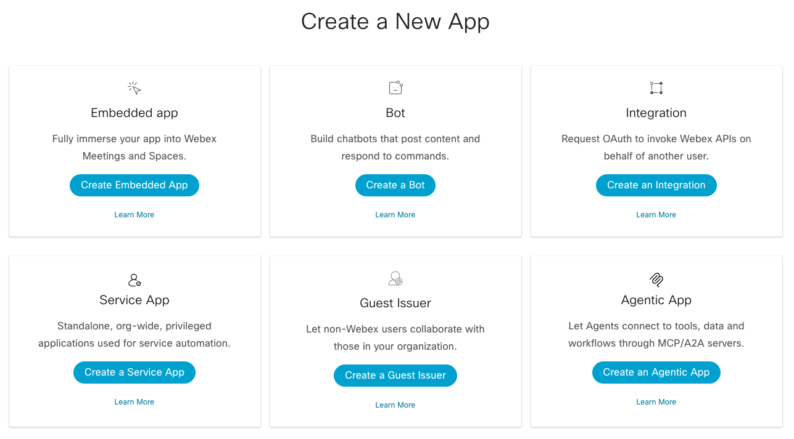{ width="950" style="display: block; margin: 0 auto; border: 1px solid lightgray; border-radius: 8px;" }

3. Fill out the webform to register a new bot.

    1. **Bot Name:** WebexOne-*USERNAME*
    2. **Bot Username:** webexone-*USERNAME*
    3. **Icon:** Select any color icon
    4. **Description:** Bot for WebexOne

    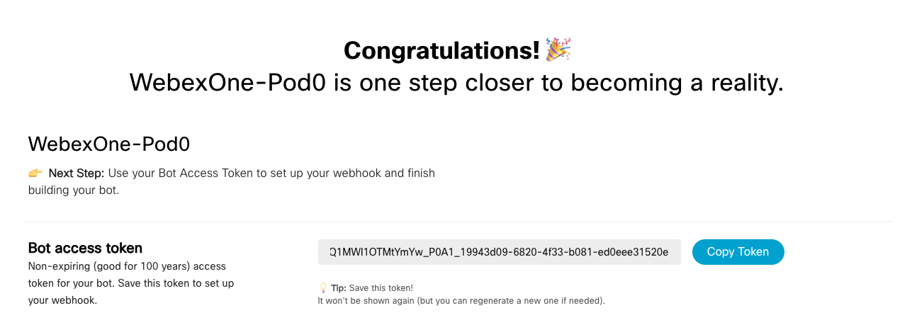{ width="950" style="display: block; margin: 0 auto; border: 1px solid lightgray; border-radius: 8px;" }

!!! Warning
    Copy your **Bot access token** to your `.env` file as **BOT_TOKEN**.

## Step 3.2: Send a message to yourself

In this step, you will send your first 1:1 message using the bot you just created.

1. In VS Code, navigate to your `.env` file, and make sure to fill and save the following variables:

    - `BOT_TOKEN`
    - `EMAIL`
    - `DOMAIN`

2. Navigate to `03-bots/01_people.py` and review the code. You will notice that there are two functions **find_people** and **all_people**.

    !!! Warning
        **all_people** will not work if you are using a bot token as it requires admin privileges.

    ??? Tip "Python Code"
        ```python
        import os
        from dotenv import load_dotenv
        from webexpythonsdk import WebexAPI # Import the WebexAPI class from the Webex Python SDK
        
        # Load environment variables from the .env file.
        load_dotenv()
        
        # Webex Bot Token for API authentication.
        bot_token = os.getenv("BOT_TOKEN")
        # Email address for user lookup.
        email = os.getenv("EMAIL")
        
        # Initialize the WebexAPI client with the bot token.
        webex = WebexAPI(bot_token)
        
        def all_people():
            """
            Retrieves and prints the display name and email(s) for all people
            accessible by the authenticated Webex bot/user.
            """
            try:
                # List all people in the organization.
                # webex.people.list() returns a GeneratorContainer, which is iterable.
                all_people_iterator = webex.people.list()
                # Iterate through the people and print their details.
                for person in all_people_iterator:
                    print(f"Name: {person.displayName}, Email: {person.emails}")
            except Exception as e:
                # Catch and print any exceptions that occur during the API call.
                print(f"An error occurred while listing all people: {e}")
        
        def find_people(email_address: str):
            """
            Finds and prints the display name and email(s) for a specific person
            based on their email address.
        
            Args:
                email_address (str): The email address of the person to find.
            """
            try:
                # List people, filtering by the provided email address.
                # webex.people.list() returns a GeneratorContainer, which is iterable.
                found_people_iterator = webex.people.list(email=email_address)
                # Iterate through the (potentially single) person found and print their details.
                for person in found_people_iterator:
                    print(f"Name: {person.displayName}, Email: {person.emails}")
            except Exception as e:
                # Catch and print any exceptions that occur during the API call.
                print(f"An error occurred while finding people by email: {e}")
        
        # Call the find_people function using the email loaded from environment variables.
        find_people(email_address=email)
        
        # Call the all_people function to list all accessible users.
        all_people()
        ```

3. Make sure that in your terminal you are in the right folder:

    - cd ../03-bots

4. Run your code with the following command:

    - pip install dotenv
    - python 01_people.py

6. You should see something like the following in the console:

    ```terminal
    Name: Pod 0, Email: ['pod0@webexone-developer.wbx.ai']
    An error occurred while listing all people: [400] Bad Request - Email, displayName, role, or id list should be specified. [Tracking ID: ROUTERGW_40944853-1355-40da-8e76-7de0f601e18b]
    ```

7. Navigate to `03-bots/02_message.py` and review the code. You will use the function you created earlier to find yourself, so you can send a message to your own account.

    ??? Tip "Python Code"
        ```python
        import os
        from dotenv import load_dotenv
        from webexpythonsdk import WebexAPI # Import the WebexAPI class from the Webex Python SDK
        
        # Load environment variables from the .env file.
        load_dotenv()
        
        # Webex Bot Token for API authentication.
        bot_token = os.getenv("BOT_TOKEN")
        # Email address for user lookup and message recipient.
        email = os.getenv("EMAIL")
        
        # Initialize the main WebexAPI client with the bot token.
        webex = WebexAPI(bot_token)
        
        def send_teams_message(bot_token: str, message: str, person_email: str):
            """
            Sends a direct message to a specified person via Webex Teams.
        
            Args:
                bot_token (str): The authentication token for the Webex bot.
                message (str): The content of the message to send (supports Markdown).
                person_email (str): The email address of the recipient.
            """
            # Initialize a new WebexAPI client for sending messages.
            webexbot = WebexAPI(bot_token)
            # Create a direct message to the specified person's email with the given markdown content.
            webexbot.messages.create(toPersonEmail=person_email, markdown=message)
        
        def find_people(email_address: str):
            """
            Finds a person by their email address using the Webex API.
        
            Args:
                email_address (str): The email address of the person to find.
        
            Returns:
                webexpythonsdk.models.Person: The first person object found, or None if an error occurs or no person is found.
            """
            try:
                # List people, filtering by the provided email address.
                # webex.people.list() returns a GeneratorContainer, so convert it to a list for indexing.
                found_people = list(webex.people.list(email=email_address))
                
                # Return the first person object found.
                if found_people:
                    return found_people[0]
                else:
                    print(f"No person found with email: {email_address}.")
                    return None
            except Exception as e:
                # Catch and print any exceptions that occur during the API call.
                print(f"An error occurred while finding people by email: {e}")
                return None
        
        # Find the person associated with the email loaded from environment variables.
        person = find_people(email_address=email)
        
        # If a person was found, send them a personalized message.
        if person:
            send_teams_message(bot_token, f"Hello {person.displayName}!", person.emails[0])
        else:
            print(f"Could not find a person with email: {email}. Message not sent.")
        ```

8. Run your code with the following command:

    - python 02_message.py

    You should have received the following message:

    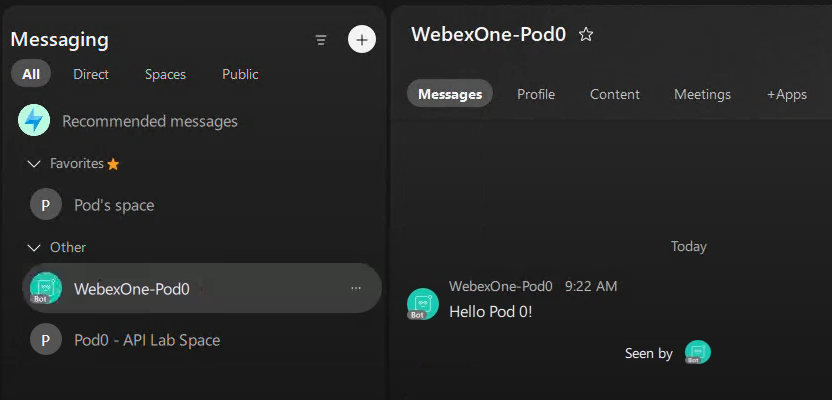{ width="750" style="display: block; margin: 0 auto; border: 1px solid lightgray; border-radius: 8px;" }

## Step 3.3: Create a Room and add yourself

In this step, you will create a room with your bot and add your user to it.

1. Navigate to `03-bots/03_rooms.py` and review the code.

    There are two functions: one to create the room (**create_webex_room**) and another to add a person to it (**add_person_to_room**).

    ??? Tip "Python Code"
        ```python
        import os
        from dotenv import load_dotenv
        from webexpythonsdk import WebexAPI # Import the WebexAPI class from the Webex Python SDK
        
        # Load environment variables from the .env file.
        load_dotenv()
        
        # Webex Bot Token for API authentication.
        bot_token = os.getenv("BOT_TOKEN")
        # Your email address, used to find your user ID.
        email = os.getenv("EMAIL")
        
        # Initialize the WebexAPI client with the bot token.
        webex = WebexAPI(bot_token)
        
        def create_webex_room(room_title: str):
            """
            Creates a new Webex room with the given title.
        
            Args:
                room_title (str): The title for the new Webex room.
        
            Returns:
                webexpythonsdk.models.Room: The created room object if successful, None otherwise.
            """
            try:
                print(f"Attempting to create room with title: '{room_title}'...")
                new_room = webex.rooms.create(title=room_title)
                print(f"Room created successfully! Room ID: {new_room.id}, Title: {new_room.title}")
                return new_room
            except Exception as e:
                print(f"An error occurred while creating the room: {e}")
                return None
        
        def add_person_to_room(room_id: str, person_email: str):
            """
            Finds a person by their email and adds them to a specified Webex room.
        
            Args:
                room_id (str): The ID of the room to add the person to.
                person_email (str): The email address of the person to add.
        
            Returns:
                webexpythonsdk.models.Membership: The membership object if successful, None otherwise.
            """
            try:
                # 1. Find the user by email to get their person ID
                print(f"Attempting to find user with email: '{person_email}'...")
                # webex.people.list() returns a GeneratorContainer, which is iterable.
                found_people = list(webex.people.list(email=person_email))
                
                if found_people:
                    # Assuming the first result is the correct person
                    person_to_add = found_people[0]
                    print(f"Found user: {person_to_add.displayName}, Person ID: {person_to_add.id}")
        
                    # 2. Add the user to the specified room
                    print(f"Attempting to add {person_to_add.displayName} to room ID: '{room_id}'...")
                    membership = webex.memberships.create(
                        roomId=room_id,
                        personId=person_to_add.id
                    )
                    print(f"User '{person_to_add.displayName}' added to room successfully! Membership ID: {membership.id}")
                    return membership
                else:
                    print(f"Error: Could not find any user with email '{person_email}'. Cannot add to room.")
                    return None
            except Exception as e:
                print(f"An error occurred while adding person to room: {e}")
                return None
        
        # Define the title for your new room.
        new_room_name = "WebexOne Room"
        
        # Step 1: Create the room
        created_room = create_webex_room(new_room_name)
        
        # Step 2: If the room was created successfully, add yourself to it.
        if created_room:
            add_person_to_room(created_room.id, email)
        else:
            print("Room creation failed, cannot proceed to add members.")
        ```

2. Run your code with the following command:

    - python 03_rooms.py

3. You will see all the steps printed in the console:

    ```terminal
    Attempting to create room with title: 'WebexOne Room'...
    Room created successfully! Room ID: Y2lzY29zcGFyazovL3VybjpURUFNOnVzLXdlc3QtMl9yL1JPT00vMzk1N2QzMzAtYmE5MC0xMWYxLTljMTYtMDNjZjE2NGFkMDkz, Title: WebexOne Room
    Attempting to find user with email: 'pod0@webexone-developer.wbx.ai'...
    Found user: Pod 0, Person ID: Y2lzY29zcGFyazovL3VzL1BFT1BMRS8xOTU2NmUyYS03YjFhLTQ3MzktODMzYy01OTdkNGI5MDM2NTU
    Attempting to add Pod 0 to room ID: 'Y2lzY29zcGFyazovL3VybjpURUFNOnVzLXdlc3QtMl9yL1JPT00vMzk1N2QzMzAtYmE5MC0xMWYxLTljMTYtMDNjZjE2NGFkMDkz'...
    User 'Pod 0' added to room successfully! Membership ID: Y2lzY29zcGFyazovL3VybjpURUFNOnVzLXdlc3QtMl9yL01FTUJFUlNISVAvMTk1NjZlMmEtN2IxYS00NzM5LTgzM2MtNTk3ZDRiOTAzNjU1OjM5NTdkMzMwLWJhOTAtMTFmMS05YzE2LTAzY2YxNjRhZDA5Mw
    ```

    You should also see the newly created room appear in your Webex App:

    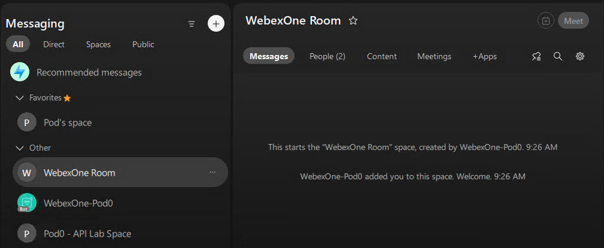{ width="850" style="display: block; margin: 0 auto; border: 1px solid lightgray; border-radius: 8px;" }

## Step 3.4: Adaptive card

In this step, you will explore how to create and send an Adaptive Card.

1. Navigate to `03-bots/04_adaptivecard.py` and review the code.

    You will notice a card content example, but ideally, you will create your own card.

    ??? Tip "Python Code"
        ```python 
        import os
        from dotenv import load_dotenv
        from webexpythonsdk import WebexAPI # Import the WebexAPI class from the Webex Python SDK
        
        # Load environment variables from the .env file.
        load_dotenv()
        
        # Webex Bot Token for API authentication.
        bot_token = os.getenv("BOT_TOKEN")
        # Email address of the recipient for the Adaptive Card.
        email = os.getenv("EMAIL")
        
        # Initialize the WebexAPI client with the bot token.
        webex = WebexAPI(bot_token)
        
        # Define the Adaptive Card structure.
        # The 'content' field should contain a valid JSON Adaptive Card payload.
        card = {
            "contentType": "application/vnd.microsoft.card.adaptive",
            "content":
                # PASTE YOUR ADAPTIVE CARD JSON HERE!
                # This is a placeholder for the actual Adaptive Card JSON structure.
                # Example structure is provided below in 'card_example'.
                {} # Placeholder for actual card content
        }
        
        # Send a message with the Adaptive Card as an attachment to the specified person.
        # The 'text' parameter can be an optional fallback text if the card cannot be rendered.
        webex.messages.create(toPersonEmail=email, text="Your client does not support Adaptive Cards. Please update your client.", attachments=[card])
        ```

    ??? Tip "Adaptive Card Example"
        ```python
        # Example Adaptive Card structure (commented out for reference).
        card_content_example = {
            "type": "AdaptiveCard",
            "body": [
                {
                    "type": "ColumnSet",
                    "columns": [
                        {
                            "type": "Column",
                            "items": [
                                {
                                    "type": "TextBlock",
                                    "weight": "Bolder",
                                    "text": "WebexOne",
                                    "horizontalAlignment": "Left",
                                    "wrap": True,
                                    "color": "Light",
                                    "size": "Large",
                                    "spacing": "Small"
                                }
                            ],
                                "width": "stretch"
                        }
                    ]
                },
                {
                    "type": "TextBlock",
                    "text": "This is my first Adaptive Card!",
                    "wrap": True
                }
            ],
            "$schema": "http://adaptivecards.io/schemas/adaptive-card.json",
            "version": "1.3"
        }
        ```

    ??? Tip "Full python code with example card"
        ```python
        import os
        from dotenv import load_dotenv
        from webexpythonsdk import WebexAPI # Import the WebexAPI class from the Webex Python SDK
        
        # Load environment variables from the .env file.
        load_dotenv()
        
        # Webex Bot Token for API authentication.
        bot_token = os.getenv("BOT_TOKEN")
        # Email address of the recipient for the Adaptive Card.
        email = os.getenv("EMAIL")
        
        # Initialize the WebexAPI client with the bot token.
        webex = WebexAPI(bot_token)
        
        # Define the Adaptive Card structure.
        # The 'content' field should contain a valid JSON Adaptive Card payload.
        card = {
            "contentType": "application/vnd.microsoft.card.adaptive",
            "content": {
                "type": "AdaptiveCard",
                "body": [
                    {
                        "type": "ColumnSet",
                        "columns": [
                            {
                                "type": "Column",
                                "items": [
                                    {
                                        "type": "TextBlock",
                                        "weight": "Bolder",
                                        "text": "WebexOne",
                                        "horizontalAlignment": "Left",
                                        "wrap": True,
                                        "color": "Light",
                                        "size": "Large",
                                        "spacing": "Small"
                                    }
                                ],
                                    "width": "stretch"
                            }
                        ]
                    },
                    {
                        "type": "TextBlock",
                        "text": "This is my first Adaptive Card!",
                        "wrap": True
                    }
                ],
                "$schema": "http://adaptivecards.io/schemas/adaptive-card.json",
                "version": "1.3" 
            }
        }
        
        # Send a message with the Adaptive Card as an attachment to the specified person.
        # The 'text' parameter can be an optional fallback text if the card cannot be rendered.
        webex.messages.create(toPersonEmail=email, text="Your client does not support Adaptive Cards. Please update your client.", attachments=[card])
        ```

2. Navigate to the Buttons and Cards Designer:

    - [Buttons and Cards Designer](https://developer.webex.com/buttons-and-cards-designer){:target="_blank"}

3. Use the UI to create your own card. Experiment with the available options to understand how they work. Once you’re ready, your card’s JSON code will appear below in the Card Payload Editor.

    !!! Warning
        When you copy the code from the Card Payload Editor, make sure to change **true** to **True** so it works correctly in Python.

4. Run your code with the following command:

    - python 04_adaptivecard.py

5. If you have used the example card, you should receive the following:

    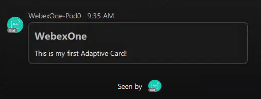{ width="550" style="display: block; margin: 0 auto; border: 1px solid lightgray; border-radius: 8px;" }
    
## Step 3.5: Bot with WebSockets

### Receiving events in real time

Webex bots can receive events in two main ways:

- **Webhooks:** Webex sends HTTP callbacks to a public URL. This works well in production, but usually requires a public endpoint or a tunnel such as ngrok during development.
- **WebSockets:** Your bot opens a persistent connection to Webex Websockets and receives events in real time. This works well in lab environments and corporate networks because no public URL is required.

In this lab, your bot connects to Webex Websockets. You will implement event handling, message parsing, and Adaptive Card actions directly in Python.

In this step, you will open a persistent connection to Webex Websockets and handle incoming messages. All the connection logic lives in a shared class, so every bot in the following steps only needs to define what to do with each event.

### WebSocket client

1. Navigate to `03-bots/websocket_client.py` and review the code.

    ??? Tip "Python Code"
        ```python
        from __future__ import annotations
        
        import asyncio
        import base64
        import json
        import logging
        import ssl
        import uuid
        from typing import Callable, Optional
        
        import certifi
        import requests
        import websockets
        from webexpythonsdk import WebexAPI
        
        logger = logging.getLogger(__name__)
        
        DEFAULT_U2C_URL = "https://u2c.wbx2.com/u2c/api/v1/catalog"
        DEVICE_DATA = {
            "deviceName": "webexone2026-bot",
            "deviceType": "DESKTOP",
            "localizedModel": "python",
            "model": "python",
            "name": "webexone2026-bot",
            "systemName": "webexone2026-bot",
            "systemVersion": "1.0",
        }
        
        ssl_context = ssl.create_default_context()
        ssl_context.load_verify_locations(certifi.where())
        
        MessageHandler = Callable[..., None]
        CardActionHandler = Callable[..., None]
        
        
        class WebSocketClient:
            def __init__(
                self,
                access_token: str,
                bot_name: str = "WebexOne2026",
                on_message: Optional[MessageHandler] = None,
                on_card_action: Optional[CardActionHandler] = None,
            ) -> None:
                self.access_token = access_token
                self.bot_name = bot_name
                self.api = WebexAPI(access_token=access_token)
                self.session = requests.Session()
                self.tracking_id = f"webexone2026_{uuid.uuid4()}"
                self.session.headers.update(self._headers())
                self.api._session.update_headers(self._headers())
                self.on_message = on_message
                self.on_card_action = on_card_action
                # Activities carry the actor's UUID, so decode it from the bot's base64 person ID.
                self.me = self.api.people.me()
                self.person_uuid = base64.b64decode(self.me.id + "==").decode().split("/")[-1]
                self.device_info = None
                self.device_url = self._get_device_url()
                self.websocket = None
                self.share_id = None
        
            def _headers(self) -> dict:
                sdk_ua = self.api._session.headers["User-Agent"]
                return {
                    "Authorization": f"Bearer {self.access_token}",
                    "Content-Type": "application/json;charset=utf-8",
                    "User-Agent": f"WebexOne2026-Bot '{self.bot_name}' ({sdk_ua})",
                    "trackingid": self.tracking_id,
                }
        
            def _get_device_url(self) -> str:
                response = self.session.get(DEFAULT_U2C_URL, params={"format": "hostmap"})
                response.raise_for_status()
                return response.json()["serviceLinks"]["wdm"]
        
            def _get_device_info(self, check_existing: bool = True) -> dict:
                if check_existing:
                    response = self.session.get(f"{self.device_url}/devices")
                    if response.status_code != 404:
                        response.raise_for_status()
                        for device in response.json().get("devices", []):
                            if device["name"] == DEVICE_DATA["name"]:
                                self.device_info = device
                                return device
        
                response = self.session.post(f"{self.device_url}/devices", json=DEVICE_DATA)
                response.raise_for_status()
                self.device_info = response.json()
                return self.device_info
        
            def _get_base64_message_id(self, activity: dict) -> str:
                activity_id = activity["id"]
                conversation_url = activity["target"]["url"]
                conv_target_id = activity["target"]["id"]
                verb = "messages" if activity["verb"] in ["post", "update"] else "attachment/actions"
                if activity["verb"] == "update" and self.share_id is not None:
                    activity_id = self.share_id
                    self.share_id = None
        
                conversation_message_url = conversation_url.replace(
                    f"conversations/{conv_target_id}", f"{verb}/{activity_id}"
                )
                conversation_message = self.session.get(conversation_message_url).json()
                return conversation_message["id"]
        
            def _ack_message(self, message_id: str) -> None:
                ack_message = {"type": "ack", "messageId": message_id}
                asyncio.run(self.websocket.send(json.dumps(ack_message)))
        
            def _process_incoming_websocket_message(self, msg: dict) -> None:
                data = msg.get("data", {})
                if data.get("eventType") != "conversation.activity":
                    return
        
                activity = data["activity"]
                verb = activity.get("verb")
        
                # Never react to the bot's own activity (avoids an echo loop).
                if activity.get("actor", {}).get("id") == self.person_uuid:
                    return
        
                if verb == "share":
                    self.share_id = activity["id"]
                    return
        
                if verb == "post":
                    message_id = self._get_base64_message_id(activity)
                    webex_message = self.api.messages.get(message_id)
                    self._ack_message(message_id)
                    print(f"Message received from {webex_message.personEmail}: {webex_message.text}")
                    if self.on_message:
                        self.on_message(webex_message, activity)
                    return
        
                if verb == "update":
                    obj = activity.get("object", {})
                    if obj.get("objectType") != "content" or obj.get("contentCategory") != "documents":
                        return
                    message_id = self._get_base64_message_id(activity)
                    webex_message = self.api.messages.get(message_id)
                    self._ack_message(message_id)
                    print(f"File message received from {webex_message.personEmail}: {webex_message.text}")
                    if self.on_message:
                        self.on_message(webex_message, activity)
                    return
        
                if verb == "cardAction":
                    message_id = self._get_base64_message_id(activity)
                    attachment_action = self.api.attachment_actions.get(message_id)
                    self._ack_message(message_id)
                    print(f"Card action received: {attachment_action.inputs}")
                    if self.on_card_action:
                        self.on_card_action(attachment_action, activity)
        
            async def _connect_and_listen(self) -> None:
                ws_url = self.device_info["webSocketUrl"]
                async with websockets.connect(ws_url, ssl=ssl_context, additional_headers=self._headers()) as websocket:
                    self.websocket = websocket
                    print(f"WebSocket connected as {self.me.displayName}, waiting for messages...")
                    auth = {
                        "id": str(uuid.uuid4()),
                        "type": "authorization",
                        "data": {"token": f"Bearer {self.access_token}"},
                    }
                    await websocket.send(json.dumps(auth))
        
                    while True:
                        raw = await websocket.recv()
                        msg = json.loads(raw)
                        loop = asyncio.get_event_loop()
                        loop.run_in_executor(None, self._safe_process, msg)
        
            def _safe_process(self, msg: dict) -> None:
                # Errors raised in executor threads are otherwise discarded silently.
                try:
                    self._process_incoming_websocket_message(msg)
                except Exception:
                    logger.exception("Failed to process incoming WebSocket message")
        
            def run(self) -> None:
                if self.device_info is None and self._get_device_info() is None:
                    raise RuntimeError("Unable to register bot device for WebSocket connection")
        
                while True:
                    try:
                        asyncio.get_event_loop().run_until_complete(self._connect_and_listen())
                    except Exception as exc:
                        logger.warning("WebSocket connection error: %s", exc)
                        self._get_device_info(check_existing=False)
                        asyncio.get_event_loop().run_until_complete(asyncio.sleep(5))
        ```

2. The **WebSocketClient** class takes care of the whole connection lifecycle, so you do not need to modify it:

    - **Find the device service:** `_get_device_url()` asks the Webex service catalog (U2C) where device registration (WDM) lives for your organization.
    - **Register a device:** `_get_device_info()` reuses the bot's existing device or registers a new one. The response includes the `webSocketUrl` the bot connects to.
    - **Connect and authorize:** `_connect_and_listen()` opens the WebSocket, verifies TLS with the `certifi` certificate bundle, and sends an authorization message with the bot token.
    - **Filter events:** Webex sends many event types. The client only processes `conversation.activity` events and ignores the bot's own activity, so the bot never replies to itself in an endless loop.
    - **Fetch the content:** events only contain IDs, not the message itself. The client builds the message ID, fetches the full message through the REST API, and acknowledges the event.
    - **Deliver the event:** new messages (`post`) and shared files (`update`) are passed to your **on_message** handler, and Adaptive Card submissions (`cardAction`) to your **on_card_action** handler.
    - **Stay connected:** if the connection drops, the client registers again and reconnects after 5 seconds. Errors inside your handlers are printed in the console instead of being silently discarded.

### Bot Helpers

During the following exercises, you will use the same functions many times, so they are grouped in a helper file.

1. Navigate to `03-bots/bot_helpers.py` and review the code.

    - **get_api()** creates the Webex API client used to call the REST API.
    - **send_message()** sends a message to a room. The text is sent as markdown, so formatting such as **bold** or quotes is rendered in Webex.
    - **send_card()** sends an Adaptive Card to a room, together with a fallback text for clients that cannot display cards.
    - **delete_message()** deletes a message, for example a card that has already been submitted.
    - **extract_input_values()** returns the values a user entered in a submitted card.
    - **is_allowed_domain()** checks whether an email address belongs to one of the allowed domains. You will use it in Step 3.8.

    ??? Tip "Python Code"
        ```python
        from __future__ import annotations
        
        from typing import Any
        
        from webexpythonsdk import WebexAPI
        
        
        def get_api(token: str) -> WebexAPI:
            return WebexAPI(access_token=token)
        
        
        def send_message(api: WebexAPI, room_id: str, text: str) -> None:
            api.messages.create(roomId=room_id, markdown=text)
        
        
        def send_card(api: WebexAPI, room_id: str, card: dict[str, Any], fallback_text: str = "Card") -> None:
            api.messages.create(
                roomId=room_id,
                text=fallback_text,
                attachments=[
                    {
                        "contentType": "application/vnd.microsoft.card.adaptive",
                        "content": card,
                    }
                ],
            )
        
        
        def delete_message(api: WebexAPI, message_id: str) -> None:
            api.messages.delete(message_id)
        
        
        def extract_input_values(attachment_action) -> dict[str, Any]:
            return dict(getattr(attachment_action, "inputs", {}) or {})
        
        
        def is_allowed_domain(email: str, allowed_domains: list[str]) -> bool:
            if not email or "@" not in email:
                return False
            domain = email.split("@", 1)[1].lower()
            return domain in {item.lower() for item in allowed_domains}
        ```

### Creating the bot

1. Navigate to `03-bots/05_websocket_bot.py` and review the code.

    The script follows this flow:

    - Authenticate the bot with the provided token.
    - Connect to Webex over WebSockets.
    - Listen for new messages and pass each one to `handle_message`.

    Key functions to review:

    - **`handle_message()`** processes each incoming message and echoes its content back. If the message has formatting, the bot uses the markdown version so the echo keeps it.
    - **`send_message()`** sends the reply through the Webex REST API.

    ??? Tip "Python Code"
        ```python
        import os
        from dotenv import load_dotenv
        # Import the shared WebSocketClient class
        from websocket_client import WebSocketClient
        # Import the Webex API SDK for direct API calls
        from bot_helpers import get_api, send_message
        
        # Load environment variables from the .env file.
        load_dotenv()
        
        # Webex Bot Token for authentication with the Webex API.
        bot_token = os.getenv("BOT_TOKEN")
        api = get_api(bot_token)
        
        def handle_message(message, activity):
            """
            Executes when a message is received by the bot.
            """
            room_id = message.roomId
            text = (getattr(message, "text", "") or "").strip()
            # Formatted messages keep their markdown in a separate field; plain ones only have text.
            content = getattr(message, "markdown", None) or text
        
            if content:
                # Echo back what they said
                send_message(api, room_id, f"Echo: {content}")
        
        # Create a WebSocket Client object.
        bot = WebSocketClient(access_token=bot_token,         # Authenticate the bot with the provided token.
                              on_message=handle_message)      # Map the incoming messages to the echo handler.
        
        # Start the bot and make it listen for incoming messages.
        bot.run()
        ```

2. Execute the code with the following command and let it run:

    - python 05_websocket_bot.py

    !!! Warning
        Wait until you see **WebSocket connected as WebexOne-*USERNAME*, waiting for messages...** in the console.

3. Send any message to your bot, and it will echo it back to you:

    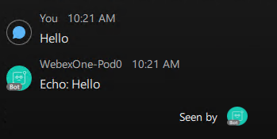{ width="450" style="display: block; margin: 0 auto; border: 1px solid lightgray; border-radius: 8px;" }

4. Observe how the incoming events are printed in the console:

    ```terminal
    WebSocket connected as WebexOne-Pod0, waiting for messages...
    Message received from pod0@webexone-developer.wbx.ai: Hello
    ```

5. Stop the bot with **Ctrl+C** before moving to the next step.

!!! Warning
    Only run one bot at a time. All the exercises use the same bot token, so if two scripts run at once, you may get duplicate or missing replies.

## Step 3.6: Command bot

In this step, you will replace the generic echo behavior with commands. Instead of repeating everything, the bot reads what the user typed and decides which action to run.

1. Navigate to `03-bots/06_command_bot.py` and review the code.

    Key concepts in this script:

    - **Command routing:** `handle_message()` takes the last word of the message and compares it with the known commands. Only the last word is checked because in group spaces the text starts with the bot mention (for example, `WebexOne-Pod0 help`).
    - **Calling the API from a bot:** the `whoami` command uses `api.people.get()` with the sender's ID, the same People API you used in Step 3.2.
    - **Fallback reply:** any unknown text gets a hint instead of silence, so users always know the bot is listening.

    ??? Tip "Python Code"
        ```python
        import os
        from dotenv import load_dotenv
        from websocket_client import WebSocketClient
        from bot_helpers import get_api, send_message
        
        # Load environment variables from the .env file.
        load_dotenv()
        
        # Webex Bot Token for authentication.
        bot_token = os.getenv("BOT_TOKEN")
        api = get_api(bot_token)
        
        HELP_TEXT = (
            "Here is what I can do:\n"
            "- hello: I greet you back.\n"
            "- whoami: I look you up in Webex and tell you who you are.\n"
            "- help: I show this list."
        )
        
        
        def handle_message(message, activity):
            """
            Reads the command the user typed and routes it to the right action.
            """
            room_id = message.roomId
            text = (getattr(message, "text", "") or "").strip().lower()
            # In group spaces the text starts with the bot mention, so only check the last word.
            command = text.split()[-1] if text else ""
        
            if command == "hello":
                # A simple reply that doesn't need any extra API call.
                send_message(api, room_id, "Hello! Type 'help' to see what I can do.")
        
            elif command == "whoami":
                # Use the Webex API from inside the bot to look up the sender.
                person = api.people.get(message.personId)
                send_message(api, room_id, f"You are {person.displayName} ({person.emails[0]}).")
        
            elif command == "help":
                send_message(api, room_id, HELP_TEXT)
        
            else:
                # Any other text falls back to a hint instead of staying silent.
                send_message(api, room_id, f"Sorry, I don't know '{command}'. Type 'help' to see what I can do.")
        
        
        # Create a WebSocket Client object.
        bot = WebSocketClient(access_token=bot_token,         # Authenticate the bot with the provided token.
                              on_message=handle_message)      # Map the incoming messages to the command router.
        
        # Start the bot and make it listen for incoming messages.
        bot.run()
        ```

2. Execute the code with the following command and let it run:

    - python 06_command_bot.py

    !!! Warning
        Wait until you see **WebSocket connected as WebexOne-*USERNAME*, waiting for messages...** in the console.

3. Try the commands: send **help** to see the list, **whoami** to find out who you are, **hello**, and any other text to see the fallback reply:

    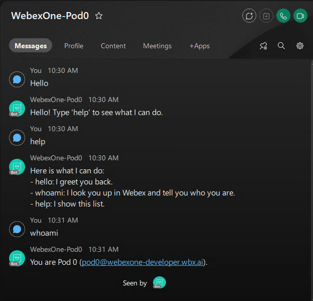{ width="650" style="display: block; margin: 0 auto; border: 1px solid lightgray; border-radius: 8px;" }

4. Stop the bot with **Ctrl+C** before moving to the next step.

## Step 3.7: Adaptive card bot

In Step 3.4, you sent an Adaptive Card, but nothing happened when someone used it. In this step, the bot sends a card with a text box and handles the submission through incoming events.

1. Navigate to `03-bots/07_card_bot.py` and review the code.

    The bot now handles two types of events:

    - **Messages:** `handle_message()` sends the card when the user types **message**. The card is built the same way as in Step 3.4, and its **Submit** button carries `callback_keyword` data so the bot knows which card was submitted.
    - **Card submissions:** when the user clicks **Submit**, Webex sends a `cardAction` event instead of a message. The client passes it to `handle_card_action()`, which reads the values the user typed from `inputs`, deletes the card so it cannot be submitted twice, and replies with the message and a formatted confirmation.

    Both handlers are registered when the bot is created: `on_message` for messages and `on_card_action` for card submissions.

    ??? Tip "Python Code"
        ```python
        import os
        from dotenv import load_dotenv
        from websocket_client import WebSocketClient
        from bot_helpers import get_api, send_message, send_card, delete_message
        
        # Load environment variables from the .env file.
        load_dotenv()
        
        # Webex Bot Token for authentication with the Webex API.
        bot_token = os.getenv("BOT_TOKEN")
        api = get_api(bot_token)
        
        
        def handle_card_action(attachment_action, activity):
            """
            Executes when an Adaptive Card with 'callback_keyword': 'message_callback' is submitted.
            It extracts the message input from the card and sends it back to the user.
            """
            room_id = attachment_action.roomId
            inputs = getattr(attachment_action, "inputs", {}) or {}
            
            # Extract the 'message' input from the submitted Adaptive Card's inputs.
            message_content = inputs.get("message")
            
            # Deletes the Adaptive Card message after submission.
            if getattr(attachment_action, "messageId", None):
                delete_message(api, attachment_action.messageId)
                
            # Create a direct message to the room with the extracted message content.
            if message_content:
                send_message(api, room_id, message_content)
                # Return a confirmation message, formatted as an info quote.
                send_message(api, room_id, "> **Info**\n> Message sent")
        
        
        def handle_message(message, activity):
            """
            Executes the 'message' command. Constructs and sends an Adaptive Card
            to the user for input.
            """
            room_id = message.roomId
            text = (getattr(message, "text", "") or "").strip().lower()
            # In group spaces the text starts with the bot mention, so only check the last word.
            command = text.split()[-1] if text else ""
        
            # The keyword users type to activate this command.
            if command == "message":
                # Define the Adaptive Card structure for user input.
                card = {
                    "type": "AdaptiveCard",
                    "body": [
                        {
                            "type": "Input.Text",
                            "placeholder": "Message",
                            "id": "message",
                            "isRequired": True,
                            "errorMessage": "Message is required",
                            "label": "Message:"
                        }
                    ],
                    "$schema": "http://adaptivecards.io/schemas/adaptive-card.json",
                    "version": "1.3",
                    "actions": [
                        {
                            "type": "Action.Submit",
                            "title": "Submit",
                            "data": {
                                "callback_keyword": "message_callback" # This links to the card action handler.
                            }
                        }
                    ]
                }
        
                # Attach the Adaptive Card to the response.
                send_card(api, room_id, card, fallback_text="Please enter your message:")
            else:
                # Let the user know which keyword the bot understands.
                send_message(api, room_id, "Type 'message' to get the card.")
        
        
        # Create a WebSocket Client object.
        bot = WebSocketClient(access_token=bot_token,         # Authenticate the bot using its token.
                              on_message=handle_message,      # Registers the message handler.
                              on_card_action=handle_card_action) # Registers the callback command for card submissions.
        
        # Start the bot and make it listen for incoming messages.
        # This call is typically blocking and keeps the bot running, waiting for commands or card submissions.
        bot.run()
        ```

2. Execute the code with the following command and let it run:

    - python 07_card_bot.py

    !!! Warning
        Wait until you see **WebSocket connected as WebexOne-*USERNAME*, waiting for messages...** in the console.

3. Send **message** to your bot to receive the card:

    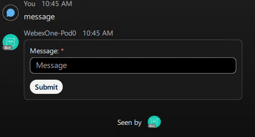{ width="450" style="display: block; margin: 0 auto; border: 1px solid lightgray; border-radius: 8px;" }

4. Enter a message and click **Submit**.

    The previous card will be deleted. You should then receive both your message and a formatted notification confirming that your message has been sent:

    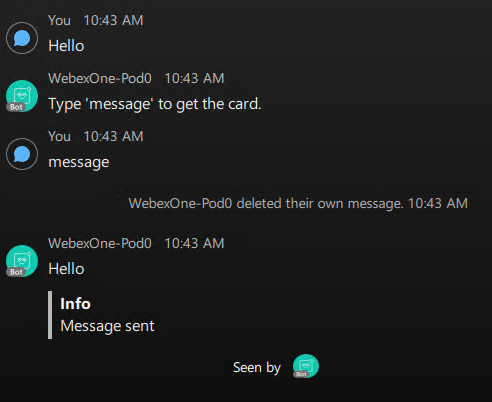{ width="500" style="display: block; margin: 0 auto; border: 1px solid lightgray; border-radius: 8px;" }

5. Observe how the card submission is printed in the console:

    ```terminal
    WebSocket connected as WebexOne-Pod0, waiting for messages...
    Message received from pod0@webexone-developer.wbx.ai: message
    Card action received: {'message': 'Hello from the card!'}
    ```

6. Stop the bot with **Ctrl+C** before moving to the next step.

## Step 3.8: Secure bot

Anyone in Webex can find your bot and send it a message, including users outside your organization. In this step, you will restrict the bot so it only answers users whose email belongs to the domain configured in your `.env` file.

1. In VS Code, navigate to your `.env` file and make sure that `DOMAIN` contains your organization's domain, without the `@` (for example, `webexone-developer.wbx.ai`).

2. Navigate to `03-bots/08_secure_bot.py` and review the code.

    This bot does the same as the card bot from Step 3.7, with a security check added in front of both handlers:

    - **Configuration:** the allowed domain is read from `DOMAIN` in the `.env` file, never written in the code. If it is missing, the bot refuses to start instead of answering everyone.
    - **`is_authorized()`:** uses **is_allowed_domain()** from the bot helpers to compare the domain of the sender's email with the allowed one. Blocked users receive a short explanation, and the attempt is printed in the console.
    - **Messages:** each message already includes the sender's email (`personEmail`), so `handle_message()` checks it before doing anything else.
    - **Card submissions:** a card submission only includes the sender's ID, so `handle_card_action()` looks up their email with `api.people.get()` first. This check is important too, because in a group space anyone can click **Submit** on a card the bot has sent.

    ??? Tip "Python Code"
        ```python
        import os
        from dotenv import load_dotenv
        from websocket_client import WebSocketClient
        from bot_helpers import get_api, send_message, send_card, delete_message, is_allowed_domain
        
        # Load environment variables from the .env file.
        load_dotenv()
        
        # Webex Bot Token for authentication with the Webex API.
        bot_token = os.getenv("BOT_TOKEN")
        api = get_api(bot_token)
        
        # Only users whose email belongs to this domain can use the bot.
        allowed_domain = os.getenv("DOMAIN")
        if not allowed_domain:
            raise SystemExit("Set DOMAIN in the .env file before starting the bot.")
        
        
        def is_authorized(room_id, email):
            """
            Checks the sender's email domain and tells blocked users why they got no answer.
            """
            if is_allowed_domain(email, [allowed_domain]):
                return True
        
            print(f"Blocked request from {email}")
            send_message(api, room_id, f"Sorry, this bot is only available to users in {allowed_domain}.")
            return False
        
        
        def handle_card_action(attachment_action, activity):
            """
            Executes when the Adaptive Card is submitted, but only for users in the allowed domain.
            """
            room_id = attachment_action.roomId
        
            # Card submissions only include the person ID, so look up their email first.
            # In group spaces anyone can press Submit, so this check matters here too.
            person = api.people.get(attachment_action.personId)
            if not is_authorized(room_id, person.emails[0]):
                return
        
            inputs = getattr(attachment_action, "inputs", {}) or {}
        
            # Extract the 'message' input from the submitted Adaptive Card's inputs.
            message_content = inputs.get("message")
        
            # Deletes the Adaptive Card message after submission.
            if getattr(attachment_action, "messageId", None):
                delete_message(api, attachment_action.messageId)
        
            # Create a direct message to the room with the extracted message content.
            if message_content:
                send_message(api, room_id, message_content)
                # Return a confirmation message, formatted as an info quote.
                send_message(api, room_id, "> **Info**\n> Message sent")
        
        
        def handle_message(message, activity):
            """
            Executes the 'message' command, but only for users in the allowed domain.
            """
            room_id = message.roomId
        
            # Messages already include the sender's email, so check it before doing anything else.
            if not is_authorized(room_id, message.personEmail):
                return
        
            text = (getattr(message, "text", "") or "").strip().lower()
            # In group spaces the text starts with the bot mention, so only check the last word.
            command = text.split()[-1] if text else ""
        
            # The keyword users type to activate this command.
            if command == "message":
                # Define the Adaptive Card structure for user input.
                card = {
                    "type": "AdaptiveCard",
                    "body": [
                        {
                            "type": "Input.Text",
                            "placeholder": "Message",
                            "id": "message",
                            "isRequired": True,
                            "errorMessage": "Message is required",
                            "label": "Message:"
                        }
                    ],
                    "$schema": "http://adaptivecards.io/schemas/adaptive-card.json",
                    "version": "1.3",
                    "actions": [
                        {
                            "type": "Action.Submit",
                            "title": "Submit",
                            "data": {
                                "callback_keyword": "message_callback" # This links to the card action handler.
                            }
                        }
                    ]
                }
        
                # Attach the Adaptive Card to the response.
                send_card(api, room_id, card, fallback_text="Please enter your message:")
            else:
                # Let the user know which keyword the bot understands.
                send_message(api, room_id, "Type 'message' to get the card.")
        
        
        # Create a WebSocket Client object.
        bot = WebSocketClient(access_token=bot_token,         # Authenticate the bot using its token.
                              on_message=handle_message,      # Registers the message handler.
                              on_card_action=handle_card_action) # Registers the callback command for card submissions.
        
        # Start the bot and make it listen for incoming messages.
        bot.run()
        ```

3. Execute the code with the following command and let it run:

    - python 08_secure_bot.py

    !!! Warning
        Wait until you see **WebSocket connected as WebexOne-*USERNAME*, waiting for messages...** in the console.

4. Send **message** to your bot. Your email belongs to the allowed domain, so the bot works exactly like in Step 3.7:

    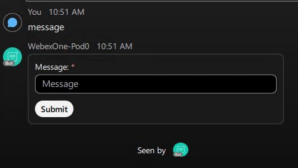{ width="500" style="display: block; margin: 0 auto; border: 1px solid lightgray; border-radius: 8px;" }

5. Now test what a user from another organization would see. Stop the bot with **Ctrl+C**, change `DOMAIN` in your `.env` file to `example.com`, save the file, and run the bot again:

    - python 08_secure_bot.py

6. Send **message** to your bot again. This time, the bot does not send the card and replies with:

    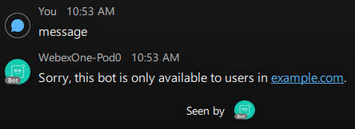{ width="450" style="display: block; margin: 0 auto; border: 1px solid lightgray; border-radius: 8px;" }

    The blocked attempt is also printed in the console:

    ```terminal
    WebSocket connected as WebexOne-Pod0, waiting for messages...
    Message received from pod0@webexone-developer.wbx.ai: message
    Blocked request from pod0@webexone-developer.wbx.ai
    ```

7. Stop the bot with **Ctrl+C** and change `DOMAIN` in your `.env` file back to your organization's domain.
