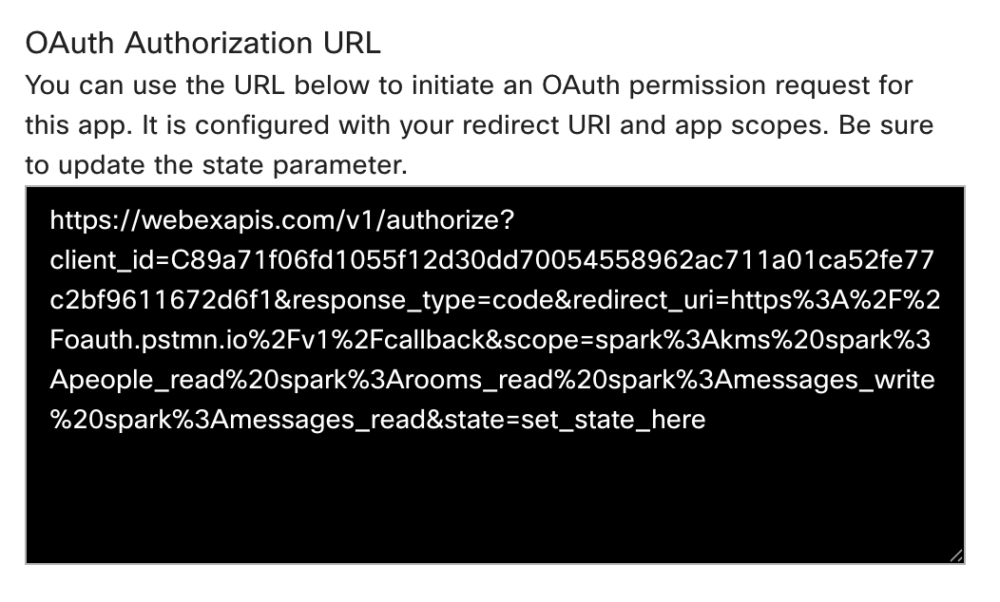
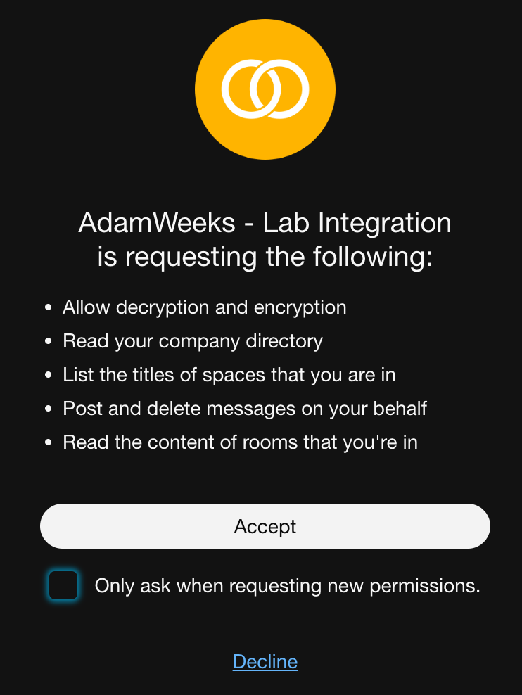
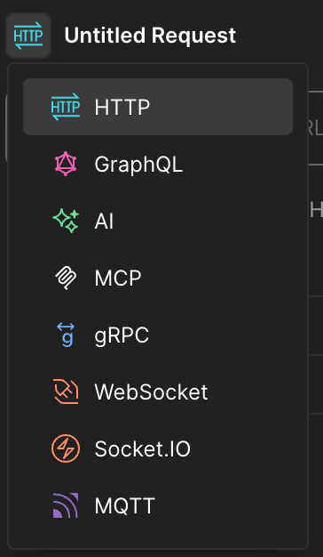
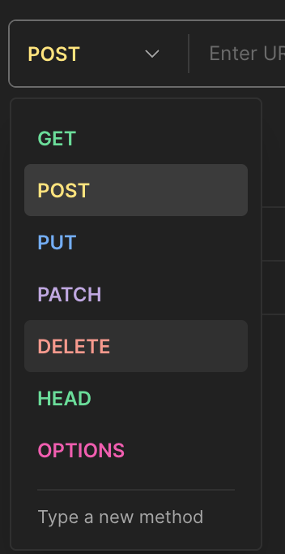
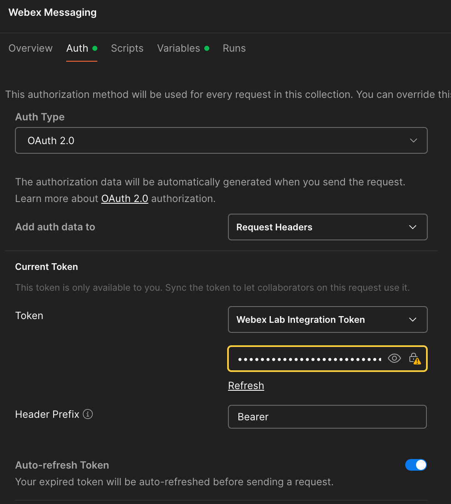

# 2 – Creating an Integration (Postman)

!!! Note
    This is the **legacy Postman version**. For the 2026 lab, use **[Lab 2 - Creating an Integration](lab3_creating-an-integration-bruno.md)** with Bruno instead.

In Chapter 1, you used a temporary developer token for quick API tests. While convenient, this isn't how real-world applications securely access user data. This chapter introduces **Webex Integrations** and the **OAuth 2.0 Authorization Code Flow**, the standard for third-party applications to get secure, user-consented access to Webex APIs. You'll create your own integration, perform a manual OAuth flow, and then configure Postman to handle it seamlessly.

Upon completion of this section, you will be able to:

1. Create a Webex Integration
2. Perform a manual OAuth 2.0 authorization flow
3. Configure OAuth 2.0 authentication in Postman
4. Make API requests with the obtained token in Postman

## Step 2.1: Create Your Webex Integration on the Developer Portal

First, you need to register your "application" (in this case, our Postman setup) with Webex. This process gives you a Client ID and Client Secret, which are essential for the OAuth flow.

1. **Navigate to "My Apps" on the Developer Portal:**
   * Open your browser and go to https://developer.webex.com/my-apps.
   * Ensure you are logged in with your **lab credentials**.
2. **Create a New Integration:**
   * Click the **"Create an Integration"** button.
3. **Fill in Integration Details:**
   * **Integration Name:** [Your Name/ID] - Lab Integration (e.g., JaneDoe-Lab Integration)
   * **Description:** Webex One Lab Integration for API testing.
   * **Icon:** Pick your favorite color icon.
   * **App Hub Description:** “Postman Integration for the Webex One 2026 Lab”
   * **Redirect URI(s):** This is critical! For Postman's built-in OAuth helper, we'll use a specific callback URL. Enter: https://oauth.pstmn.io/v1/callback
   * **Scopes:** These define what permissions your integration will request from the user. Check the following boxes:
   * spark:messages_write
   * spark:messages_read
   * spark:people_read
   * spark:rooms_read
   * Click **"Add Integration"**.
4. **Record Your Client ID and Client Secret:**
   * After creation, you'll see your integration's details. **Copy and save your Client ID and Client Secret and OAuth Authorization URL** to a temporary text file or notepad. These are sensitive credentials and will be needed shortly.
   * For best results, leave this page open for the rest of the lab.
   * *Note:* The Client Secret is only shown once. If you lose it, you'll have to regenerate it.

## Step 2.2: Manual OAuth 2.0 Authorization Code Flow (Browser + API Call)

Now, let's manually walk through the steps a user and an application would take to get an access token using the Authorization Code flow. This will help you understand the underlying mechanics.

1. **Use the Authorization URL:**
   * Copy the **“OAuth Authorization URL”** from the Integration Details page  
     { width="850" style="display: block; margin: 0 auto; border: 1px solid lightgray; border-radius: 8px;" }  
     Paste this URL into your browser's address bar:
   * *Query Params Explanation:*
   * response_type=code: We want an authorization code.
   * client_id: Your integration's unique ID.
   * redirect_uri: Where Webex sends the user back after authorization. Must match what you registered.
   * scope: The permissions we're requesting.
   * state: An optional parameter for security, usually a random string.?
2. **Authorize the Integration (User Consent):**
   * Press Enter to navigate to the constructed URL.
   * You'll be prompted to log in to Webex (if not already) and then asked to grant permission to your [Your Name/ID] - Lab Integration for the requested scopes.  
     { width="700" style="display: block; margin: 0 auto; border: 1px solid lightgray; border-radius: 8px;" }
   * Uncheck the **“Only ask when requesting new permissions.”** checkbox. This way, when we authorize again later, we will see the same dialog.
   * Click **"Accept"**
3. **Capture the Authorization Code:**
   * Webex will redirect your browser to https://oauth.pstmn.io/v1/callback?code=YOUR_AUTHORIZATION_CODE&state=set_by_app.
   * **Copy the authorization code value** from the URL in your browser's address bar. This is your temporary authorization code.
4. **Exchange the Code for an Access Token (Postman API Call):**
   * Open Postman.
   * Create a new HTTP Request (click the + tab).
   * If it doesn’t say “HTTP”, you will need to change the type.  
     { width="400" style="display: block; margin: 0 auto; border: 1px solid lightgray; border-radius: 8px;" }
   * Set the request method type to **POST**.  
     { width="400" style="display: block; margin: 0 auto; border: 1px solid lightgray; border-radius: 8px;" }
   * Set the URL to: https://webexapis.com/v1/access_token
   * Go to the **"Body"** tab, select **x-www-form-urlencoded**.
   * Add the following key-value pairs:
     + Grant Type
       1. **KEY:** grant_type
       2. **VALUE:** authorization_code
     + Client ID
       1. **KEY:** client_id
       2. **VALUE:** YOUR_CLIENT_ID (Paste your Client ID)
     + Client Secret
       1. **KEY:** client_secret
       2. **VALUE:** YOUR_CLIENT_SECRET (Paste your Client Secret)
     + Auth Code
       1. **KEY:** code
       2. **VALUE:** YOUR_AUTHORIZATION_CODE (Paste the code you captured in step 3)
     + Redirect
       1. **KEY:** redirect_uri
       2. **VALUE:** https://oauth.pstmn.io/v1/callback
   * Click **"Send"**.
5. **Observe the Token Response:**
   * You should receive a 200 OK response containing your access_token, refresh_token, expires_in (how long the access token is valid), and scope.
   * **Copy your new access_token**. This token was generated via your integration and user consent, making it a more secure way to access Webex APIs on behalf of a user.
6. **Update Postman Collection with New Token:**
   * In your personal Postman workspace, navigate to your forked **"Webex Messaging"** collection.
   * Click on the collection name in the left sidebar, then select the **"Variables"** tab in the main window.
   * Find the webex_token variable you created in Chapter 1.
   * Paste the webex_token you just copied from step 5 into the **" Value"** column for webex_token.
7. **Make an API Call with the Integration Token (List Rooms):**
   * In your forked "Webex Messaging" collection, expand the **"Rooms"** folder.
   * Click on the **GET List Rooms** request (which corresponds to GET /v1/rooms).
   * Click the blue **"Send"** button.
   * You should receive a 200 OK response. Verify that the rooms listed are correct for your lab account. This call was made using the access_token obtained through your integration!

## Step 2.3: Configure OAuth 2.0 in Postman for Your Integration

Manually performing the OAuth flow is cumbersome. Postman has built-in support to automate much of this. Let's configure your forked "Webex Messaging" collection to use your new integration.

1. **Open Your Forked "Webex Messaging" Collection:**
   * In your personal Postman workspace, navigate to your forked "Webex Messaging" collection.
2. **Access Collection Authorization Settings:**
   * Click on your forked **"Webex Messaging"** collection in the left sidebar.
   * In the main Postman window, click the **"Authorization"** tab.
3. **Configure OAuth 2.0:**
   * For the **TYPE**, select **"OAuth 2.0"**.
   * Fill in the following details in the "GET NEW ACCESS TOKEN" window:
     + **Token Name:** Webex Lab Integration Token
     + **Grant Type:** Authorization Code
     + **Callback URL:** https://oauth.pstmn.io/v1/callback (This must match your registered Redirect URI)
     + **Auth URL:** https://webexapis.com/v1/authorize
     + **Access Token URL:** https://webexapis.com/v1/access_token
     + **Client ID:** YOUR_CLIENT_ID (Paste your Client ID from 2.1.4)
     + **Client Secret:** YOUR_CLIENT_SECRET (Paste your Client Secret from 2.1.4)
     + **Scope:** spark:people_read spark:rooms_read spark:messages_write spark:messages_read (Ensure these match what you registered, separated by spaces)
     + **Client Authentication:** Send client credentials in body
   * Scroll down and click **"Get New Access Token"**.
   * Click **"Proceed"**.
4. **Authorize in Browser:**
   * Postman will open a browser window. You'll be prompted to log in to Webex (if necessary) and grant permission to your [Your Name/ID] - Lab Integration.
   * Click **"Accept"** or **"Authorize"**.
5. **Postman Retrieves Token:**
   * The browser will redirect, and Postman will automatically capture the authorization code and exchange it for an access token.
   * In the "MANAGE ACCESS TOKENS" window, you should see your Webex Lab Integration Token listed.
   * Click **"Use Token"**.
6. **Verify Collection Authorization:**
   * Back in the collection's "Authorization" tab, the "Token" field should now show your Webex Lab Integration Token selected.
   * Click **"Save"** for the collection.

{ width="850" style="display: block; margin: 0 auto; border: 1px solid lightgray; border-radius: 8px;" }

(Your auth screen should look like this now)

## Step 2.4: Make API Requests with Your Integration Token

Now that your Postman collection is configured to use the OAuth 2.0 flow, all requests within it will automatically use the access token obtained through your integration.

1. **Retrieve Your Own User Details (GET /v1/people/me):**
   * In your forked “Webex Messaging” collection, expand the **“People API”** folder.
   * Click on the **GET Get My Own Details** request.
   * In the main request window, ensure the “Authorization” tab shows “Inherit auth from parent” or “Bearer Token” with the Webex Lab Integration Token selected.
   * Click the blue **“Send”** button.
   * You should receive a 200 OK response with your user details. This time, the token came from your integration!
2. **Send a Message to Your Lab Space (POST Create a Message):**
   * In your forked “Webex Messaging” collection, expand the **“Messages API”** folder.
   * Click on the **POST Create a Message** request.
   * In the “Body” tab, replace `{{roomId}}` with the id of your lab space (you can get this from the GET List Rooms request if you don’t have it handy from Chapter 1).
   * Change the text field to: “text”: “Hello from my Webex Integration via Postman!”.
   * Click the blue **“Send”** button.
   * Check your Webex client – the message should appear, sent using your integration’s permissions.

Congratulations! You've successfully created a Webex Integration, understood the OAuth 2.0 flow, and used it to securely make API requests. This is a fundamental concept for building robust Webex applications.
