# 3 – Building a Bot

Upon completion of this section, you will be able to:

1. Create a **Bot** in Webex.
2. Send a message and find people using the Bot using Python.
3. Create a room and add a person using the Bot using Python.
4. Create and send and Adaptive Card.
5. Create an interactive bot using webex_bot python library.

Reference:  
<https://developer.webex.com/messaging/docs/bots>

## Step 3.1: Create a Bot

First you need to create your bot:

1. Log into [developer.webex.com](https://developer.webex.com/) with credentials that were provided.
2. Up on the top right corner of the page, click your avatar and then select ‘My Webex Apps’.
3. On the ‘Create a New App’ page, find the Bot card and click the ‘Create a Bot’ button.

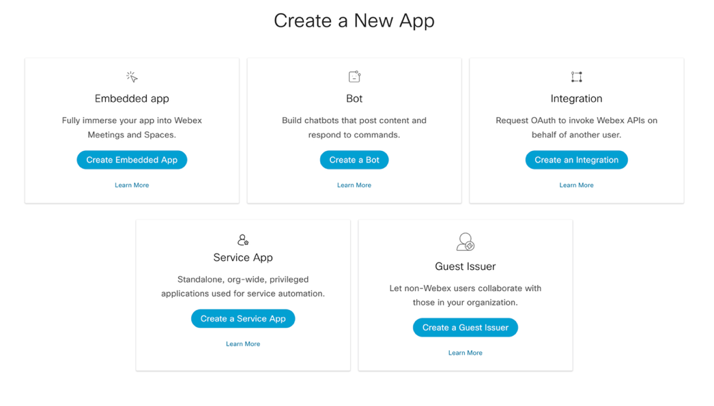{ width="850" style="display: block; margin: 0 auto; border: 1px solid lightgray; border-radius: 8px;" }

1. Fill out the webform to register a new service app.  
   1. **Bot Name:** WebexOne-*USERNAME*
   2. **Bot Username:** WebexOne-*USERNAME*
   3. **Icon:** *Select any color icon*.
   4. **Description**: “Bot for WebexOne”

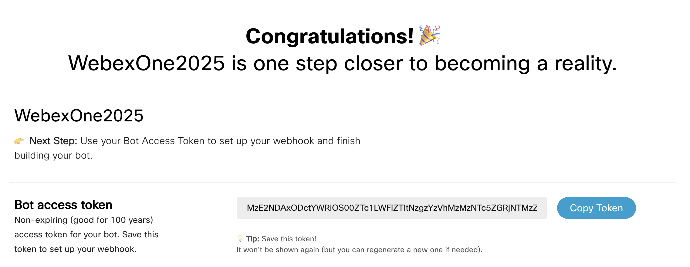{ width="850" style="display: block; margin: 0 auto; border: 1px solid lightgray; border-radius: 8px;" }

!!! Warning
    Copy your **Bot access token** in your .env file as **BOT_TOKEN**.

    { width="150" style="display: block; margin: 0 auto; border: 1px solid lightgray; border-radius: 8px;" }

## Step 3.2: Send a message to yourself

In this step, you will send your first 1:1 message using the bot you just created. There are two options to achieve this:

1. In VS Code navigate to your .env file, and make sure to fill and save the following variables:
   * BOT_TOKEN
   * EMAIL
   * DOMAIN
2. Navigate to 03-bots/01_people.py and review the code. You will notice that there are two functions **find_people** and **all_people**.

    !!! Warning
        **all_people** will not work if you are using a bot token as it requires admin privileges.

        { width="150" style="display: block; margin: 0 auto; border: 1px solid lightgray; border-radius: 8px;" }

3. Make sure that in your terminal you are in the right folder:
   * cd 03-bots
4. Run your code with the following command:  
   * python 01_people.py
5. You should see the following in the console:  
     
   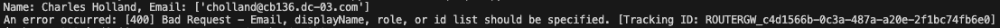{ width="850" style="display: block; margin: 0 auto; border: 1px solid lightgray; border-radius: 8px;" }
6. Navigate to 03-bots/02_message.py and review the code. You will be using the function you created earlier to find yourself, so you can send a message to your own account.
7. Run your code with the following command:  
   * python 02_message.py

You should have received now the following message:

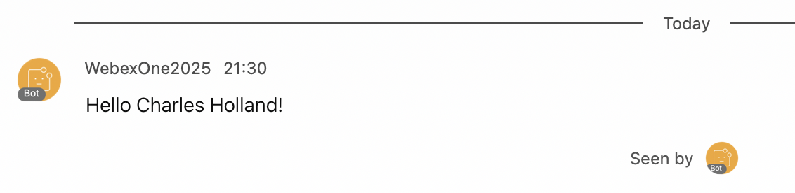{ width="850" style="display: block; margin: 0 auto; border: 1px solid lightgray; border-radius: 8px;" }

## Step 3.3: Create a Room and add yourself

In this step, you will create a room with your bot and add your user to it.

1. Navigate to 03-bots/03_rooms.py and review the code.  
     
   There are two functions, one to create the room **create_webex_room** and another one to add a person to it **add_person_to_room**.
2. Run your code with the following command:  
   * python 03_rooms.py
3. You will see all the steps printed in the console:  
     
   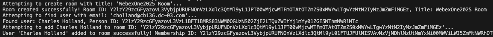{ width="850" style="display: block; margin: 0 auto; border: 1px solid lightgray; border-radius: 8px;" }  
     
   You should also see the newly created room appear in your Webex App:  
     
   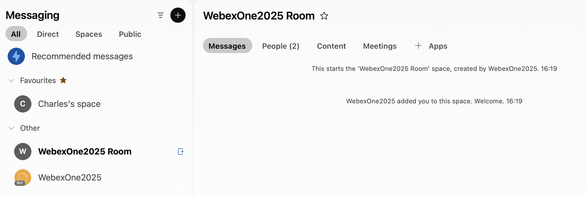{ width="850" style="display: block; margin: 0 auto; border: 1px solid lightgray; border-radius: 8px;" }

## Step 3.4: Adaptive card

In this step, you will explore how to create and send an Adaptive Card.

1. Navigate to 03-bots/04_adaptivecard and review the code.  
     
   You will notice that card content example, but ideally you will create your own card.
2. Navigate to the Buttons and Cards Designer:  
   * <https://developer.webex.com/buttons-and-cards-designer>
3. Use the UI to create your own card. Experiment with the available options to understand how they work. Once you’re ready, your card’s JSON code will appear below in the Card Payload Editor.

    !!! Warning
        When you copy the code from the Card Payload Editor, make sure to change **true** to **True** so it works correctly in Python.

        { width="700" style="display: block; margin: 0 auto; border: 1px solid lightgray; border-radius: 8px;" }

4. Now, run your code with the following command:
   * python 04_adaptivecard.py

If you have used the example card, you should receive the following:  
  
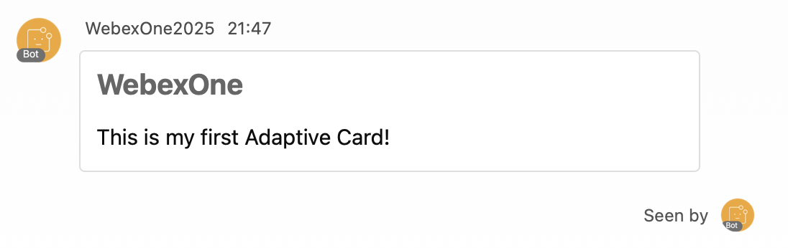{ width="850" style="display: block; margin: 0 auto; border: 1px solid lightgray; border-radius: 8px;" }

## Step 3.5: webex_bot

In this step and the following ones, you will work with the webex_bot library to get familiar with all the available options. You’ll start with example cards and functions, and then learn how to add your own.

1. Navigate to 03-bots/05_webex_bot.py and review the code.  
     
   In this first example, you will use the default cards and functions provided to understand how the process works.
2. Execute the code with the following command and let it run:  
   * python 05_webex_bot.py

!!! Warning
    Wait until you see the message “WebSocket Opened.” appear in the console.

    { width="700" style="display: block; margin: 0 auto; border: 1px solid lightgray; border-radius: 8px;" }

1. Send any message to your bot, and it will respond with the following card using the default function:  
     
   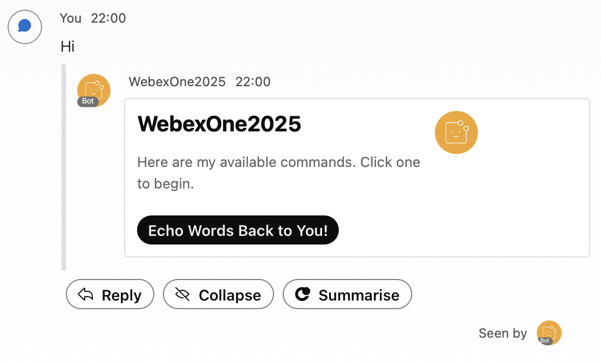{ width="850" style="display: block; margin: 0 auto; border: 1px solid lightgray; border-radius: 8px;" }
2. It is interesting to see how all the events are reflected in the console:  
     
   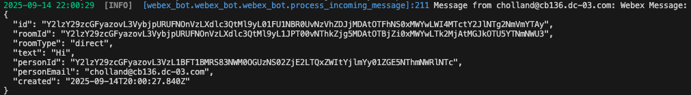{ width="850" style="display: block; margin: 0 auto; border: 1px solid lightgray; border-radius: 8px;" }
3. Once you click “Echo Words Back to You!”, an action will be executed and you will receive the following cards:  
     
   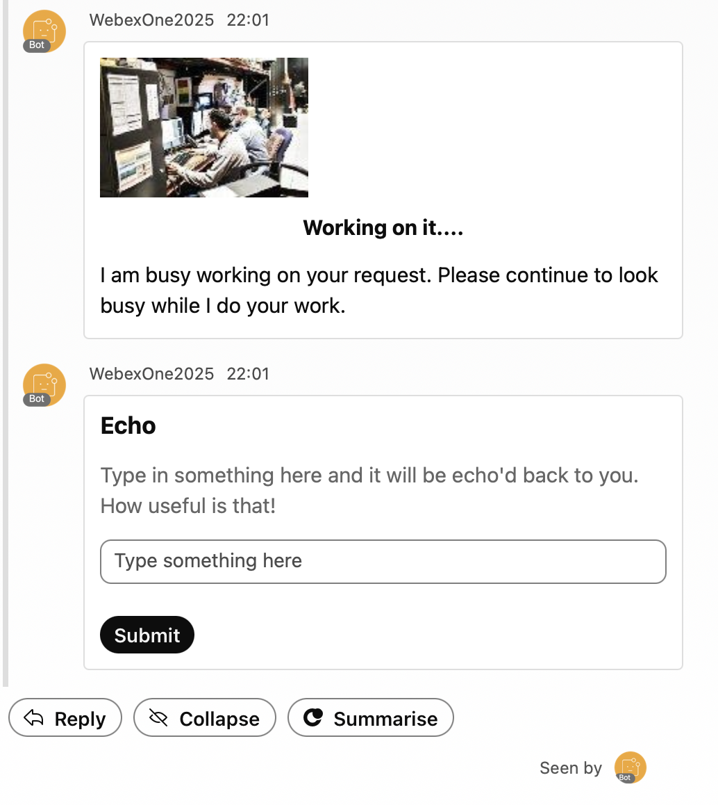{ width="850" style="display: block; margin: 0 auto; border: 1px solid lightgray; border-radius: 8px;" }
4. New event is also reflected in the console:  
     
   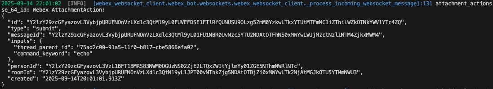{ width="850" style="display: block; margin: 0 auto; border: 1px solid lightgray; border-radius: 8px;" }
5. Type something in the box and click Submit. You should receive a new message, and the previous card will be deleted:   
     
   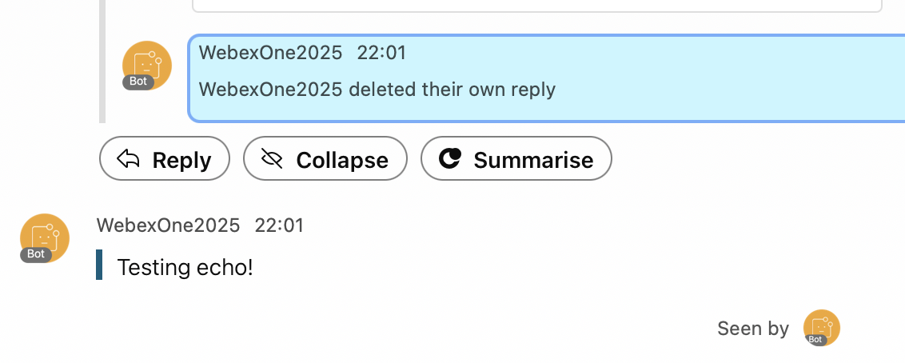{ width="850" style="display: block; margin: 0 auto; border: 1px solid lightgray; border-radius: 8px;" }
6. You should be able to see the message you sent in the console:  
     
   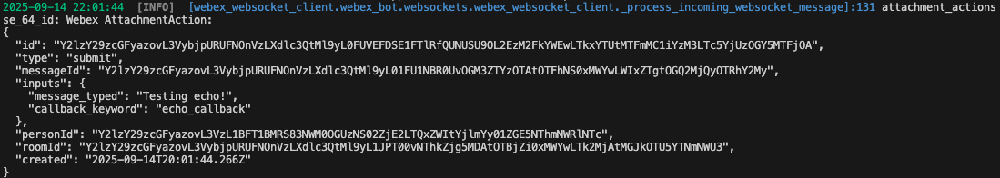{ width="850" style="display: block; margin: 0 auto; border: 1px solid lightgray; border-radius: 8px;" }

## Step 3.6: webex_bot – Create your own function

In this step, you will learn how to create your own function and add it to the bot.

1. Navigate to 03-bots/06_webex_bot-2.py and review the code.

    You will be using WebexPythonSDK to send a message as shown previously.

    !!! Note
        Some changes have been made:

        - **approved_domains** is used to restrict bot access to people inside your domain.
        - **include_demo_commands** is set to False to hide the Echo function.
        - **delete_previous_message** is set to True to delete the previous card and avoid duplicate actions.
        - **bot_name** is the name that the bot will display on the cards.
        - **command_keyword** is the text that you can use to invoke a function instead of the assistant.
        - **help_message** will be the name of your function.

        { width="700" style="display: block; margin: 0 auto; border: 1px solid lightgray; border-radius: 8px;" }

You can also access the information previously displayed in the console from the **attachment_actions** variable.

2. Execute the code with the following command and let it run:

    - python 06_webex_bot-2.py

!!! Warning
    Wait until you see the message “WebSocket Opened.” appear in the console.

    { width="700" style="display: block; margin: 0 auto; border: 1px solid lightgray; border-radius: 8px;" }

3. Send any message to your bot and you will get the following card with your new function **Send Hello!**:
     
   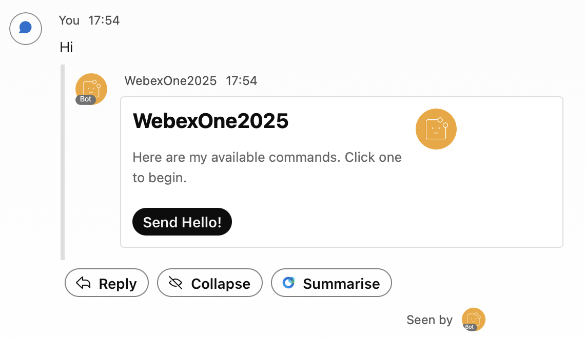{ width="850" style="display: block; margin: 0 auto; border: 1px solid lightgray; border-radius: 8px;" }
2. Click **Send Hello!**. The card will be deleted, you will receive a new message confirming that the message has been sent, and you should also see your **Hello!** message:  
     
   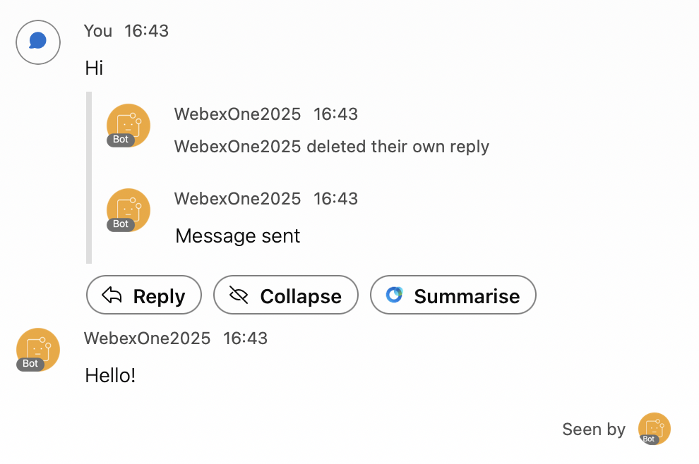{ width="850" style="display: block; margin: 0 auto; border: 1px solid lightgray; border-radius: 8px;" }
3. To directly invoke this function, you can text your bot with **message** keyword. This will automatically send you the **Hello!** message:  
     
   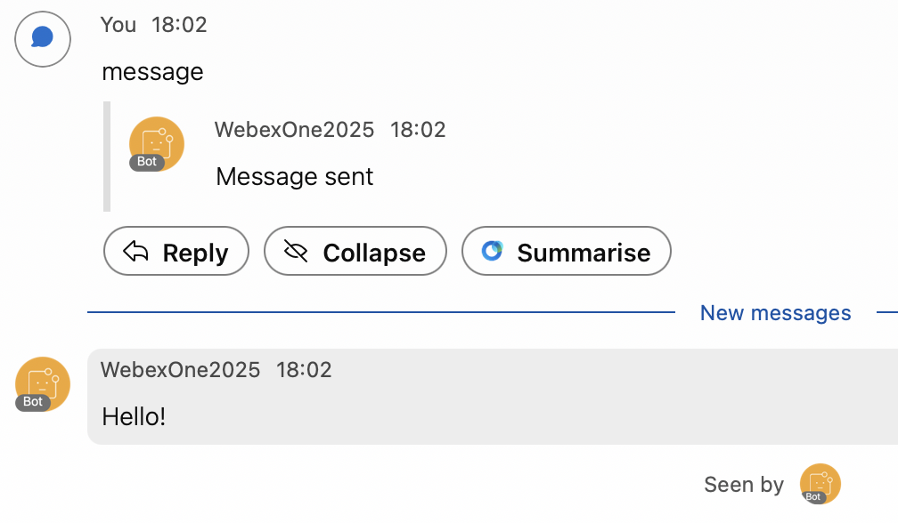{ width="850" style="display: block; margin: 0 auto; border: 1px solid lightgray; border-radius: 8px;" }

## Step 3.7: webex_bot – Adaptive card processing

In this final step, you will send an Adaptive Card with multiple fields and use the submitted data to trigger an action.

1. Navigate to 03-bots/07_webex_bot-3.py and review the code.

    !!! Note
        Some changes have been added:

        - **chained_commands** are the functions that will trigger this function when card data is submitted.
        - **quote_info** formats your response.
        - **Response** object allows you to send the Adaptive Card.

        { width="700" style="display: block; margin: 0 auto; border: 1px solid lightgray; border-radius: 8px;" }

2. Execute the code with the following command and let it run:

    - python 07_webex_bot-3.py

!!! Warning
    Wait until you see the message “WebSocket Opened.” appear in the console.

    { width="700" style="display: block; margin: 0 auto; border: 1px solid lightgray; border-radius: 8px;" }

3. Text **message** to your bot to invoke your function directly:
     
   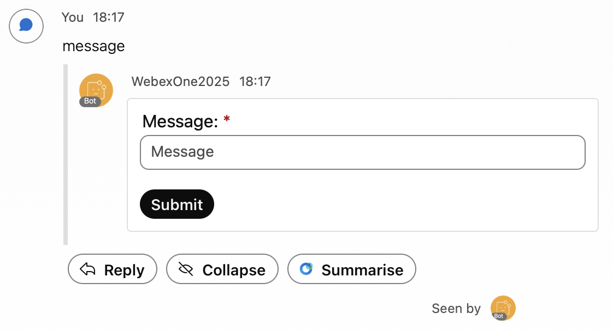{ width="850" style="display: block; margin: 0 auto; border: 1px solid lightgray; border-radius: 8px;" }
2. Enter a message and click Submit.  
     
   The previous card will be deleted. You should then receive both your message and a formatted notification confirming that your message has been sent:

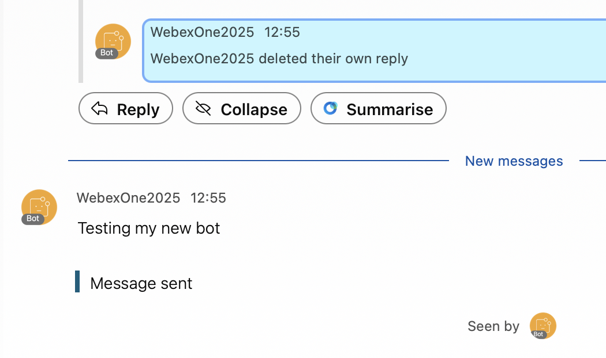{ width="850" style="display: block; margin: 0 auto; border: 1px solid lightgray; border-radius: 8px;" }
