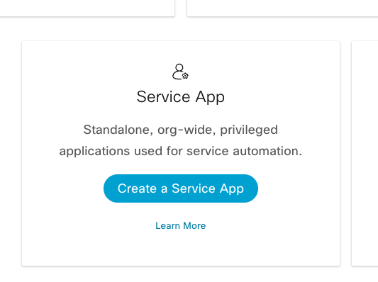
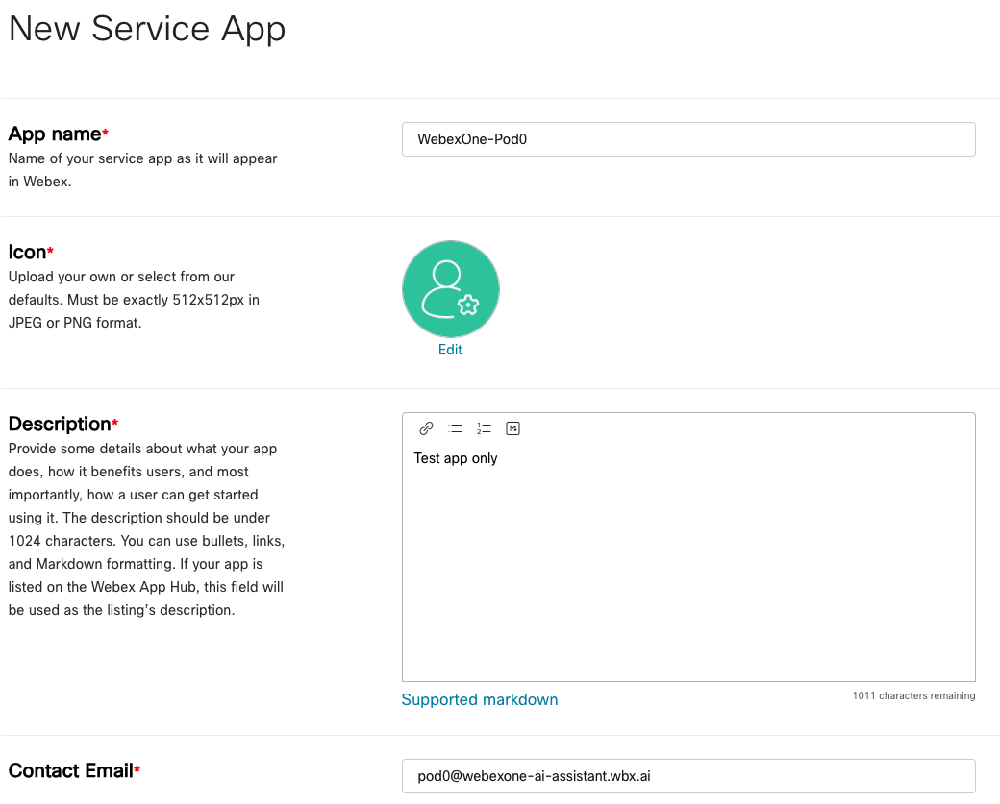
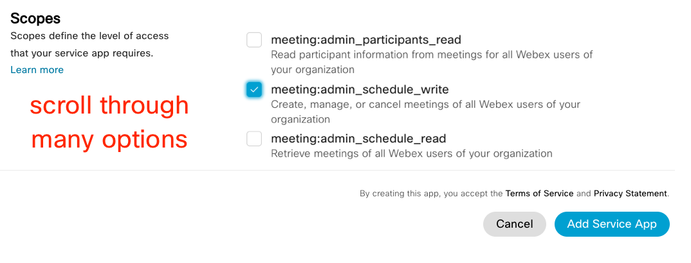
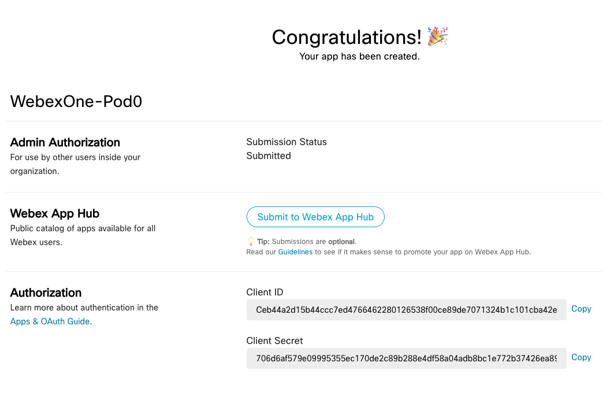
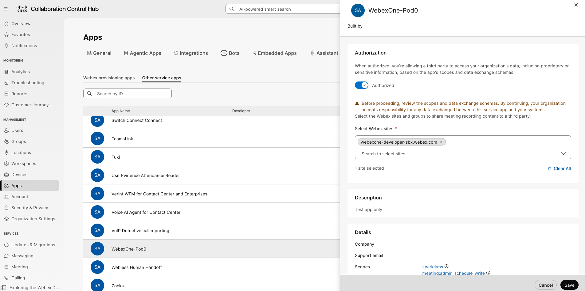
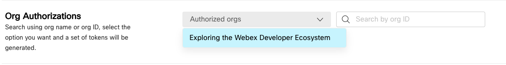
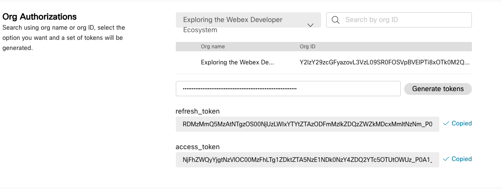
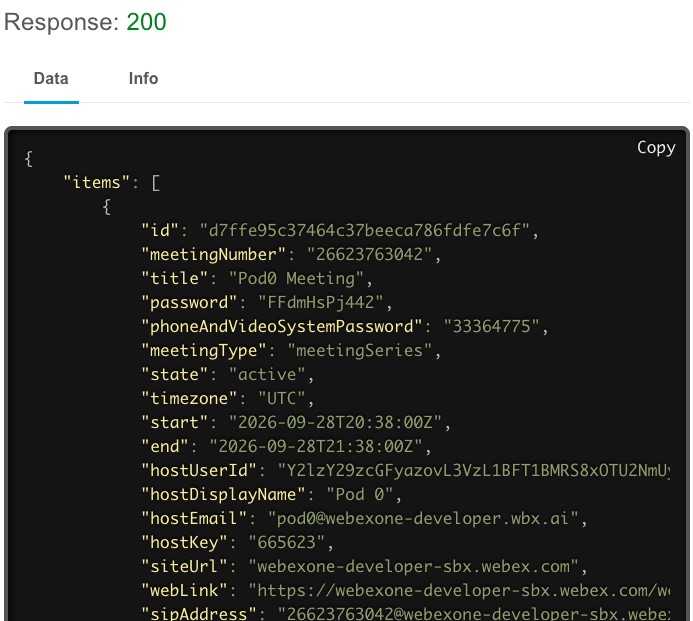

# Lab 4 – Deploying a Meeting Scheduler Service App

In this section, you will create a Service App that schedules a meeting on behalf of a user. Unlike a bot, a Service App does not act as itself: it acts on behalf of the organization, with permissions (scopes) that a Webex administrator must authorize in Control Hub. Once authorized, it receives an access token to call the APIs and a refresh token to get a new access token when the current one expires.

Upon completion of this section, you will be able to:

1. Create a **Service App** in Webex.
2. Request admin authorization to allow the Service App and observe the admin tasks in Control Hub.
3. Retrieve an access and refresh token to be used in a sample Service App.
4. Configure a sample Python-based Service App with the access and refresh token.
5. Run the sample Service App with admin permissions to schedule a meeting on behalf of a test user.
6. Verify the scheduled meeting in Webex.

## Step 4.1: Create a Webex Service App

First, you need to register a Service App in the Webex Developer portal.

1. In the [Webex for Developers](https://developer.webex.com/){:target="_blank"} portal, on the top right corner of the page, click your avatar and then select **[My Webex Apps](https://developer.webex.com/my-apps)**{:target="_blank"}.
2. On the **Create a New App** page, find the Service App card and click the **Create a Service App** button.

    { width="500" style="display: block; margin: 0 auto; border: 1px solid lightgray; border-radius: 8px;" }

3. Fill out the webform to register a new service app.

    1. **App Name:** WebexOne-*USERNAME*
    2. **Icon:** *Select any color icon*.
    3. **Description**: `Test app only`
    4. **Contact Email**: Use the email from the Webex login.

    { width="800" style="display: block; margin: 0 auto; border: 1px solid lightgray; border-radius: 8px;" }

4. **Select Scopes:** `meeting:admin_schedule_write`

    This scope allows the app to schedule meetings on behalf of any user in the organization.

    { width="800" style="display: block; margin: 0 auto; border: 1px solid lightgray; border-radius: 8px;" }

5. Click the **Add Service App** button to finish registration.

## Step 4.2: Request Admin Authorization

After successfully registering the Service App, you are taken to a page that contains a *Client ID* and *Client Secret*. This is also where you request admin authorization for the Service App.

1. Open `.env` in Visual Studio Code, then copy and paste the **Client ID** and **Client Secret** values:

    ```env
    CLIENTID=
    SECRETID=
    ```

    !!! Warning
        The Client Secret is only shown once. If you lose it, you will need to regenerate it.

2. Click the **Request admin authorization** button.

    { width="750" style="display: block; margin: 0 auto; border: 1px solid lightgray; border-radius: 8px;" }

    !!! Warning "Important"
        The lab instructor will demonstrate the actions taken by the Webex administrator to authorize a Service App in Control Hub.

        A Webex Administrator must then go to **Collaboration Control Hub** -> **Apps** -> **Service Apps**, select your app, and click **Authorize**.

        { style="display: block; margin: 0 auto; border: 1px solid lightgray; border-radius: 8px;"}

## Step 4.3: Retrieve the Access and the Refresh Token

After the admin authorizes your Service App registration, you can retrieve the access tokens.

1. Refresh the page that displays the *Client ID* and *Client Secret*.
2. In the **Org Authorizations** section, select the **Exploring the Webex Developer Ecosystem** org from the dropdown menu:

    { width="800" style="display: block; margin: 0 auto; border: 1px solid lightgray; border-radius: 8px;"}
    
3. Paste the *Client Secret* value from your `.env` file (`SECRETID`) in the field below, then click the **Generate tokens** button:

    { width="800" style="display: block; margin: 0 auto; border: 1px solid lightgray; border-radius: 8px;"}

4. Open `.env` in Visual Studio Code, then copy and paste the **access_token** and **refresh_token** values:

    ```env
    WEBEX_ACCESS_TOKEN=
    REFRESH_TOKEN=
    ```

    !!! Warning
        Both values are only shown once. Treat them like passwords: they allow anyone who has them to schedule meetings in your organization.

## Step 4.4: Configure the Sample Service App

Now that the access and refresh tokens are in your `.env` file, the sample Python app can use them. The script reads them automatically, so you do not need to paste them into the code.

1. Navigate to `04-serviceapps/01_serviceapp.py` and review the code.

    The script has two functions:

    - **create_meeting()** calls the Meetings API with the access token. The `hostEmail` field tells Webex which user the meeting is scheduled for; this is what the `meeting:admin_schedule_write` scope allows.
    - **get_tokens_refresh()** exchanges the refresh token for a new access token. Access tokens expire, so if the first call returns `401 Unauthorized`, the script refreshes the token and tries again.

    ??? Tip "Python Code"
        ```python
        import requests
        import json
        import os
        import datetime
        from dotenv import load_dotenv
        
        # Load environment variables from the .env file
        load_dotenv()
        
        clientID = os.getenv("CLIENTID") # Client ID for your Webex service app
        secretID = os.getenv("SECRETID") # Client Secret for your Webex service app
        access_token = os.getenv("WEBEX_ACCESS_TOKEN") # Access token obtained after admin authorization
        refresh_token = os.getenv("REFRESH_TOKEN") # Refresh token obtained after admin authorization
        email = os.getenv("EMAIL") # Email address of the host for meeting creation.
        
        """
        Function Name : get_tokens_refresh()
        Description : This is a utility function that leverages the refresh token
                      in exchange for a fresh access_token and refresh_token
                      when a 401 is received when using an invalid access_token
                      while making an api_call().
                      NOTE: in production, auth tokens would not be stored
                      in a Session. This app will request a new token each time
                      it runs which will not be able to check against expired tokens. 
        """
        def get_tokens_refresh():
            print("function : get_token_refresh()")
            
            url = "https://webexapis.com/v1/access_token"
            headers = {'accept':'application/json','content-type':'application/x-www-form-urlencoded'}
            payload = ("grant_type=refresh_token&client_id={0}&client_secret={1}&"
                            "refresh_token={2}").format(clientID, secretID, refresh_token)
            req = requests.post(url=url, data=payload, headers=headers)
            results = json.loads(req.text)
        
            print("Token returned in refresh result : ", results["access_token"])
            print("Refresh Token returned in refresh result : ", results["refresh_token"])
            return results["access_token"], results["refresh_token"]
        
        """
        Function Name : create_meeting()
        Description : This is a function that uses the access_token 
                      to create a meeting on behalf of a subuser in 
                      a webex organization.
        """
        def create_meeting() :
            # Calculate meeting start and end times (24 and 25 hours from now, respectively)
            my_date_start = (datetime.datetime.now() + datetime.timedelta(hours=24)).replace(microsecond=0).isoformat()
            my_date_end = (datetime.datetime.now() + datetime.timedelta(hours=25)).replace(microsecond=0).isoformat()
        
            body = {
            'title': 'Example Meeting Title',                  # String, Required | Meeting title. The title can be a maximum of 128 characters long.
            'start': my_date_start,                            # String, Required | https://en.wikipedia.org/wiki/ISO_8601 format
            'end':   my_date_end,                              # String, Required | Replace the start/end with the times you'd like
            'hostEmail' : email
            }
        
            headers = {
                'Authorization': f'Bearer {access_token}',         # https://oauth.net/2/bearer-tokens/
                'Content-Type': 'application/json',                # https://developer.mozilla.org/en-US/docs/Learn/JavaScript/Objects/JSON
            }
        
            response = requests.post('https://webexapis.com/v1/meetings', headers=headers, data=json.dumps(body)) # https://developer.webex.com/docs/meetings
        
            if response.status_code == 200:
                print('statusCode:', response.status_code)
                print(response.json())
            else:
                print('Error:', response.status_code, response.text)
            return response
        
        #the below line is commented out, but will force the app to produce a 401 and invoke the refresh token function
        #access_token += 'joe'
        
        #print("before call", access_token)
        response = create_meeting()
        
        if (response.status_code == 401) :
            access_token, refresh_token = get_tokens_refresh()
            create_meeting()
        ```

2. In `create_meeting()`, update the meeting title so you can recognize your meeting later, for example:

    ```python
    body = {
    'title': 'Pod0 Meeting',                  # String, Required | Meeting title. The title can be a maximum of 128 characters long.
    'start': my_date_start,                            # String, Required | https://en.wikipedia.org/wiki/ISO_8601 format
    'end':   my_date_end,                              # String, Required | Replace the start/end with the times you'd like
    'hostEmail' : email
    }
    ```

3. Save the file.

!!! Warning
    The meeting is scheduled for the user in `EMAIL` in your `.env` file, and that user needs a Webex Meetings license. If they do not have one, the API returns `404 Cannot find the data`.

## Step 4.5: Run the Sample Service App

1. Change to the service app folder:

    - cd ../04-serviceapps

2. Run the sample app:

    - python 01_serviceapp.py

3. A successful run prints `statusCode: 200` and the meeting details in JSON format:

    ```terminal
    statusCode: 200
    {'id': 'd7ffe95c37464c37beeca786fdfe7c6f', 'meetingNumber': '26623763042', 'title': 'Pod0 Meeting', 'password': '<redacted>', 'phoneAndVideoSystemPassword': '<redacted>', 'meetingType': 'meetingSeries', 'state': 'active', 'timezone': 'UTC', 'start': '2026-09-28T20:38:00Z', 'end':'2026-09-28T21:38:00Z', 'hostUserId': 'Y2lzY29zcGFyazovL3VzL1BFT1BMRS8xOTU2NmUyYS03YjFhLTQ3MzktODMzYy01OTdkNGI5MDM2NTU', 'hostDisplayName':'Pod 0', 'hostEmail': 'pod0@webexone-developer.wbx.ai', 'hostKey': '<redacted>', 'siteUrl': 'webexone-developer-sbx.webex.com', 'webLink': 'https://webexone-developer-sbx.webex.com/webexone-developer-sbx/j.php?MTID=m05c6e054c4e259570f72203c8b3dab4c', 'sipAddress': '26623763042@webexone-developer-sbx.webex.com', 'dialInIpAddress': '173.243.2.68', 'enabledAutoRecordMeeting': False, 'allowAnyUserToBeCoHost': False, 'allowFirstUserToBeCoHost': False, 'allowAuthenticatedDevices': True, 'enabledJoinBeforeHost': False, 'joinBeforeHostMinutes': 0, 'enableConnectAudioBeforeHost': False, 'excludePassword': False, 'publicMeeting': False, 'enableAutomaticLock': False, 'unlockedMeetingJoinSecurity': 'allowJoinWithLobby', 'telephony': {'accessCode': '26623763042', 'callInNumbers': [{'label': 'United States Toll', 'callInNumber': '+1-650-479-3208', 'tollType': 'toll'}], 'links': [{'rel': 'globalCallinNumbers', 'href': '/v1/meetings/d7ffe95c37464c37beeca786fdfe7c6f/globalCallinNumbers', 'method': 'GET'}]}, 'meetingOptions': {'enabledChat': True, 'enabledVideo': True, 'enabledFileTransfer': True}, 'attendeePrivileges': {'enabledShareContent': True, 'enabledSaveDocument': True, 'enabledPrintDocument': True, 'enabledAnnotate': True, 'enabledViewParticipantList':True, 'enabledViewThumbnails': True, 'enabledRemoteControl': True, 'enabledViewAnyDocument': True, 'enabledViewAnyPage': True, 'enabledContactOperatorPrivately': False, 'enabledChatHost': True, 'enabledChatPresenter': True, 'enabledChatOtherParticipants': True}, 'sessionTypeId':3, 'scheduledType': 'meeting', 'simultaneousInterpretation': {'enabled': False}, 'enabledVisualWatermark': False, 'enabledBreakoutSessions': False, 'audioConnectionOptions': {'audioConnectionType': 'webexAudio', 'enabledTollFreeCallIn': False, 'enabledGlobalCallIn': True, 'enabledAudienceCallBack': False, 'entryAndExitTone': 'noTone', 'allowHostToUnmuteParticipants': False, 'allowAttendeeToUnmuteSelf': True, 'muteAttendeeUponEntry': False}, 'enabledLiveStream': False}
    ```

## Step 4.6: Verify the Scheduled Meeting in Webex

You can quickly confirm that the Service App scheduled the meeting on behalf of your test user with one more API call.

1. Go back to the browser that is logged in as your test user on `developer.webex.com`.
2. Navigate to the List Meetings API reference page:

    - [List Meetings](https://developer.webex.com/docs/api/v1/meetings/list-meetings){:target="_blank"}

3. Make an API call to list meetings for the test user by adding your personal access token to the **Authorization** header (after Bearer) and then clicking the blue **Run** button (scroll down, along the right side).
4. The response should return a `200 OK` and show the meeting information that was scheduled by the Service App on behalf of the test user:

    { width="550" style="display: block; margin: 0 auto; border: 1px solid lightgray; border-radius: 8px;"}
