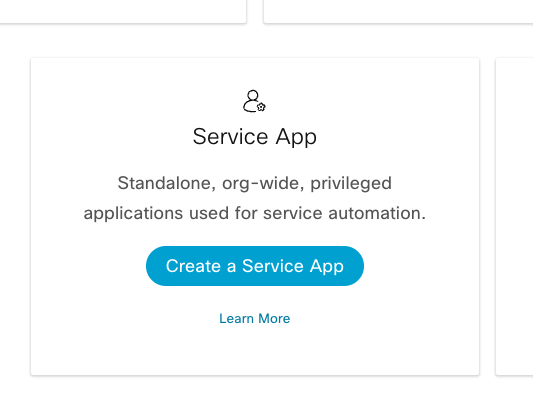
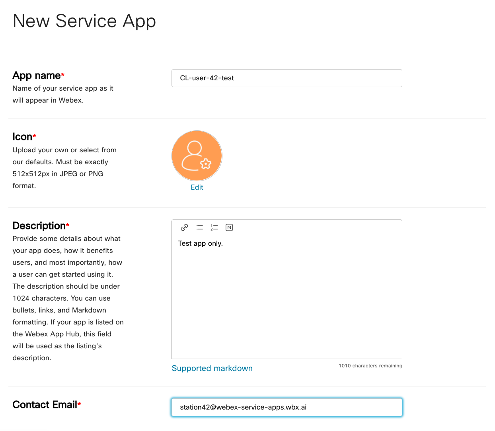
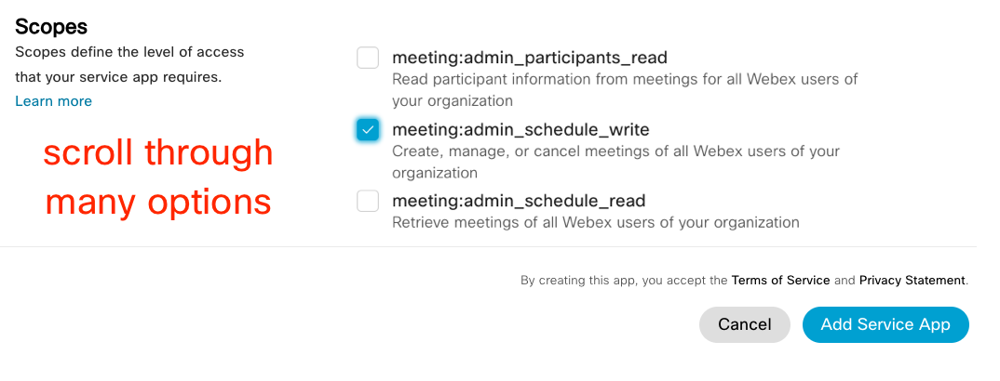
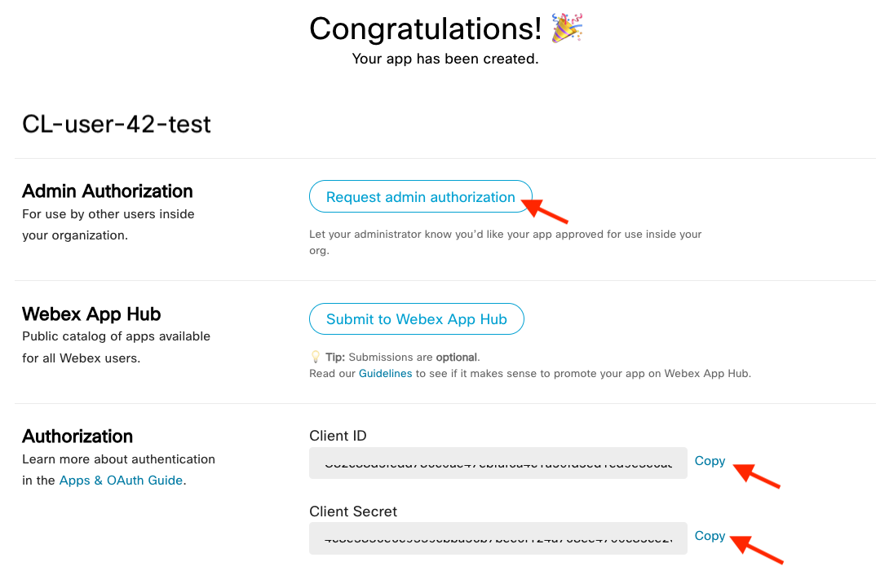
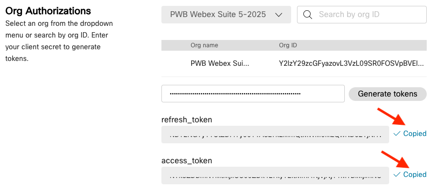

# 4 – Deploying a Meeting Scheduler Service App

Upon completion of this section, you will be able to:

1. Create a **Service App** in Webex.
2. Request admin authorization to allow the Service App and observe the admin tasks in Control Hub.
3. Retrieve an access and refresh token to be used in a sample Service App.
4. Configure a sample Python-based Service App with the access and refresh token.
5. Run the sample Service App with admin permissions to schedule a meeting on behalf of a test user.
6. Verify the scheduled meeting in Webex.

Reference:

<https://developer.webex.com/create/docs/service-apps>

## Step 4.1: Create a Webex Service App

First is to register a Service App in the Webex Developer portal.

1. Log into developer.webex.com with credentials that were provided.
2. Up on the top right corner of the page, click your avatar and then select ‘My Webex Apps’.
3. On the ‘Create a New App’ page, find the Service App card and click the ‘Create a Service App’ button.

{ width="700" style="display: block; margin: 0 auto; border: 1px solid lightgray; border-radius: 8px;" }

1. Fill out the webform to register a new service app.  
   1. **App Name:** WebexOne-username
   2. **Icon:** *Select any color icon*.
   3. **Description**: “Test app only”
   4. **Contact Email**: Use the email from the Webex login.

{ width="850" style="display: block; margin: 0 auto; border: 1px solid lightgray; border-radius: 8px;" }

* 1. **Select Scopes:** meeting:admin_schedule_write

{ width="850" style="display: block; margin: 0 auto; border: 1px solid lightgray; border-radius: 8px;" }

1. Click the **‘Add Service App’** button to finish registration.

## Step 4.2: Request Admin Authorization

After successfully registering the Service App, you are taken to a page that contains a *Client ID* and *Client Secret*. This is also where you request admin authorization for the Service App.

1. Copy & paste the Client ID and Client Secret values into a notepad for later use. Do note, this client secret is only shown once.
2. Click the **‘Request admin authorization’** button.

{ width="850" style="display: block; margin: 0 auto; border: 1px solid lightgray; border-radius: 8px;" }

1. *The lab instructor will demonstrate the actions taken by the Webex administrator to authorize a Service App in Control Hub.*

## Step 4.3: Retrieve the Access and the Refresh Token

After the admin authorizes your Service App registration, you can retrieve the access tokens.

1. Refresh the page that displays the *Client ID* and *Client Secret*.
2. In the ‘**Org Authorizations’** section, select the   
   PWB Webex Suite 5-2026 org from the dropdown menu.
3. Paste in the *Client Secret* value from your notepad in the field below, then click the ‘Generate tokens’ button.
4. Copy & paste the refresh_token and access_token values in your notepad for later use. *Both values are only shown once.*

{ width="700" style="display: block; margin: 0 auto; border: 1px solid lightgray; border-radius: 8px;" }

## Step 4.4: Configure the Sample Service App

Now that the access and refresh tokens are ready, we can insert them into the sample Python app and configure the meeting using a code editor.

1. Open the .env file in Visual Studio Code:  
   1. Go to **line 7** of the code and replace the text with the **clientID** value from your notepad.  
      * CLIENTID= "EXAMPLEC3ad18d5cb9bd01571e9b038438819c2b1"
   2. On **line 8**, replace the text with the **secretID** value from your notepad.  
      * SECRETID= "EXAMPLEC3ad18d5cb9bdu05e9b0f130h88192b1"
   3. On **line 9**, replace the text with the **access_token** value from your notepad.  
      * WEBEX_ACCESS_TOKEN= 'EXAMPLEQ2Y0_P03_0e01-g3-b55n-y06at4'
   4. On **line 10**, replace the text with the **refresh_token** value from your notepad.  
      * REFRESH_TOKEN= 'EXAMPLE1hMt2_PA1_0e01-a56a-b0Gj204'
2. Open the 04-serviceapps/01_serviceapp.py file in Visual Studio Code:  
   1. Scroll to **line 69**, after 'title': replace the text and give your meeting a unique name.  
      * 'title': 'Automatic Meeting Example',
   2. **Save** the 01_serviceapp.py file.

## Step 4.5: Run the Sample Service App.

With all the Service App components added to Python code, the sample app is now ready to be initialized.

1. Go back to the command line window in the 04-serviceapps directory.
2. Launch the 01_serviceapp.py file from that location with this command:  
   * python3 01_serviceapp.py
3. A success will return a statusCode 200 along with the the newly created meeting details in JSON format.  
   * *statusCode: 200  
       
     {'id': '7f36776aa9034d6091ef00dcee83ced2', 'meetingNumber': '26607444195', 'title': 'Important Customer Meeting', 'password'… … }*

## Step 4.6: Verify the Scheduled Meeting in Webex.

You can quickly confirm that the Service App scheduled the meeting on behalf of your test user with one more API call.

1. Go back to the browser that is logged in as your test user on developer.webex.com.
2. Navigate to the List Meetings API reference page.  
   * <https://developer.webex.com/docs/api/v1/meetings/list-meetings>
3. Make an API call to list meetings for the test user by adding your personal access token to the ‘Authorization’ header (after Bearer) and then clicking the blue ‘Run’ button (scroll down, along the right side).
4. The response should return a 200/OK and show the meeting information that was scheduled by the Service App on behalf of the test user
