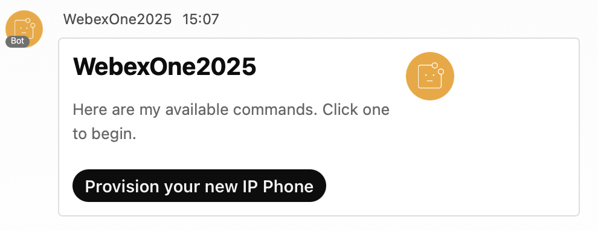
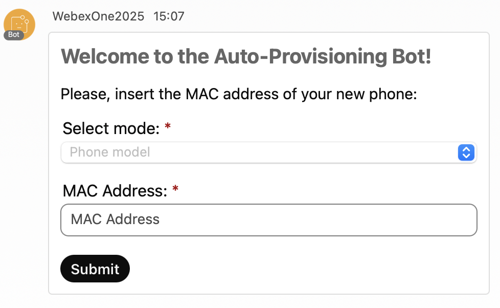
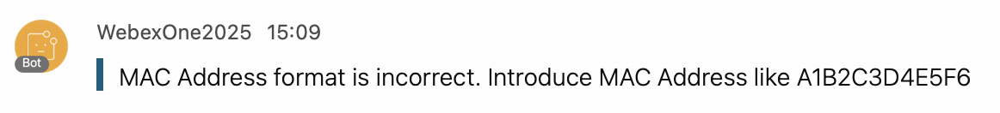

# Lab 5 – Use Cases

In this section, you will put your Webex API knowledge into practice by building real-world solutions. You will explore how bots and Service Apps can help users find the right spaces, automate device provisioning, and collect feedback across an organization.

All the bots in this section use the same `WebSocketClient` and bot helpers from Lab 3, and the same pattern: every message gets a menu card, and each button in a card is routed to its action with a `callback_keyword`.

Upon completion of this section, you will be able to:

1. Apply the concepts that you have learned to create practical solutions using Webex APIs.
2. Build a bot that lets users join spaces from a shared directory and list their own spaces for everyone.
3. Develop an interactive bot for end-users to provision their own devices using a MAC address.
4. Build a bot that enables permitted users to collect feedback from all users in the organization.
5. Integrate API calls, handle pagination, and manage bot interactions for real-world scenarios.

## Exercise 1: Space Directory Bot

Create a bot that helps users find and join the spaces of the organization. Instead of asking around for an invite, users can browse a shared directory of spaces and join them, or list one of their own spaces so everyone can find it.

Requirements:

1. Only allow users in your organization's domain to use the bot.
2. Present an Adaptive Card with two options: **Join a space** and **List a space**.
3. **Join a space:** show a dropdown with the spaces in the directory, and add the user to the selected space.
4. **List a space:** show a dropdown with the spaces the user could list, and add the selected space to the directory.
5. Only allow users to list spaces they are a member of, and only allow them to join spaces that are in the directory.

### Solution

1. Navigate to `05-usecases/01_space_bot.py` and review the code.

    These are the key points to understand how each requirement has been met:

    1. **Domain restriction**
        The **`is_authorized()`** function checks the sender's email domain against `DOMAIN` before any other action, just like the secure bot from Step 3.8.
    2. **Menu card**
        The **`handle_message()`** handler answers every message with the menu card, and **`handle_card_action()`** routes each button to its action using the `callback_keyword` of the card.
    3. **Join a space**
        The **`show_directory()`** function sends the spaces in the directory, and **`join_space()`** adds the user with the Memberships API. If the user is already a member, the API returns `409` and the bot lets them know.
    4. **List a space**
        The **`choose_space_to_list()`** function shows the group spaces where both the bot and the user are members, and **`list_space()`** saves the selected space in `spaces.json`, so the directory survives a restart.
    5. **Never trust card inputs**
        A card submission contains whatever the user sent, so the bot checks again that the space is in the directory before adding someone, and that the user is a member before listing a space.

    !!! Info
        The bot can only add people to spaces it is a member of. That is why a space must include the bot before it can be listed.

2. Change your directory in the terminal:

    - cd ../05-usecases

3. Execute the code with the following command and let it run:

    - python 01_space_bot.py

    !!! Warning
        Wait until you see **WebSocket connected as WebexOne-*USERNAME*, waiting for messages...** in the console.

4. Send any message to your bot in your 1:1 space to get the menu card, and click **List a space**.

    You will see the **WebexOne Room** space you created in Step 3.3. The bot created it, so both you and the bot are already members.

5. Select **WebexOne Room** and click **List it**. You will receive a confirmation that the space is now listed.

6. In Webex, leave **WebexOne Room**, so you can join it again from the directory.

7. Send another message to your bot, click **Join a space**, select **WebexOne Room**, and click **Join**. You will be added back to the space.

8. Repeat the previous step. This time, the bot lets you know that you are already a member of the space.

    !!! Tip
        To list any other space, first add your bot to it with its email address, then click **List a space** again. You can also ask someone next to you to send a message to your bot and join your space from the directory.

9. Stop the bot with **Ctrl+C** before moving to the next exercise.

## Exercise 2: End-User Phone Provisioning Assistant

Create an interactive Webex bot that enables end-users to auto-provision their new phones by submitting the device's MAC address. The bot will guide the user through the process using an Adaptive Card and interact with backend services to complete the provisioning.

Requirements:

1. Validate that the MAC address provided by the user follows the correct format (e.g., `AA:BB:CC:DD:EE:FF` or `AABBCCDDEEFF`).
2. Present an Adaptive Card to the user with:
    1. An input field for the MAC address.
    2. A choice set (dropdown) for selecting the phone model, with the following pre-defined options:
        - DMS Cisco 8851
        - DMS Cisco 8861
        - DMS Cisco 8865
3. Use the submitted data (MAC address and selected phone model) to initiate device provisioning through the backend or relevant API.
4. Notify the user in Webex of the provisioning result (success or error).

    { width="850" style="display: block; margin: 0 auto; border: 1px solid lightgray; border-radius: 8px;" }

!!! Warning
    In this exercise, you will need to add the **spark-admin:devices_write** scope to your Service App.
    In the next exercises, you will also need to add **spark-admin:people_read** scope. Do it now for simplicity.

    Please notify us to have your Service App rights approved.

    Once approved, generate new tokens as in Step 4.3 and update `WEBEX_ACCESS_TOKEN` in your `.env` file, because a token only includes the scopes that were approved when it was generated.

### Solution

1. Navigate to `05-usecases/02_device_bot.py` and review the code.

    These are the key points to understand how each requirement has been met:

    1. **MAC address validation**
        The **`normalize_mac_address()`** function uses a regular expression to check the MAC format before calling the API. It accepts `AA:BB:CC:DD:EE:FF`, `AA-BB-CC-DD-EE-FF`, and `AABBCCDDEEFF`, and converts them to the format the API expects.
    2. **Adaptive Card presentation**
        The **`handle_message()`** handler sends the menu card, and the **Provision your new IP Phone** button sends the provisioning card with the MAC input and the phone model dropdown.
    3. **Device provisioning**
        The **`provision_device()`** function sends the card data to the `/v1/devices` API with the Service App token. The device is assigned to the user who submitted the card.
    4. **Provisioning result notification**
        **`provision_device()`** replies with a success, duplicate, or error message based on the API's response status.

2. Execute the code with the following command and let it run:

    - python 02_device_bot.py

    !!! Warning
        Wait until you see **WebSocket connected as WebexOne-*USERNAME*, waiting for messages...** in the console.

3. Send any message to your bot to get the following card:

    { width="850" style="display: block; margin: 0 auto; border: 1px solid lightgray; border-radius: 8px;" }

4. Click **Provision your new IP Phone** to get the following provisioning card:

    { width="850" style="display: block; margin: 0 auto; border: 1px solid lightgray; border-radius: 8px;" }

5. If you submit a MAC address in the wrong format, you will receive a notification about the error:

    { width="850" style="display: block; margin: 0 auto; border: 1px solid lightgray; border-radius: 8px;" }

6. If you submit a duplicate MAC address, such as "54A3152300C8", you will receive a notification about the duplication:

    { width="700" style="display: block; margin: 0 auto; border: 1px solid lightgray; border-radius: 8px;" }

7. If you submit a valid MAC address, you will receive a message like the following:

    { width="700" style="display: block; margin: 0 auto; border: 1px solid lightgray; border-radius: 8px;" }

8. You can verify the device registration in Control Hub:

    { width="850" style="display: block; margin: 0 auto; border: 1px solid lightgray; border-radius: 8px;" }

9. Stop the bot with **Ctrl+C** before moving to the next exercise.

## Exercise 3: Create a feedback bot for your organization

Develop an assistant bot that allows only permitted users to collect feedback from all users in the organization.

Requirements:

1. Only allow permitted users to access the bot's feedback functionality.
2. Provide access through the menu card to send a feedback request to all users in the organization.
3. Present an Adaptive Card with a text input box for each user to enter their feedback.
4. Collect responses from recipients and send a confirmation or error notification to the user after feedback is submitted.

    { width="850" style="display: block; margin: 0 auto; border: 1px solid lightgray; border-radius: 8px;" }

!!! Warning
    In this exercise, you will need to add the **spark-admin:people_read** scope to your Service App. Please notify us to have your Service App rights approved. Once approved, generate new tokens as in Step 4.3 and update `WEBEX_ACCESS_TOKEN` in your `.env` file.

### Pagination

When retrieving a large amount of information, you need to handle pagination. With pagination, the API returns a limited set of results per request. If more data is available, the response includes a `Link` header with `rel="next"`, which provides the URL to fetch the next page of results. This process continues until all results have been retrieved.

1. Navigate to `05-usecases/03_pagination.py` and review the code.

    In this example, a pagination limit of 2 users is used.

2. Execute the code with the following command:

    - python 03_pagination.py

3. You will now see all the users listed in the console, displayed in pages of size 2:

    { width="850" style="display: block; margin: 0 auto; border: 1px solid lightgray; border-radius: 8px;" }

### Solution

1. Navigate to `05-usecases/03_feedback_bot.py` and review the code.

    These are the key points to understand how each requirement has been met:

    1. **Permitted User Access Only**
        The **`is_allowed_sender()`** function verifies that the user's email matches `EMAIL` in your `.env` file before sending feedback requests. All other users in the domain can still submit feedback.
    2. **Org-wide Feedback Card Distribution**
        The **Send feedback card to all users in the organization** button calls **`send_feedback_to_all()`**, which lists every user with the Service App token and sends each of them the feedback card. The SDK follows the pagination links automatically, just like `03_pagination.py` does by hand.
    3. **Adaptive Card Feedback Input**
        The **`feedback_card()`** function builds a card with a multi-line **Input.Text** element for the feedback.
    4. **Collect Responses, Notify Sender**
        The **`submit_feedback()`** function forwards the submitted feedback to `EMAIL` and sends a confirmation or error message back to the user who submitted it.

2. Execute the code with the following command and let it run:

    - python 03_feedback_bot.py

    !!! Warning
        Wait until you see **WebSocket connected as WebexOne-*USERNAME*, waiting for messages...** in the console.

3. Send any message to your bot to get the following card:

    { width="850" style="display: block; margin: 0 auto; border: 1px solid lightgray; border-radius: 8px;" }

4. Once you click **Send feedback card to all users in the organization**, the cards will begin sending. You will receive the following notification message once the process is completed:

    { width="850" style="display: block; margin: 0 auto; border: 1px solid lightgray; border-radius: 8px;" }

5. At this point, all users will receive the following feedback card:

    { width="850" style="display: block; margin: 0 auto; border: 1px solid lightgray; border-radius: 8px;" }

6. Once users submit their feedback, they will receive the following notification message:

    { width="850" style="display: block; margin: 0 auto; border: 1px solid lightgray; border-radius: 8px;" }

7. At the same time, you, as an admin, will be notified with the user's feedback:

    { width="700" style="display: block; margin: 0 auto; border: 1px solid lightgray; border-radius: 8px;" }

8. Stop the bot with **Ctrl+C** when you are done.
