# Lab 5 – Use Cases

In this section, you will put your Webex API knowledge into practice by building real-world solutions. You will explore how bots and Service Apps can help users find the right spaces, automate device provisioning, and collect feedback across an organization.

All the bots in this section use the same `WebSocketClient` and bot helpers from Lab 3, and the same pattern: every message gets a menu card, and each button in a card is routed to its action with a `callback_keyword`.

Upon completion of this section, you will be able to:

1. Apply the concepts that you have learned to create practical solutions using Webex APIs.
2. Build a bot that lets users join spaces from a shared directory and list their own spaces for everyone.
3. Develop an interactive bot for end-users to provision their own devices using a MAC address.
4. Build a bot that enables permitted users to collect feedback from all users in the organization.
5. Integrate API calls, handle pagination, and manage bot interactions for real-world scenarios.

## Exercise 1: Space Directory Bot

Create a bot that helps users find and join the spaces of the organization. Instead of asking around for an invite, users can browse a shared directory of spaces and join them, or list one of their own spaces so everyone can find it.

Requirements:

1. Only allow users in your organization's domain to use the bot.
2. Present an Adaptive Card with two options: **Join a space** and **List a space**.
3. **Join a space:** show a dropdown with the spaces in the directory, and add the user to the selected space.
4. **List a space:** show a dropdown with the spaces the user could list, and add the selected space to the directory.
5. Only allow users to list spaces they are a member of, and only allow them to join spaces that are in the directory.

    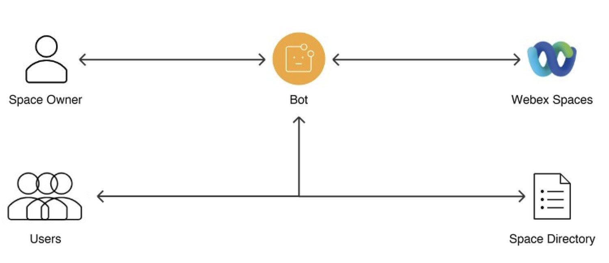{ width="850" style="display: block; margin: 0 auto; border: 1px solid lightgray; border-radius: 8px;" }

??? Tip "Solution"

    1. Navigate to `05-usecases/01_space_bot.py` and review the code.

        These are the key points to understand how each requirement has been met:

        1. **Domain restriction**
            The **`is_authorized()`** function checks the sender's email domain against `DOMAIN` before any other action, just like the secure bot from Step 3.8.
        2. **Menu card**
            The **`handle_message()`** handler answers every message with the menu card, and **`handle_card_action()`** routes each button to its action using the `callback_keyword` of the card.
        3. **Join a space**
            The **`show_directory()`** function sends the spaces in the directory, and **`join_space()`** adds the user with the Memberships API. If the user is already a member, the API returns `409` and the bot lets them know.
        4. **List a space**
            The **`choose_space_to_list()`** function shows the group spaces where both the bot and the user are members, and **`list_space()`** saves the selected space in `spaces.json`, so the directory survives a restart.
        5. **Never trust card inputs**
            A card submission contains whatever the user sent, so the bot checks again that the space is in the directory before adding someone, and that the user is a member before listing a space.

        !!! Info
            The bot can only add people to spaces it is a member of. That is why a space must include the bot before it can be listed.

        ??? Tip "Python Code"
            ```python
            import json
            import os
            import sys
            from dotenv import load_dotenv
            from webexpythonsdk import ApiError
            
            # Reuse the WebSocket client and helpers from Lab 3.
            sys.path.append(os.path.join(os.path.dirname(os.path.abspath(__file__)), "..", "03-bots"))
            from websocket_client import WebSocketClient
            from bot_helpers import get_api, send_message, send_card, delete_message, is_allowed_domain
            
            # Load environment variables from the .env file.
            load_dotenv()
            
            # Webex Bot Token for authentication with the Webex API.
            bot_token = os.getenv("BOT_TOKEN")
            api = get_api(bot_token)
            
            # Only users whose email belongs to this domain can use the bot.
            allowed_domain = os.getenv("DOMAIN")
            if not allowed_domain:
                raise SystemExit("Set DOMAIN in the .env file before starting the bot.")
            
            # The bot's own email, shown to users so they know who to add to their space.
            bot_email = api.people.me().emails[0]
            
            # The directory of listed spaces is saved next to this script, so it survives a restart.
            DIRECTORY_FILE = os.path.join(os.path.dirname(os.path.abspath(__file__)), "spaces.json")
            
            
            def load_directory():
                """
                Returns the list of spaces everyone can join: [{"id": ..., "title": ...}, ...]
                """
                if not os.path.exists(DIRECTORY_FILE):
                    return []
                with open(DIRECTORY_FILE) as file:
                    return json.load(file)
            
            
            def save_directory(spaces):
                with open(DIRECTORY_FILE, "w") as file:
                    json.dump(spaces, file, indent=2)
            
            
            def is_member(room_id, person_id):
                """
                Checks whether a person is a member of a space.
                """
                return any(True for _ in api.memberships.list(roomId=room_id, personId=person_id))
            
            
            def is_authorized(room_id, email):
                """
                Checks the sender's email domain and tells blocked users why they got no answer.
                """
                if is_allowed_domain(email, [allowed_domain]):
                    return True
            
                print(f"Blocked request from {email}")
                send_message(api, room_id, f"Sorry, this bot is only available to users in {allowed_domain}.")
                return False
            
            
            def menu_card():
                """
                The main menu: every message to the bot answers with this card.
                """
                return {
                    "type": "AdaptiveCard",
                    "body": [
                        {
                            "type": "TextBlock",
                            "text": "Space Directory",
                            "weight": "Bolder",
                            "size": "Large"
                        },
                        {
                            "type": "TextBlock",
                            "text": "Join one of the listed spaces, or list one of your spaces so everyone can find it.",
                            "wrap": True
                        }
                    ],
                    "$schema": "http://adaptivecards.io/schemas/adaptive-card.json",
                    "version": "1.3",
                    "actions": [
                        {
                            "type": "Action.Submit",
                            "title": "Join a space",
                            "data": {"callback_keyword": "browse"}
                        },
                        {
                            "type": "Action.Submit",
                            "title": "List a space",
                            "data": {"callback_keyword": "choose_space"}
                        }
                    ]
                }
            
            
            def spaces_card(title, spaces, callback_keyword, button_title):
                """
                A card with a dropdown of spaces. The selected space ID is returned as 'room_id'.
                """
                return {
                    "type": "AdaptiveCard",
                    "body": [
                        {
                            "type": "TextBlock",
                            "text": title,
                            "weight": "Bolder",
                            "wrap": True
                        },
                        {
                            "type": "Input.ChoiceSet",
                            "id": "room_id",
                            "placeholder": "Select a space",
                            "choices": [{"title": space["title"], "value": space["id"]} for space in spaces],
                            "isRequired": True,
                            "errorMessage": "Select a space"
                        }
                    ],
                    "$schema": "http://adaptivecards.io/schemas/adaptive-card.json",
                    "version": "1.3",
                    "actions": [
                        {
                            "type": "Action.Submit",
                            "title": button_title,
                            "data": {"callback_keyword": callback_keyword}
                        }
                    ]
                }
            
            
            def show_directory(room_id):
                """
                Sends the list of spaces the user can join.
                """
                spaces = load_directory()
                if not spaces:
                    send_message(api, room_id, "No spaces are listed yet. Use **List a space** to add the first one.")
                    return
            
                send_card(api, room_id, spaces_card("Which space do you want to join?", spaces, "join", "Join"),
                          fallback_text="Select a space to join")
            
            
            def join_space(room_id, person_id, selected_room_id):
                """
                Adds the user to the selected space, as long as it is in the directory.
                """
                # Never trust card inputs blindly: only spaces from the directory can be joined.
                space = next((space for space in load_directory() if space["id"] == selected_room_id), None)
                if not space:
                    send_message(api, room_id, "That space is not in the directory.")
                    return
            
                try:
                    api.memberships.create(roomId=space["id"], personId=person_id)
                    send_message(api, room_id, f"> **Info**\n> You have been added to **{space['title']}**.")
                except ApiError as error:
                    if error.status_code == 409:
                        send_message(api, room_id, f"You are already a member of **{space['title']}**.")
                    else:
                        print(f"Could not add {person_id} to {space['title']}: {error}")
                        send_message(api, room_id, f"Sorry, I could not add you to **{space['title']}**.")
            
            
            def choose_space_to_list(room_id, person_id):
                """
                Sends the spaces that the user could list: group spaces where both the bot
                and the user are members, and that are not listed yet.
                """
                listed_ids = {space["id"] for space in load_directory()}
                candidates = [
                    {"id": room.id, "title": room.title}
                    for room in api.rooms.list(type="group")
                    if room.id not in listed_ids and is_member(room.id, person_id)
                ]
            
                if not candidates:
                    send_message(api, room_id, f"To list a space, first add me (**{bot_email}**) to it, then try again.")
                    return
            
                send_card(api, room_id, spaces_card("Which space do you want to list?", candidates, "list_space", "List it"),
                          fallback_text="Select a space to list")
            
            
            def list_space(room_id, person_id, selected_room_id):
                """
                Adds the selected space to the directory, so everyone can join it.
                """
                # Check again when the card is submitted: only members can list their own spaces.
                if not is_member(selected_room_id, person_id):
                    send_message(api, room_id, "You can only list spaces you are a member of.")
                    return
            
                spaces = load_directory()
                if any(space["id"] == selected_room_id for space in spaces):
                    send_message(api, room_id, "That space is already listed.")
                    return
            
                title = api.rooms.get(selected_room_id).title
                spaces.append({"id": selected_room_id, "title": title})
                save_directory(spaces)
                send_message(api, room_id, f"> **Info**\n> **{title}** is now listed. Everyone can join it with **Join a space**.")
            
            
            def handle_card_action(attachment_action, activity):
                """
                Routes each card submission to the right action using its 'callback_keyword'.
                """
                room_id = attachment_action.roomId
                person_id = attachment_action.personId
            
                # Card submissions only include the person ID, so look up their email first.
                person = api.people.get(person_id)
                if not is_authorized(room_id, person.emails[0]):
                    return
            
                inputs = getattr(attachment_action, "inputs", {}) or {}
                action = inputs.get("callback_keyword")
            
                # Deletes the submitted card, so it cannot be submitted twice.
                delete_message(api, attachment_action.messageId)
            
                if action == "browse":
                    show_directory(room_id)
                elif action == "join":
                    join_space(room_id, person_id, inputs.get("room_id"))
                elif action == "choose_space":
                    choose_space_to_list(room_id, person_id)
                elif action == "list_space":
                    list_space(room_id, person_id, inputs.get("room_id"))
            
            
            def handle_message(message, activity):
                """
                Any message from an allowed user gets the main menu.
                """
                if not is_authorized(message.roomId, message.personEmail):
                    return
            
                send_card(api, message.roomId, menu_card(), fallback_text="Space Directory")
            
            
            # Create a WebSocket Client object.
            bot = WebSocketClient(access_token=bot_token,         # Authenticate the bot using its token.
                                  on_message=handle_message,      # Registers the message handler.
                                  on_card_action=handle_card_action) # Registers the handler for card submissions.
            
            # Start the bot and make it listen for incoming messages.
            bot.run()
            ```

    2. Change your directory in the terminal:

        - cd ../05-usecases

    3. Execute the code with the following command and let it run:

        - python 01_space_bot.py

        !!! Warning
            Wait until you see **WebSocket connected as WebexOne-*USERNAME*, waiting for messages...** in the console.

    4. Send any message to your bot in your 1:1 space to get the menu card:
    
        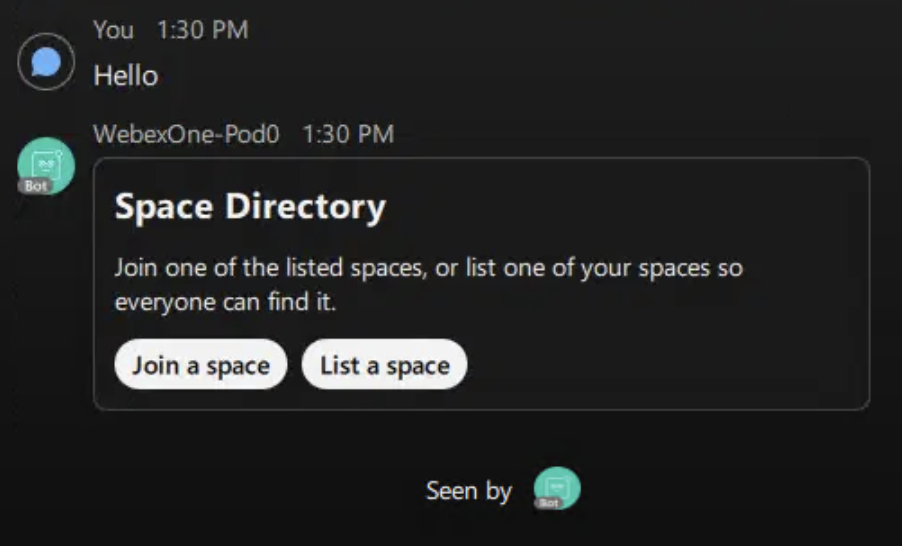{ width="450" style="display: block; margin: 0 auto; border: 1px solid lightgray; border-radius: 8px;" }
        
    5. Click **List a space** and you will see the **WebexOne Room** space you created in Step 3.3. The bot created it, so both you and the bot are already members:

        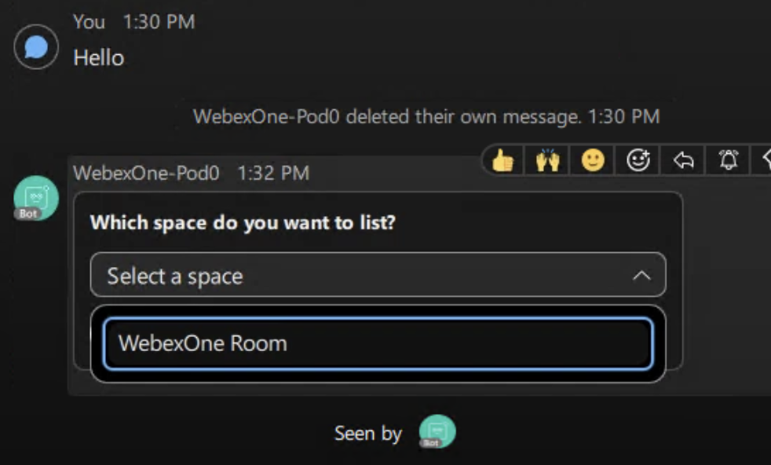{ width="450" style="display: block; margin: 0 auto; border: 1px solid lightgray; border-radius: 8px;" }        

    6. Select **WebexOne Room** and click **List it**. You will receive a confirmation that the space is now listed:

        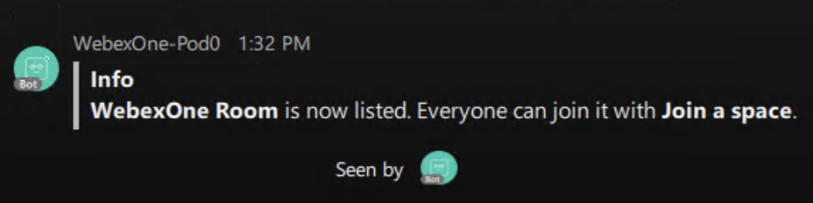{ width="450" style="display: block; margin: 0 auto; border: 1px solid lightgray; border-radius: 8px;" }

    7. In Webex, leave **WebexOne Room**, so you can join it again from the directory:

        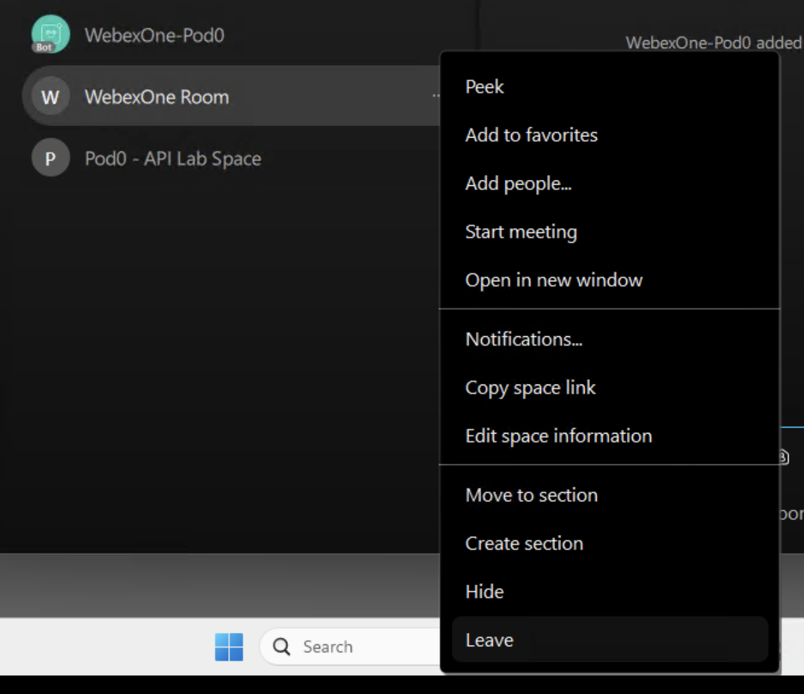{ width="450" style="display: block; margin: 0 auto; border: 1px solid lightgray; border-radius: 8px;" }

    8. Send another message to your bot, click **Join a space**, select **WebexOne Room**, and click **Join**. You will be added back to the space:

        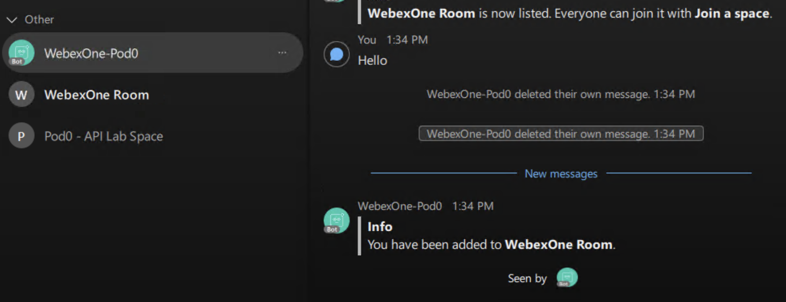{ width="450" style="display: block; margin: 0 auto; border: 1px solid lightgray; border-radius: 8px;" }

    9. Repeat the previous step. This time, the bot lets you know that you are already a member of the space:

        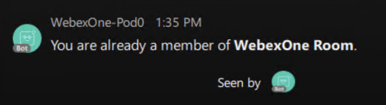{ width="450" style="display: block; margin: 0 auto; border: 1px solid lightgray; border-radius: 8px;" }
        
        !!! Tip
            To list any other space, first add your bot to it with its email address, then click **List a space** again. You can also ask someone next to you to send a message to your bot and join your space from the directory.

    10. Stop the bot with **Ctrl+C** before moving to the next exercise.

## Exercise 2: End-User Phone Provisioning Assistant

Create an interactive Webex bot that enables end-users to auto-provision their new phones by submitting the device's MAC address. The bot will guide the user through the process using an Adaptive Card and interact with backend services to complete the provisioning.

Requirements:

1. Validate that the MAC address provided by the user follows the correct format (e.g., `AA:BB:CC:DD:EE:FF` or `AABBCCDDEEFF`).
2. Present an Adaptive Card to the user with:
    1. An input field for the MAC address.
    2. A choice set (dropdown) for selecting the phone model, with the following pre-defined options:
        - DMS Cisco 8851
        - DMS Cisco 8861
        - DMS Cisco 8865
3. Use the submitted data (MAC address and selected phone model) to initiate device provisioning through the backend or relevant API.
4. Notify the user in Webex of the provisioning result (success or error).

    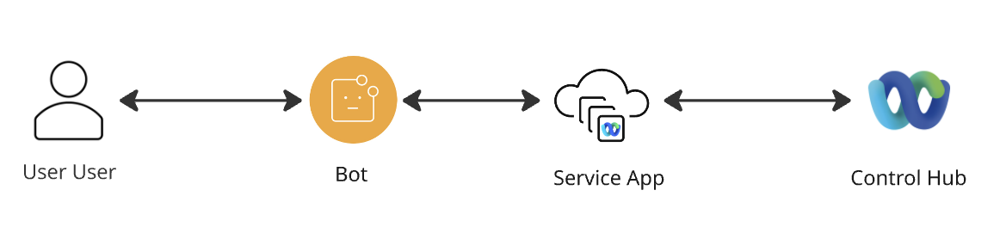{ width="850" style="display: block; margin: 0 auto; border: 1px solid lightgray; border-radius: 8px;" }

!!! Warning
    In this exercise, you will need to add the **spark-admin:devices_write** scope to your Service App.
    In the next exercises, you will also need to add **spark-admin:people_read** scope. Do it now for simplicity.

    Please notify us to have your Service App rights approved.

    Once approved, generate new tokens as in Step 4.3 and update `WEBEX_ACCESS_TOKEN` in your `.env` file, because a token only includes the scopes that were approved when it was generated.

??? Tip "Solution"

    1. Navigate to `05-usecases/02_device_bot.py` and review the code.

        These are the key points to understand how each requirement has been met:

        1. **MAC address validation**
            The **`normalize_mac_address()`** function uses a regular expression to check the MAC format before calling the API. It accepts `AA:BB:CC:DD:EE:FF`, `AA-BB-CC-DD-EE-FF`, and `AABBCCDDEEFF`, and converts them to the format the API expects.
        2. **Adaptive Card presentation**
            The **`handle_message()`** handler sends the menu card, and the **Provision your new IP Phone** button sends the provisioning card with the MAC input and the phone model dropdown.
        3. **Device provisioning**
            The **`provision_device()`** function sends the card data to the `/v1/devices` API with the Service App token. The device is assigned to the user who submitted the card.
        4. **Provisioning result notification**
            **`provision_device()`** replies with a success, duplicate, or error message based on the API's response status.

        ??? Tip "Python Code"
            ```python
            import os
            import re
            import sys
            import requests
            from dotenv import load_dotenv
            
            # Reuse the WebSocket client and helpers from Lab 3.
            sys.path.append(os.path.join(os.path.dirname(os.path.abspath(__file__)), "..", "03-bots"))
            from websocket_client import WebSocketClient
            from bot_helpers import get_api, send_message, send_card, delete_message, is_allowed_domain
            
            # Load environment variables from the .env file.
            load_dotenv()
            
            # Webex Bot Token for authentication with the Webex API.
            bot_token = os.getenv("BOT_TOKEN")
            api = get_api(bot_token)
            
            # Service App access token with the spark-admin:devices_write scope, used to create devices.
            access_token = os.getenv("WEBEX_ACCESS_TOKEN")
            
            # Only users whose email belongs to this domain can use the bot.
            allowed_domain = os.getenv("DOMAIN")
            if not allowed_domain:
                raise SystemExit("Set DOMAIN in the .env file before starting the bot.")
            
            
            def is_authorized(room_id, email):
                """
                Checks the sender's email domain and tells blocked users why they got no answer.
                """
                if is_allowed_domain(email, [allowed_domain]):
                    return True
            
                print(f"Blocked request from {email}")
                send_message(api, room_id, f"Sorry, this bot is only available to users in {allowed_domain}.")
                return False
            
            
            def normalize_mac_address(mac):
                """
                Accepts AA:BB:CC:DD:EE:FF, AA-BB-CC-DD-EE-FF or AABBCCDDEEFF.
                Returns the MAC address as 12 uppercase characters, or None if the format is wrong.
                """
                mac = (mac or "").strip().upper()
                if re.fullmatch(r"([0-9A-F]{2}[:-]){5}[0-9A-F]{2}|[0-9A-F]{12}", mac):
                    return re.sub(r"[:-]", "", mac)
                return None
            
            
            def menu_card():
                """
                The main menu: every message to the bot answers with this card.
                """
                return {
                    "type": "AdaptiveCard",
                    "body": [
                        {
                            "type": "TextBlock",
                            "text": "Welcome to the Auto-Provisioning Bot!",
                            "weight": "Bolder",
                            "size": "Large",
                            "wrap": True
                        }
                    ],
                    "$schema": "http://adaptivecards.io/schemas/adaptive-card.json",
                    "version": "1.3",
                    "actions": [
                        {
                            "type": "Action.Submit",
                            "title": "Provision your new IP Phone",
                            "data": {"callback_keyword": "provision"}
                        }
                    ]
                }
            
            
            def provision_card():
                """
                The provisioning form: phone model and MAC address.
                """
                return {
                    "type": "AdaptiveCard",
                    "body": [
                        {
                            "type": "TextBlock",
                            "text": "Please select the model and enter the MAC address of your new phone:",
                            "wrap": True
                        },
                        {
                            "type": "Input.ChoiceSet",
                            "choices": [
                                {"title": "DMS Cisco 8851", "value": "DMS Cisco 8851"},
                                {"title": "DMS Cisco 8861", "value": "DMS Cisco 8861"},
                                {"title": "DMS Cisco 8865", "value": "DMS Cisco 8865"}
                            ],
                            "placeholder": "Phone model",
                            "id": "model",
                            "isRequired": True,
                            "errorMessage": "Model is required",
                            "label": "Select model:"
                        },
                        {
                            "type": "Input.Text",
                            "placeholder": "AA:BB:CC:DD:EE:FF",
                            "id": "mac_address",
                            "isRequired": True,
                            "errorMessage": "MAC is required",
                            "label": "MAC Address:"
                        }
                    ],
                    "$schema": "http://adaptivecards.io/schemas/adaptive-card.json",
                    "version": "1.3",
                    "actions": [
                        {
                            "type": "Action.Submit",
                            "title": "Submit",
                            "data": {"callback_keyword": "provision_callback"}
                        }
                    ]
                }
            
            
            def provision_device(room_id, person_id, inputs):
                """
                Validates the submitted data and creates the device for the user with the Devices API.
                """
                mac_address = normalize_mac_address(inputs.get("mac_address"))
                model = inputs.get("model")
            
                if not mac_address:
                    send_message(api, room_id, "> **Error**\n> MAC Address format is incorrect. Use a format like AA:BB:CC:DD:EE:FF or AABBCCDDEEFF.")
                    return
            
                payload = {
                    "mac": mac_address,
                    "model": model,
                    "personId": person_id
                }
                headers = {
                    "Content-Type": "application/json",
                    "Accept": "application/json",
                    "Authorization": f"Bearer {access_token}"
                }
            
                response = requests.post("https://webexapis.com/v1/devices", headers=headers, json=payload, timeout=30)
                print(f"Provisioning {model} {mac_address}: {response.status_code}")
            
                if response.status_code == 200:
                    send_message(api, room_id, f"> **Info**\n> Your {model} ({mac_address}) has been added successfully.")
                elif response.status_code == 409:
                    send_message(api, room_id, "> **Error**\n> This MAC Address is already registered.")
                else:
                    print(response.text)
                    send_message(api, room_id, "> **Error**\n> There was an error provisioning your phone.")
            
            
            def handle_card_action(attachment_action, activity):
                """
                Routes each card submission to the right action using its 'callback_keyword'.
                """
                room_id = attachment_action.roomId
            
                # Card submissions only include the person ID, so look up their email first.
                person = api.people.get(attachment_action.personId)
                if not is_authorized(room_id, person.emails[0]):
                    return
            
                inputs = getattr(attachment_action, "inputs", {}) or {}
                action = inputs.get("callback_keyword")
            
                # Deletes the submitted card, so it cannot be submitted twice.
                delete_message(api, attachment_action.messageId)
            
                if action == "provision":
                    send_card(api, room_id, provision_card(), fallback_text="Provision your new IP Phone")
                elif action == "provision_callback":
                    provision_device(room_id, attachment_action.personId, inputs)
            
            
            def handle_message(message, activity):
                """
                Any message from an allowed user gets the main menu.
                """
                if not is_authorized(message.roomId, message.personEmail):
                    return
            
                send_card(api, message.roomId, menu_card(), fallback_text="Auto-Provisioning Bot")
            
            
            # Create a WebSocket Client object.
            bot = WebSocketClient(access_token=bot_token,         # Authenticate the bot using its token.
                                  on_message=handle_message,      # Registers the message handler.
                                  on_card_action=handle_card_action) # Registers the handler for card submissions.
            
            # Start the bot and make it listen for incoming messages.
            bot.run()
            ```

    2. Execute the code with the following command and let it run:

        - python 02_device_bot.py

        !!! Warning
            Wait until you see **WebSocket connected as WebexOne-*USERNAME*, waiting for messages...** in the console.

    3. Send any message to your bot to get the following card:

        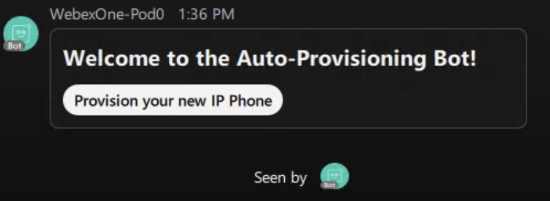{ width="450" style="display: block; margin: 0 auto; border: 1px solid lightgray; border-radius: 8px;" }

    4. Click **Provision your new IP Phone** to get the following provisioning card:

        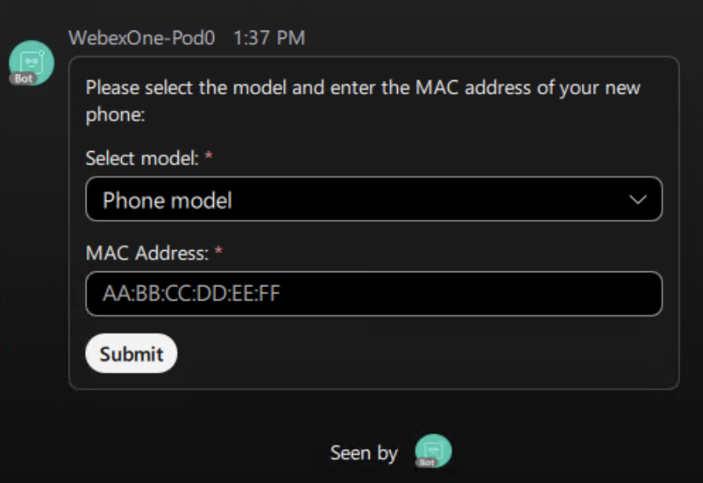{ width="450" style="display: block; margin: 0 auto; border: 1px solid lightgray; border-radius: 8px;" }

    5. If you submit a MAC address in the wrong format, you will receive a notification about the error:

        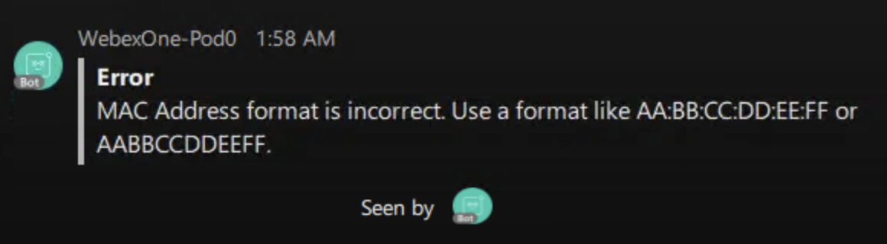{ width="450" style="display: block; margin: 0 auto; border: 1px solid lightgray; border-radius: 8px;" }

    6. If you submit a duplicate MAC address, such as "54A3152300C8", you will receive a notification about the duplication:

        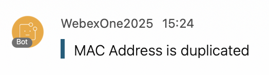{ width="700" style="display: block; margin: 0 auto; border: 1px solid lightgray; border-radius: 8px;" }

    7. If you submit a valid MAC address, you will receive a message like the following:

        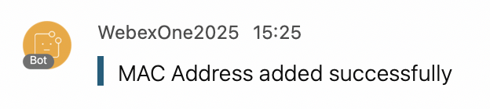{ width="700" style="display: block; margin: 0 auto; border: 1px solid lightgray; border-radius: 8px;" }

    8. You can verify the device registration in Control Hub:

        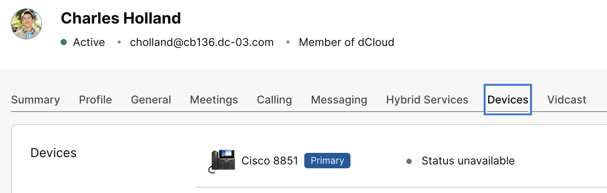{ width="850" style="display: block; margin: 0 auto; border: 1px solid lightgray; border-radius: 8px;" }

    9. Stop the bot with **Ctrl+C** before moving to the next exercise.

## Exercise 3: Create a feedback bot for your organization

Develop an assistant bot that allows only permitted users to collect feedback from all users in the organization.

Requirements:

1. Only allow permitted users to access the bot's feedback functionality.
2. Provide access through the menu card to send a feedback request to all users in the organization.
3. Present an Adaptive Card with a text input box for each user to enter their feedback.
4. Collect responses from recipients and send a confirmation or error notification to the user after feedback is submitted.

    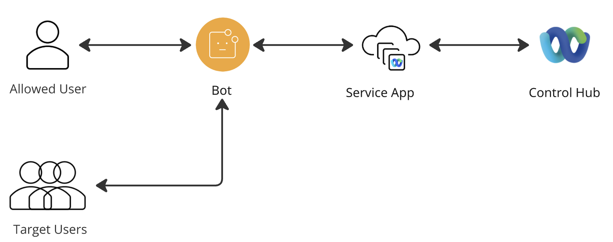{ width="850" style="display: block; margin: 0 auto; border: 1px solid lightgray; border-radius: 8px;" }

!!! Warning
    In this exercise, you will need to add the **spark-admin:people_read** scope to your Service App if you didn't add it before.
    
    Please notify us to have your Service App rights approved. Once approved, generate new tokens as in Step 4.3 and update `WEBEX_ACCESS_TOKEN` in your `.env` file.

### Pagination

When retrieving a large amount of information, you need to handle pagination. With pagination, the API returns a limited set of results per request. If more data is available, the response includes a `Link` header with `rel="next"`, which provides the URL to fetch the next page of results. This process continues until all results have been retrieved.

1. Navigate to `05-usecases/03_pagination.py` and review the code.

    In this example, a pagination limit of 2 users is used.

    ??? Tip "Python Code"
        ```python
        import os
        import requests
        from dotenv import load_dotenv
        
        load_dotenv()
        
        # Service App access token with the spark-admin:people_read scope.
        access_token = os.getenv("WEBEX_ACCESS_TOKEN")
        MAX = 2
        
        
        def list_people_page(url: str | None = None) -> None:
            headers = {"Authorization": f"Bearer {access_token}"}
            # The 'next' link already includes the page size, so only send it on the first request.
            params = None if url else {"max": MAX}
            response = requests.get(url or "https://webexapis.com/v1/people", headers=headers, params=params, timeout=30)
            response.raise_for_status()
        
            for person in response.json().get("items", []):
                print(f"Name: {person.get('displayName')} | Email: {person.get('emails', [''])[0]}")
        
            # Webex returns the next page URL in the 'Link' header with rel="next".
            if "next" in response.links:
                print("\n--- Next page ---\n")
                list_people_page(response.links["next"]["url"])
        
        
        if __name__ == "__main__":
            list_people_page()
        ```

2. Execute the code with the following command:

    - python 03_pagination.py

3. You will now see all the users listed in the console, displayed in pages of size 2:

    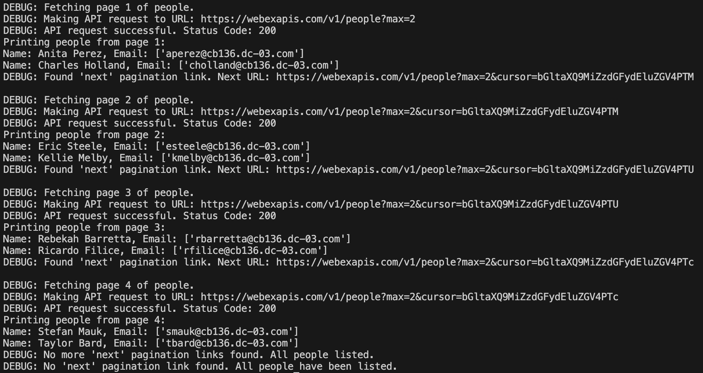{ width="850" style="display: block; margin: 0 auto; border: 1px solid lightgray; border-radius: 8px;" }

??? Tip "Solution"

    1. Navigate to `05-usecases/03_feedback_bot.py` and review the code.

        These are the key points to understand how each requirement has been met:

        1. **Permitted User Access Only**
            The **`is_allowed_sender()`** function verifies that the user's email matches `EMAIL` in your `.env` file before sending feedback requests. All other users in the domain can still submit feedback.
        2. **Org-wide Feedback Card Distribution**
            The **Send feedback card to all users in the organization** button calls **`send_feedback_to_all()`**, which lists every user with the Service App token and sends each of them the feedback card. The SDK follows the pagination links automatically, just like `03_pagination.py` does by hand.
        3. **Adaptive Card Feedback Input**
            The **`feedback_card()`** function builds a card with a multi-line **Input.Text** element for the feedback.
        4. **Collect Responses, Notify Sender**
            The **`submit_feedback()`** function forwards the submitted feedback to `EMAIL` and sends a confirmation or error message back to the user who submitted it.

        ??? Tip "Python Code"
            ```python
            import os
            import sys
            from dotenv import load_dotenv
            from webexpythonsdk import WebexAPI  # Import the Webex API SDK for making direct Webex API calls.
            
            # Reuse the WebSocket client and helpers from Lab 3.
            sys.path.append(os.path.join(os.path.dirname(os.path.abspath(__file__)), "..", "03-bots"))
            from websocket_client import WebSocketClient
            from bot_helpers import get_api, send_message, send_card, delete_message, is_allowed_domain
            
            # Load environment variables from the .env file.
            load_dotenv()
            
            # Webex Bot Token for authentication with the Webex API.
            bot_token = os.getenv("BOT_TOKEN")
            api = get_api(bot_token)
            
            # Service App access token with the spark-admin:people_read scope, used to list all people in the org.
            access_token = os.getenv("WEBEX_ACCESS_TOKEN")
            
            # The only user allowed to send feedback requests. This user also receives all the feedback.
            email = os.getenv("EMAIL")
            
            # Only users whose email belongs to this domain can use the bot.
            allowed_domain = os.getenv("DOMAIN")
            if not allowed_domain:
                raise SystemExit("Set DOMAIN in the .env file before starting the bot.")
            
            
            def is_authorized(room_id, sender_email):
                """
                Checks the sender's email domain and tells blocked users why they got no answer.
                """
                if is_allowed_domain(sender_email, [allowed_domain]):
                    return True
            
                print(f"Blocked request from {sender_email}")
                send_message(api, room_id, f"Sorry, this bot is only available to users in {allowed_domain}.")
                return False
            
            
            def is_allowed_sender(sender_email):
                """
                Checks if the sender is the admin configured in EMAIL. Case-insensitive comparison.
                """
                if not email:
                    print("EMAIL is not set in .env. All users are blocked from sending feedback requests.")
                    return False
                return sender_email.lower() == email.lower()
            
            
            def menu_card():
                """
                The main menu: every message to the bot answers with this card.
                """
                return {
                    "type": "AdaptiveCard",
                    "body": [
                        {
                            "type": "TextBlock",
                            "text": "Feedback Bot",
                            "weight": "Bolder",
                            "size": "Large"
                        }
                    ],
                    "$schema": "http://adaptivecards.io/schemas/adaptive-card.json",
                    "version": "1.3",
                    "actions": [
                        {
                            "type": "Action.Submit",
                            "title": "Send feedback card to all users in the organization",
                            "data": {"callback_keyword": "feedback"}
                        }
                    ]
                }
            
            
            def feedback_card():
                """
                The card every user in the organization receives.
                """
                return {
                    "type": "AdaptiveCard",
                    "body": [
                        {
                            "type": "TextBlock",
                            "text": "We'd love to hear your thoughts!",
                            "wrap": True,
                            "size": "Medium",
                            "weight": "Bolder"
                        },
                        {
                            "type": "Input.Text",
                            "placeholder": "Enter your feedback here...",
                            "id": "feedback_input", # This ID will be used to extract the input value.
                            "isMultiline": True,
                            "isRequired": True,
                            "errorMessage": "Feedback cannot be empty.",
                            "label": "Your Feedback:"
                        }
                    ],
                    "$schema": "http://adaptivecards.io/schemas/adaptive-card.json",
                    "version": "1.3",
                    "actions": [
                        {
                            "type": "Action.Submit",
                            "title": "Submit Feedback",
                            "data": {"callback_keyword": "feedback_submit"}
                        }
                    ]
                }
            
            
            def send_feedback_to_all(room_id, sender_email):
                """
                Sends the feedback card to every user in the organization. Only the admin in EMAIL can do this.
                """
                if not is_allowed_sender(sender_email):
                    print(f"Unauthorized user {sender_email} tried to send feedback requests.")
                    send_message(api, room_id, "> **Error**\n> You are not authorized to send feedback requests to the entire organization.")
                    return
            
                # Bots cannot list everyone in the organization, so use the Service App token.
                # The SDK follows the pagination links automatically, like 03_pagination.py does by hand.
                service_app = WebexAPI(access_token=access_token)
                try:
                    all_people = [person for person in service_app.people.list() if person.emails]
                except Exception as error:
                    print(f"Error listing people: {error}")
                    send_message(api, room_id, "> **Error**\n> I could not list the users in the organization.")
                    return
            
                print(f"Sending the feedback card to {len(all_people)} people")
                failed = 0
                for person in all_people:
                    try:
                        api.messages.create(
                            toPersonEmail=person.emails[0],
                            text="Please provide your feedback:", # Fallback text.
                            attachments=[{"contentType": "application/vnd.microsoft.card.adaptive", "content": feedback_card()}]
                        )
                    except Exception as error:
                        failed += 1
                        print(f"Error sending the feedback card to {person.emails[0]}: {error}")
            
                summary = f"Feedback cards have been sent to {len(all_people) - failed} users in the organization."
                if failed:
                    summary += f" {failed} could not be sent, check the console for details."
                send_message(api, room_id, f"> **Info**\n> {summary}")
            
            
            def submit_feedback(room_id, sender_email, feedback_text):
                """
                Forwards the submitted feedback to the admin in EMAIL and thanks the user.
                """
                print(f"Feedback submitted by {sender_email}")
                try:
                    api.messages.create(
                        toPersonEmail=email,
                        markdown=f"**New Feedback Received!**\n\n**From:** {sender_email}\n**Feedback:**\n```\n{feedback_text}\n```"
                    )
                    send_message(api, room_id, "> **Info**\n> Thank you for your feedback! It has been submitted.")
                except Exception as error:
                    print(f"Error forwarding feedback to {email}: {error}")
                    send_message(api, room_id, "> **Error**\n> There was an error submitting your feedback. Please try again later.")
            
            
            def handle_card_action(attachment_action, activity):
                """
                Routes each card submission to the right action using its 'callback_keyword'.
                """
                room_id = attachment_action.roomId
            
                # Card submissions only include the person ID, so look up their email first.
                sender_email = api.people.get(attachment_action.personId).emails[0]
                if not is_authorized(room_id, sender_email):
                    return
            
                inputs = getattr(attachment_action, "inputs", {}) or {}
                action = inputs.get("callback_keyword")
            
                # Deletes the submitted card, so it cannot be submitted twice.
                delete_message(api, attachment_action.messageId)
            
                if action == "feedback":
                    send_feedback_to_all(room_id, sender_email)
                elif action == "feedback_submit":
                    submit_feedback(room_id, sender_email, inputs.get("feedback_input"))
            
            
            def handle_message(message, activity):
                """
                Any message from an allowed user gets the main menu.
                """
                if not is_authorized(message.roomId, message.personEmail):
                    return
            
                send_card(api, message.roomId, menu_card(), fallback_text="Feedback Bot")
            
            
            # Create a WebSocket Client object.
            bot = WebSocketClient(access_token=bot_token,         # Authenticate the bot using its token.
                                  on_message=handle_message,      # Registers the message handler.
                                  on_card_action=handle_card_action) # Registers the handler for card submissions.
            
            # Start the bot and make it listen for incoming messages.
            bot.run()
            ```

    2. Execute the code with the following command and let it run:

        - python 03_feedback_bot.py

        !!! Warning
            Wait until you see **WebSocket connected as WebexOne-*USERNAME*, waiting for messages...** in the console.

    3. Send any message to your bot to get the following card:

        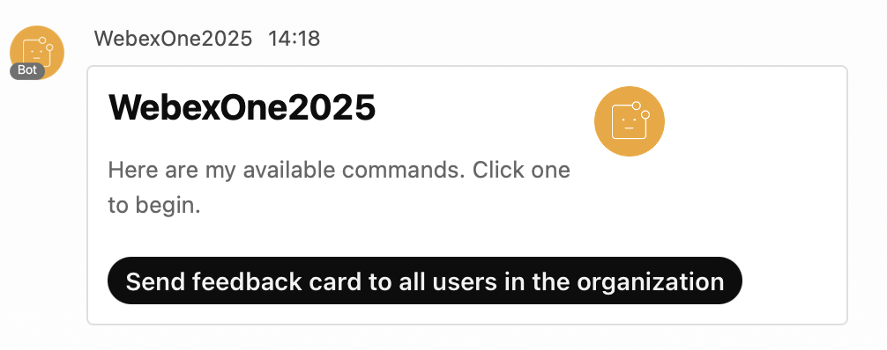{ width="850" style="display: block; margin: 0 auto; border: 1px solid lightgray; border-radius: 8px;" }

    4. Once you click **Send feedback card to all users in the organization**, the cards will begin sending. You will receive the following notification message once the process is completed:

        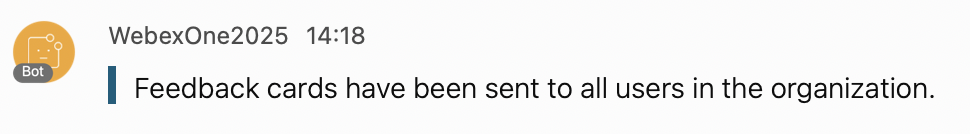{ width="850" style="display: block; margin: 0 auto; border: 1px solid lightgray; border-radius: 8px;" }

    5. At this point, all users will receive the following feedback card:

        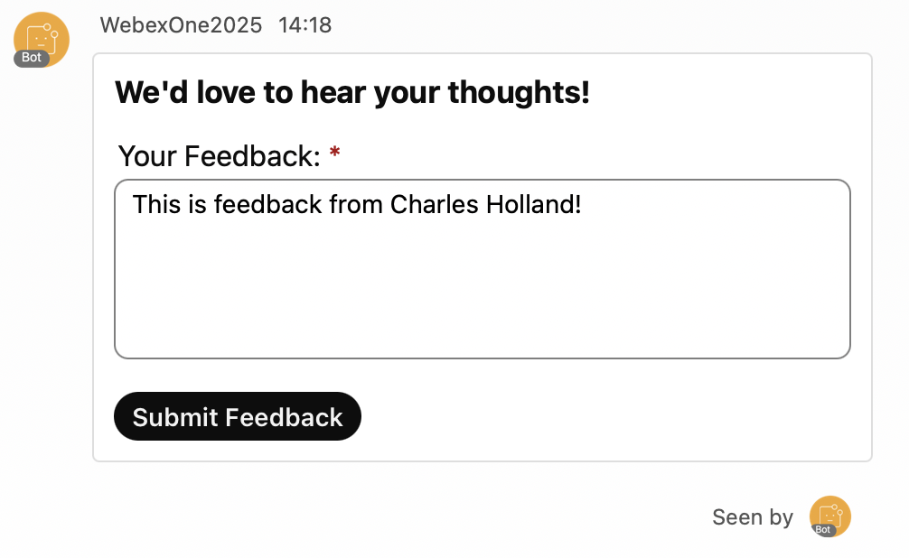{ width="850" style="display: block; margin: 0 auto; border: 1px solid lightgray; border-radius: 8px;" }

    6. Once users submit their feedback, they will receive the following notification message:

        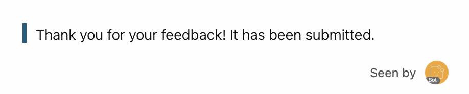{ width="850" style="display: block; margin: 0 auto; border: 1px solid lightgray; border-radius: 8px;" }

    7. At the same time, you, as an admin, will be notified with the user's feedback:

        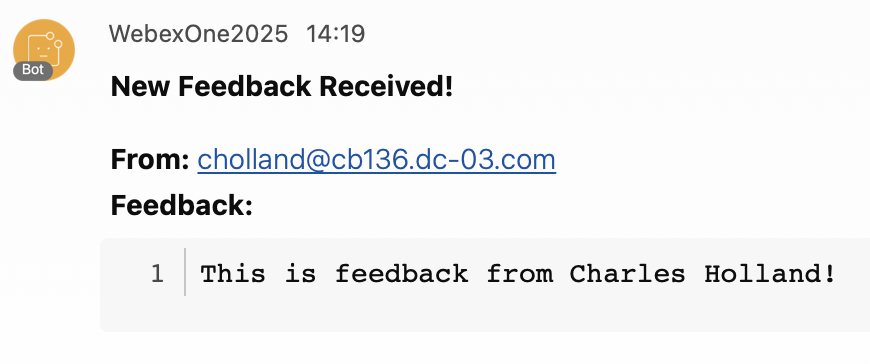{ width="700" style="display: block; margin: 0 auto; border: 1px solid lightgray; border-radius: 8px;" }

    8. Stop the bot with **Ctrl+C** when you are done.
