# Lab 5 – Webex MCP Servers

In this section, you will use **Webex MCP Servers** to work with Webex through an AI assistant. Instead of writing code, you will describe what you want in plain language, and the assistant will call the Webex APIs for you.

Upon completion of this section, you will be able to:

1. Explain what MCP is and how the Webex MCP Servers expose Webex to AI assistants.
2. Use the Webex Messaging MCP Server to work with spaces and messages.
3. Use the Webex Meetings MCP Server to find and schedule meetings.

### Prerequisites

You will quickly notice in the documentation that every official Webex MCP server includes this requirement:

!!! Warning "Prerequisites"
    This MCP server must be enabled by your organization's admin in Webex Control Hub before it can be used. See [Provisioning on Control Hub](https://developer.webex.com/mcp/docs/provisioning-on-control-hub){:target="_blank"} for details.

MCP servers are **NOT** enabled by default in your organization. An administrator needs to enable them before your users can use them.

??? Note "Reference: How to enable MCP servers in your organization"
    These steps have been completed before this lab, since you are all sharing the same organization, but they are relevant for your own organizations. The presenters will demonstrate this process.

    1. If you try to access MCP for the first time, you will see the message **No allowed MCP servers found**.

        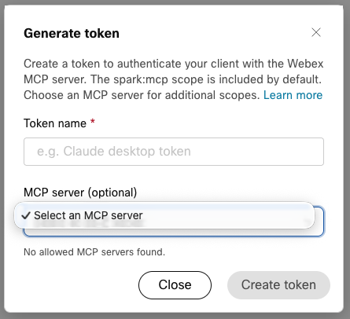{ width="400" style="display: block; margin: 0 auto; border: 1px solid lightgray; border-radius: 8px;"}

    2. To enable them, go to **Collaboration Control Hub** -> **Apps** -> **Agentic Apps** and select the **Webex** tab:

        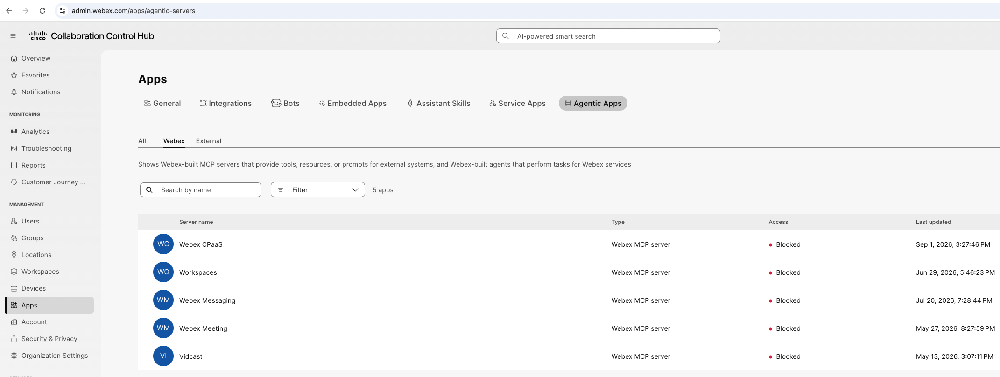{ style="display: block; margin: 0 auto; border: 1px solid lightgray; border-radius: 8px;"}

    3. To enable any of them, click **Allowed for all users** and save:

        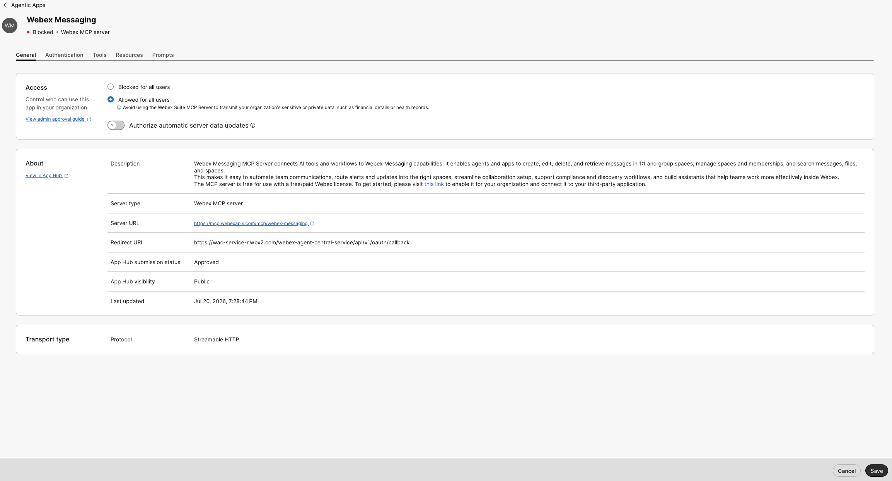{ style="display: block; margin: 0 auto; border: 1px solid lightgray; border-radius: 8px;"}

    4. You are not done yet. You also need to allow specific tools for each MCP server. Go to the MCP server, select the **Tools** tab, and enable the tools you want your users to use. In this case, all of them are enabled:

        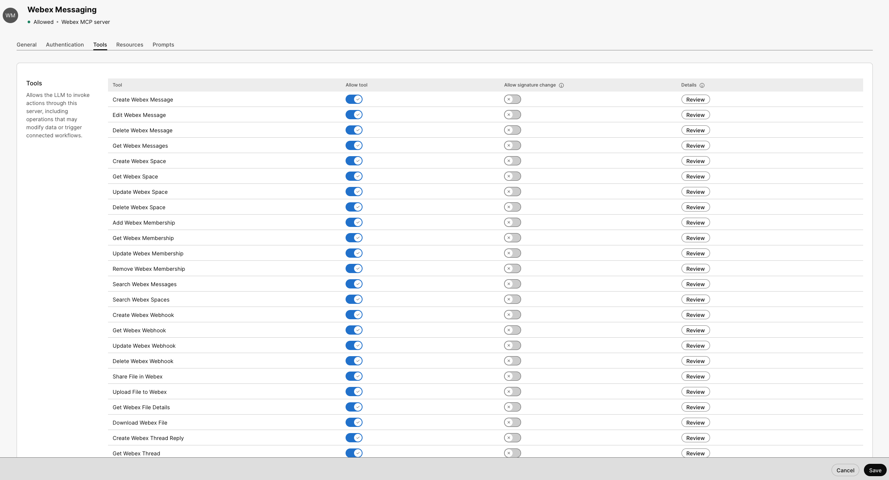{ style="display: block; margin: 0 auto; border: 1px solid lightgray; border-radius: 8px;"}

        After this change, users will be able to use the server.

## Step 5.1: Understand MCP and Webex MCP Servers

The **Model Context Protocol (MCP)** is an open standard that lets AI assistants use external tools. It has three parts:

- **MCP client:** the AI assistant you talk to. In this lab, it runs in the Webex MCP Lab website.
- **MCP server:** a service that offers a set of **tools** the assistant can call. Webex provides a **Messaging** server (spaces, messages, memberships) and a **Meetings** server (meetings, schedules, join links).
- **Tools:** single actions, such as *list spaces* or *create meeting*. Each tool calls the same Webex REST APIs you used in the previous labs.

When you send a request, the assistant decides which tools to call, calls them, and uses the results to answer you.

Webex MCP Servers act **on behalf of the signed-in user**. This is the main difference with what you built before:

| | Acts as | Permissions |
|---|---|---|
| **Bot** (Lab 3) | The bot itself | Only the spaces the bot is in |
| **Service App** (Lab 4) | The organization | Admin scopes approved in Control Hub |
| **Webex MCP Server** (Lab 5) | You | What you can do in Webex, limited to the tools your admin allowed in Control Hub |

!!! Warning
    The assistant can send messages and schedule meetings as you. Read what it plans to do before you confirm any action that creates, changes, or deletes something.

## Step 5.2: Generate your MCP tokens

Now that MCP is enabled in the organization, you need a token for each MCP server you want to use.

1. In the [Webex for Developers](https://developer.webex.com/){:target="_blank"} portal, on the top right corner of the page, click your avatar and then select **[Webex Agentic MCP App token](https://developer.webex.com/agentic-token){:target="_blank"}**:

    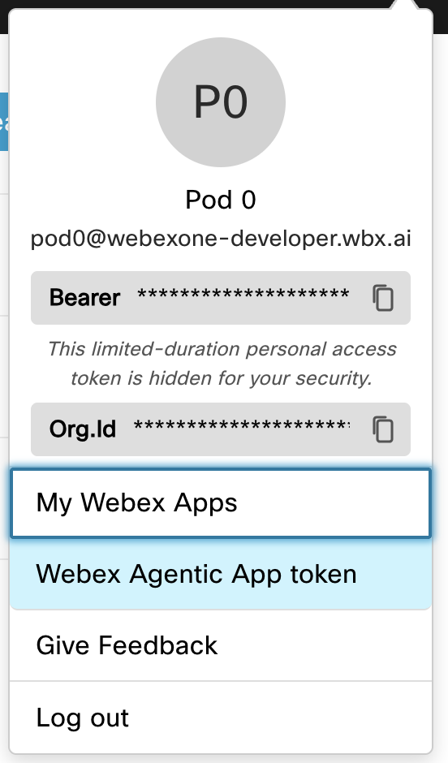{ width="300" style="display: block; margin: 0 auto; border: 1px solid lightgray; border-radius: 8px;"}

2. Under **Generate token**, click **Generate now**:

    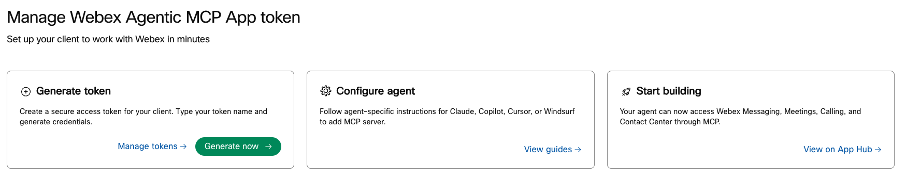{ style="display: block; margin: 0 auto; border: 1px solid lightgray; border-radius: 8px;"}

3. You need a separate token per MCP server. Start with **Webex Messaging**:

    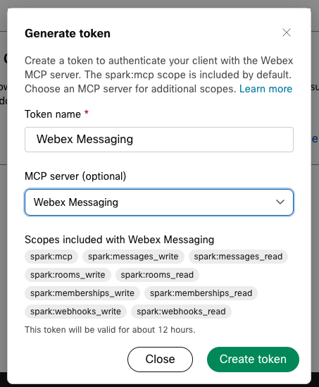{ width="450" style="display: block; margin: 0 auto; border: 1px solid lightgray; border-radius: 8px;"}

4. You will now see the token:

    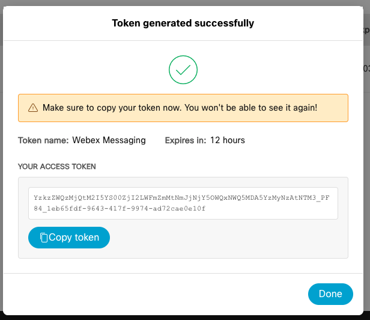{ width="500" style="display: block; margin: 0 auto; border: 1px solid lightgray; border-radius: 8px;"}

    !!! Warning
        Copy the token now, as you won't be able to see it again later. You will paste it in the Webex MCP Lab in the next step.

5. Repeat steps 2 to 4, this time selecting **Webex Meetings**, and copy that token too.

!!! Warning
    These tokens act as you. Do not share them or paste them anywhere other than the lab website.

## Step 5.3: Connect the MCP servers

The Webex MCP Lab website is an AI assistant that works as your MCP client, so you do not need VS Code or any configuration file for this section.

1. Open the [Webex MCP Lab](https://mcp-lab.webexdevs.com/){:target="_blank"} in your browser:

    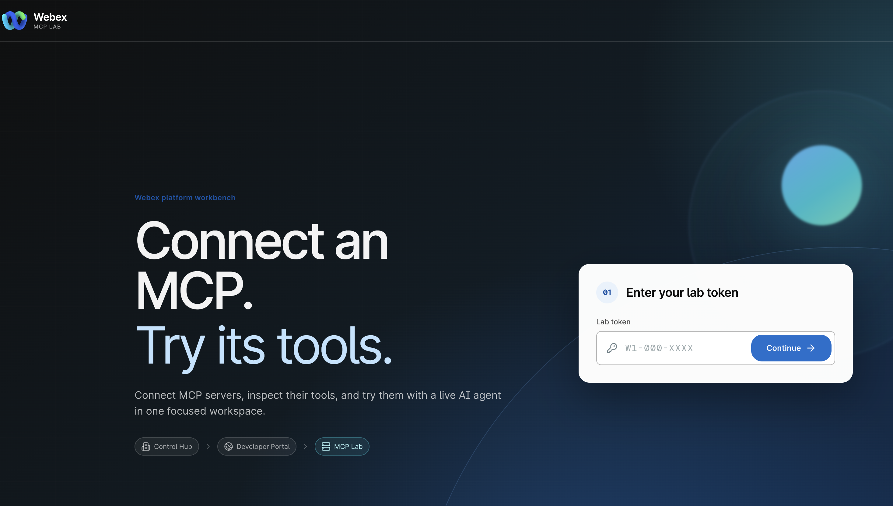{ width="950" style="display: block; margin: 0 auto; border: 1px solid lightgray; border-radius: 8px;"}

2. Sign in using your key. Your key will be **LAB-21122-*XXXX***, where XXXX represents the characters assigned to your Pod. You can find the here:

    ??? Note "Credentials"

        | Pod | Key |
        |---:|---|
        | 1 | LAB-21122-8T9N |
        | 3 | LAB-21122-4RXW |
        | 4 | LAB-21122-6YDM |
        | 5 | LAB-21122-EDSH |
        | 7 | LAB-21122-9JV1 |
        | 8 | LAB-21122-9VYM |
        | 9 | LAB-21122-GNEV |
        | 10 | LAB-21122-YFVA |
        | 11 | LAB-21122-FP66 |
        | 12 | LAB-21122-FNB3 |
        | 13 | LAB-21122-QW2N |
        | 14 | LAB-21122-3K6K |
        | 15 | LAB-21122-S1R5 |
        | 16 | LAB-21122-05MJ |
        | 17 | LAB-21122-XX3N |
        | 18 | LAB-21122-SCY2 |
        | 19 | LAB-21122-J2KS |
        | 21 | LAB-21122-79N7 |
        | 22 | LAB-21122-WPHR |
        | 23 | LAB-21122-MQW4 |
        | 24 | LAB-21122-4KWZ |
        | 25 | LAB-21122-ECP6 |
        | 27 | LAB-21122-V9CS |
        | 28 | LAB-21122-3C09 |
        | 29 | LAB-21122-DS3T |
        | 30 | LAB-21122-A92N |
        | 31 | LAB-21122-629Z |
        | 32 | LAB-21122-N8DR |
        | 33 | LAB-21122-AHZ6 |
        | 34 | LAB-21122-1ZMV |

    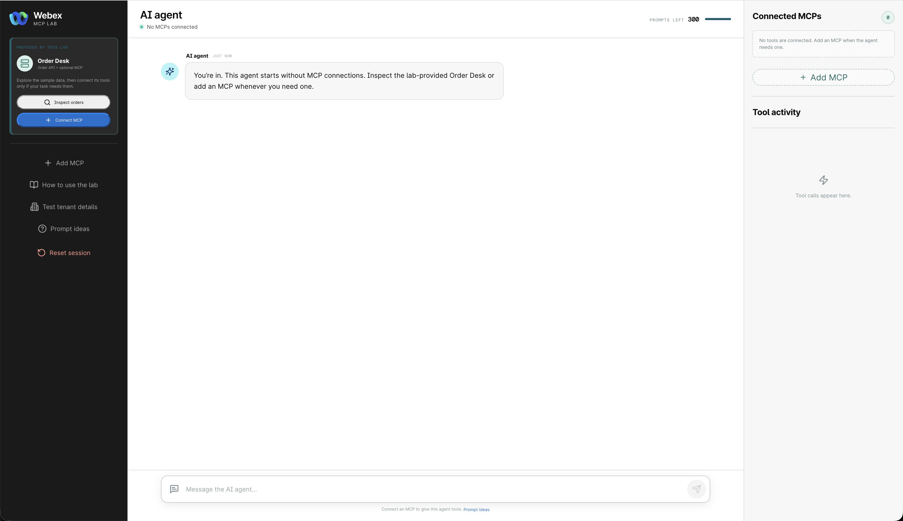{ width="950" style="display: block; margin: 0 auto; border: 1px solid lightgray; border-radius: 8px;"}

4. In the **Connected MCPs** panel on the right, click **Add MCP**:

    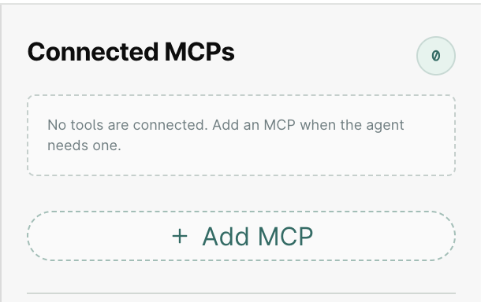{ width="450" style="display: block; margin: 0 auto; border: 1px solid lightgray; border-radius: 8px;"}

5. From the list of available MCPs, choose **Webex Messaging**:

    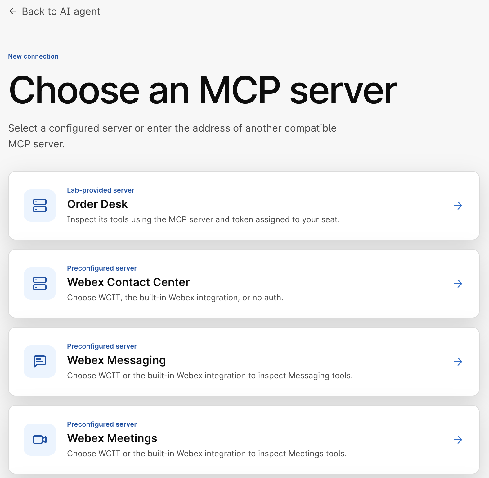{ width="650" style="display: block; margin: 0 auto; border: 1px solid lightgray; border-radius: 8px;"}

6. Introduce your **WCIT Token** and click **Discover tools**:

    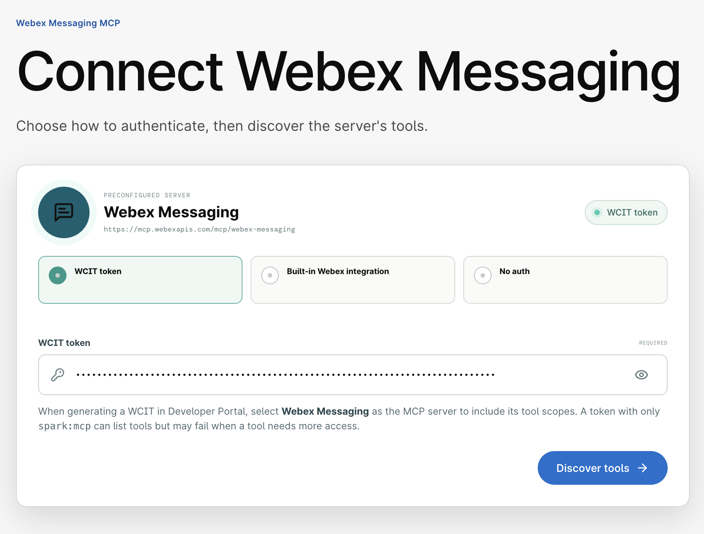{ width="750" style="display: block; margin: 0 auto; border: 1px solid lightgray; border-radius: 8px;"}

7. You will see the list of tools available:

    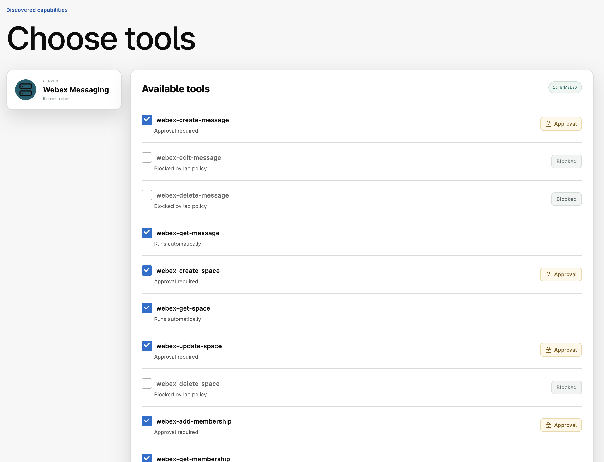{ width="750" style="display: block; margin: 0 auto; border: 1px solid lightgray; border-radius: 8px;"}

    !!! Note
        Destructive MCP tools are disabled for this lab.

8. Click **Connect MCP** at the bottom of the page:

    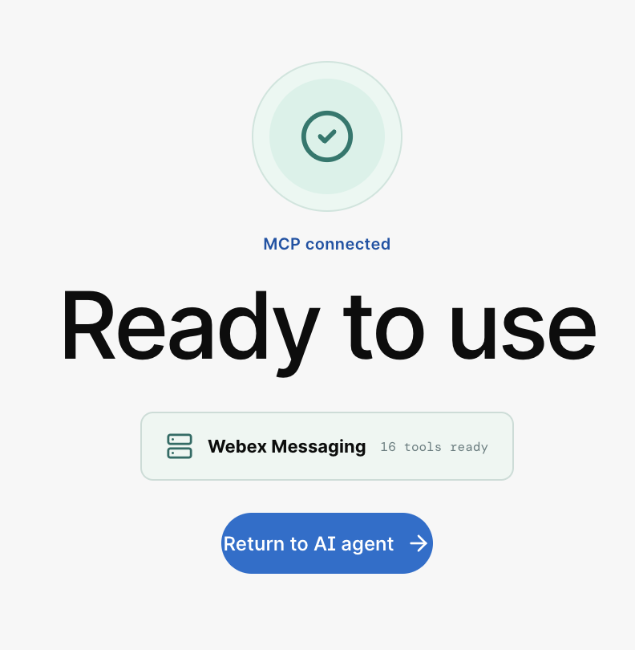{ width="350" style="display: block; margin: 0 auto; border: 1px solid lightgray; border-radius: 8px;"}

9. After you click **Return to AI Agent**, you should be back at the chat interface and the MCP should be listed:

    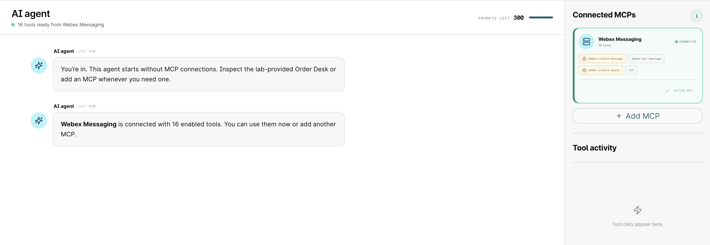{ width="950" style="display: block; margin: 0 auto; border: 1px solid lightgray; border-radius: 8px;"}

10. Repeat steps 3 to 8 for the **Webex Meetings** server.

11. Check that both servers now appear in the **Connected MCPs** panel:

    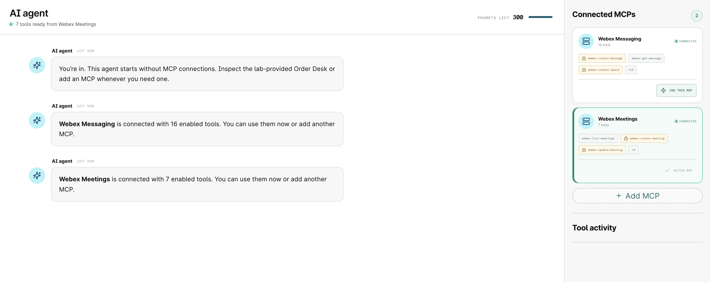{ width="950" style="display: block; margin: 0 auto; border: 1px solid lightgray; border-radius: 8px;"}

    !!! Info
        Your tokens are only kept in your lab session. If you click **Reset session**, you will need to add the servers again.

## Step 5.4: Webex Messaging

In this step, you will repeat some of the actions from the previous labs, this time without code.

!!! Warning
    This lab uses one MCP server at a time, so select the server you need before each request.

1. Make sure that you select **Webex Messaging**:

    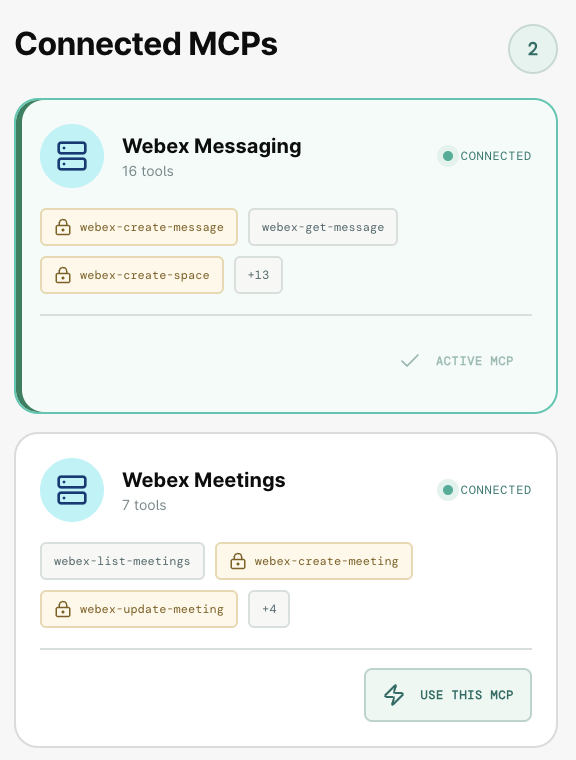{ width="350" style="display: block; margin: 0 auto; border: 1px solid lightgray; border-radius: 8px;"}

2. Ask the agent to list your spaces:

    - List my most recently active Webex space and its title.

    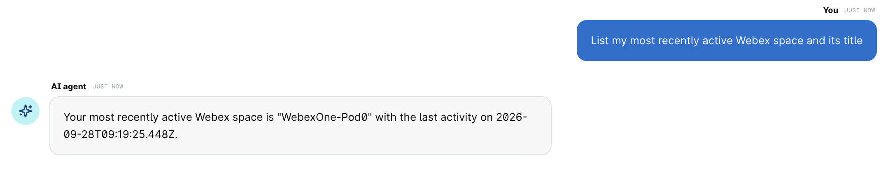{ width="950" style="display: block; margin: 0 auto; border: 1px solid lightgray; border-radius: 8px;"}

    !!! Tip
        Keep an eye on the **Tool activity** panel on the right during the next steps. It shows every tool the assistant calls and the parameters it sends, which is the same work you did in code in the previous labs.

        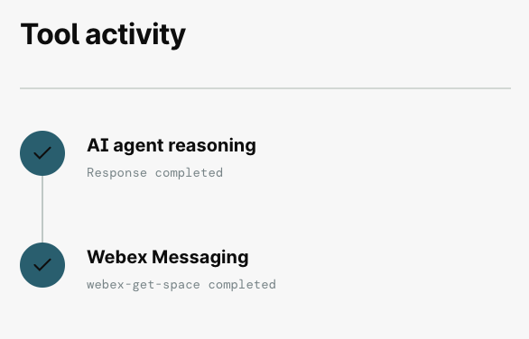{ width="400" style="display: block; margin: 0 auto; border: 1px solid lightgray; border-radius: 8px;"}

3. Ask now for the members of that space:

    - Who are the members of the space "WebexOne-Pod0"?

    You should see yourself and your bot:

    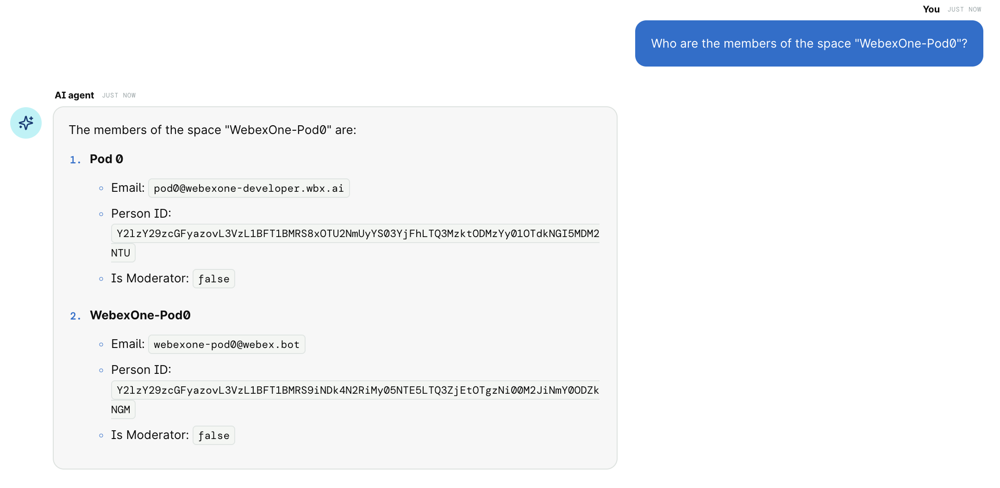{ width="950" style="display: block; margin: 0 auto; border: 1px solid lightgray; border-radius: 8px;"}

4. Read a conversation. Ask about your 1:1 space with your bot:

    - Summarize the last 10 messages in my 1:1 space with my bot WebexOne-USERNAME.

    The assistant reads the messages as you, so it can see the echo, commands, and cards you tested before:

    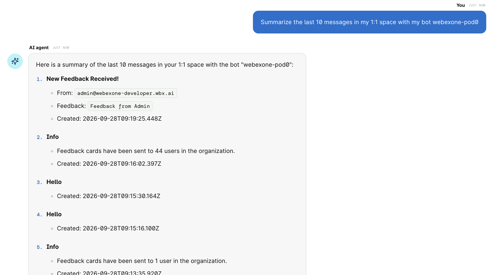{ width="950" style="display: block; margin: 0 auto; border: 1px solid lightgray; border-radius: 8px;"}

5. Send a message as yourself:

    - Send a message to the space "WebexOne Room" saying "Hello from the Webex MCP Lab!" in bold.

    !!! Note
        This action will require tool approval:

        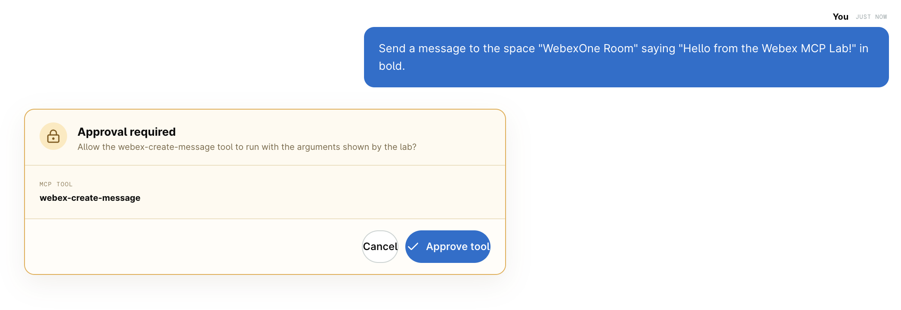{ width="850" style="display: block; margin: 0 auto; border: 1px solid lightgray; border-radius: 8px;"}

    After you approve it, the assistant confirms the message was sent:

    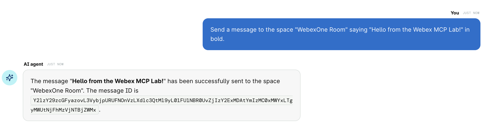{ width="950" style="display: block; margin: 0 auto; border: 1px solid lightgray; border-radius: 8px;"}

    Open Webex and check the space. Notice that the message was sent by **you**, not by your bot:

    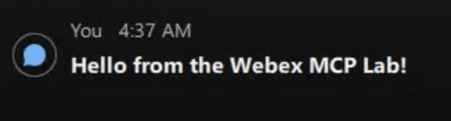{ width="350" style="display: block; margin: 0 auto; border: 1px solid lightgray; border-radius: 8px;"}

6. Do some more testing yourself now.

    !!! Warning
        The assistant can only call one tool per request in this lab, so ask for one action at a time:

        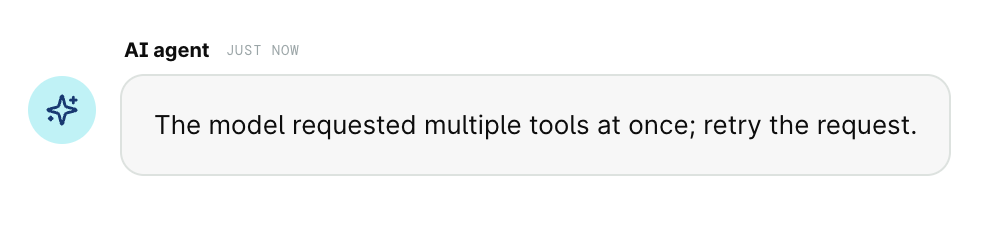{ width="450" style="display: block; margin: 0 auto; border: 1px solid lightgray; border-radius: 8px;"}

## Step 5.5: Webex Meetings

In Lab 4, your Service App scheduled a meeting on your behalf. Now you will find and schedule meetings as yourself.

1. Make sure you change the active MCP server to Meetings:

    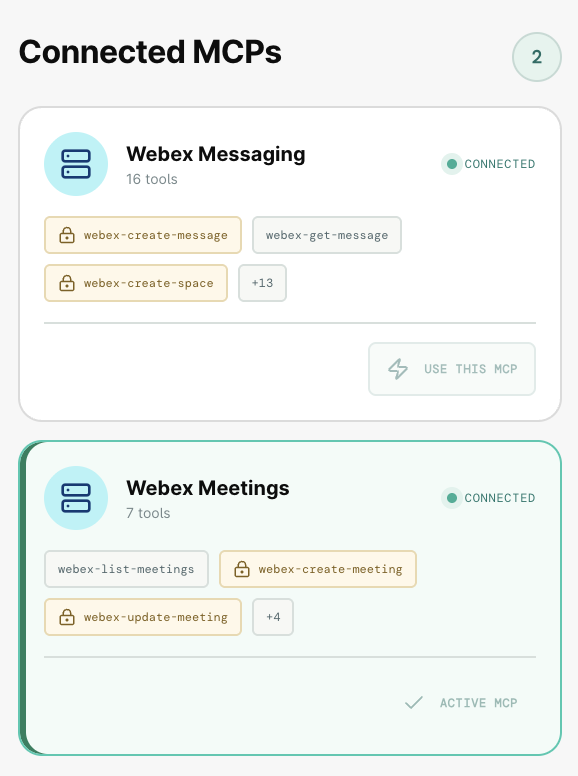{ width="350" style="display: block; margin: 0 auto; border: 1px solid lightgray; border-radius: 8px;"}

2. Find the meeting your Service App created:

    - List my upcoming Webex meetings for the next 7 days, with title, start time, and join link.

    You should see the meetings created in the previous exercises.

    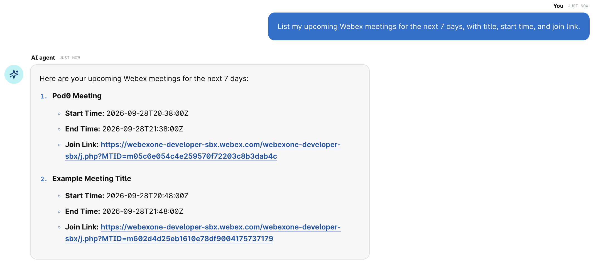{ width="950" style="display: block; margin: 0 auto; border: 1px solid lightgray; border-radius: 8px;"}

3. Get the details of those meetings:

    - Show me the meeting number and host of the meetings I scheduled.

    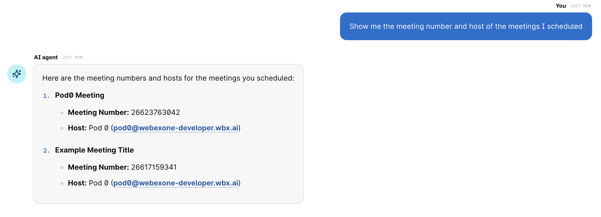{ width="950" style="display: block; margin: 0 auto; border: 1px solid lightgray; border-radius: 8px;"}

4. Schedule a new meeting:

    - Schedule a 30-minute Webex meeting tomorrow at 10:00 in my time zone, called "WebexOne MCP Meeting".

    !!! Note
        Again, as it is a create action, it will require tool approval.

    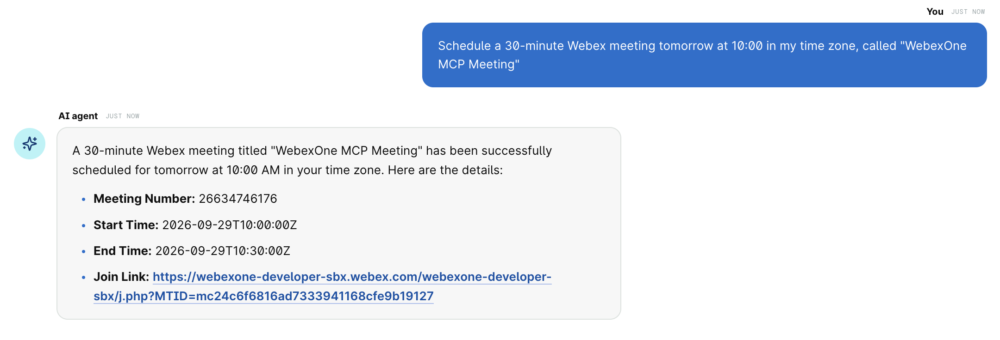{ width="950" style="display: block; margin: 0 auto; border: 1px solid lightgray; border-radius: 8px;"}

    !!! Tip
        Always mention the time zone. Without it, the meeting may be scheduled in UTC, just like the Service App script in Lab 4.

5. Open Webex and check that the meeting appears in your calendar:

    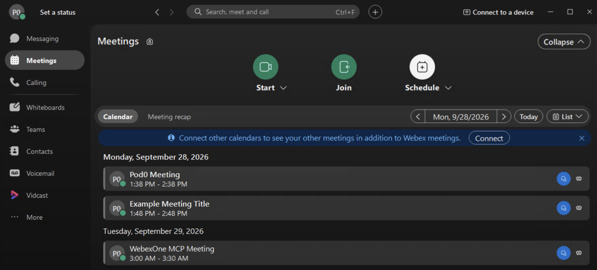{ width="900" style="display: block; margin: 0 auto; border: 1px solid lightgray; border-radius: 8px;"}
