# 5 – Use Cases (webex_bot)

!!! Note
    This is the **legacy `webex_bot` version**. For the 2026 lab, use **[Lab 5 - Use Cases](lab6_use-cases-websockets.md)** with WebSocket handlers instead.

In this section, you will put your Webex API knowledge into practice by building real-world solutions. You will explore how bots and integrations can streamline communication and automate device provisioning in an organization.

Upon completion of this section, you will be able to:

1. Apply the concepts that you have learned to create practical solutions using Webex APIs.
2. Build a bot that enables permitted users to collect feedback from all users in the organization.
3. Build a bot that enables permitted users to send targeted or organization-wide messages.
4. Develop an interactive bot for end-users to provision their own devices using a MAC address.
5. Integrate API calls, handle pagination, and manage bot interactions for real-world scenarios.

## Exercise 1: Create a feedback bot for your organization

Develop an assistant bot that allows only permitted users to collect feedback from all users in the organization.

Requirements:

1. Only allow permitted users to access the bot’s feedback functionality.
2. Provide access through the default card to send a feedback request to all users in the organization.
3. Present an Adaptive Card with a text input box for the user to enter the feedback request message.
4. Collect responses from recipients and send a confirmation or error notification to the requesting user after feedback is submitted.

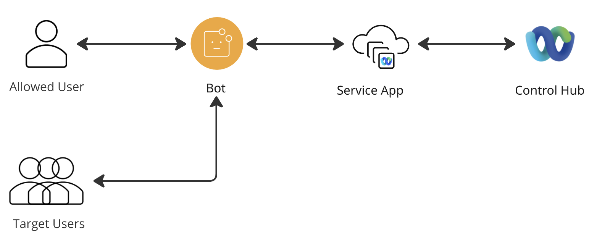{ width="850" style="display: block; margin: 0 auto; border: 1px solid lightgray; border-radius: 8px;" }

!!! Warning
    In this exercise, you will need to add the **spark-admin:people_read** scope to your Service App. Please notify us to have your Service App rights approved.

### Pagination

When retrieving a large amount of information, you need to handle pagination. With pagination, the API returns a limited set of results per request. If more data is available, the response includes a link labeled rel="next", which provides the URL to fetch the next page of results. This process continues until all results have been retrieved.

1. Navigate to 06-usecases/01_pagination.py and review the code.  
     
   In this example, a pagination limit of 2 users is used.
2. Execute the code with the following command and let it run:  
   * python 01_pagination.py
3. You will now see all the users listed in the console, displayed in pages of size 2:

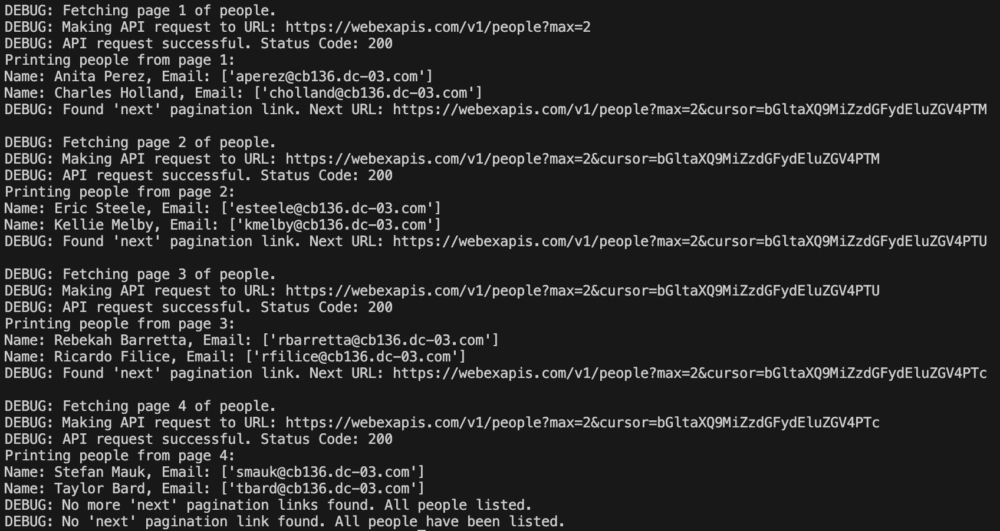{ width="850" style="display: block; margin: 0 auto; border: 1px solid lightgray; border-radius: 8px;" }

### Solution

1. Navigate to 06-usecases/01_feedback.py and review the code.  
     
   These are the key points to understand how each requirement has been met:  
   1. **Permitted User Access Only**  
      The **is_allowed_sender**function verifies the user's email against a predefined constant before allowing command execution.
   2. **Org-wide Feedback Card Distribution**The **/feedback** command sends an Adaptive Card containing a feedback form to every user in the Webex organization.
   3. **Adaptive Card Feedback Input**The Adaptive Card created by the bot includes a multi-line **Input.Text** element specifically for feedback entry.
   4. **Collect Responses, Notify Sender**  
      A chained command extracts the feedback from the submitted card, forwards it to the designated email, and sends a confirmation or error message back to the submitting user.
2. Change your directory in the terminal:  
   * cd ../06-usecases
3. Execute the code with the following command and let it run:  
   * python 01_feedback.py

!!! Warning
    Wait until you see the message “WebSocket Opened.” appear in the console.

1. Send any message to your bot to get the following card:  
     
   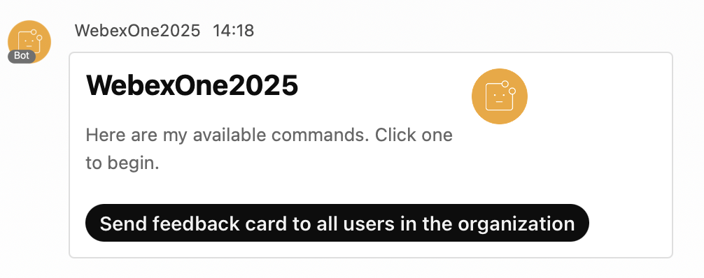{ width="850" style="display: block; margin: 0 auto; border: 1px solid lightgray; border-radius: 8px;" }
2. Once you click **Send feedback card to all users in the organization**, the cards will begin sending. You will receive the following notification message once the process is completed:  
     
   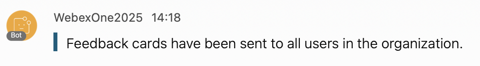{ width="850" style="display: block; margin: 0 auto; border: 1px solid lightgray; border-radius: 8px;" }
3. At this point, all users will receive the following feedback card:   
     
   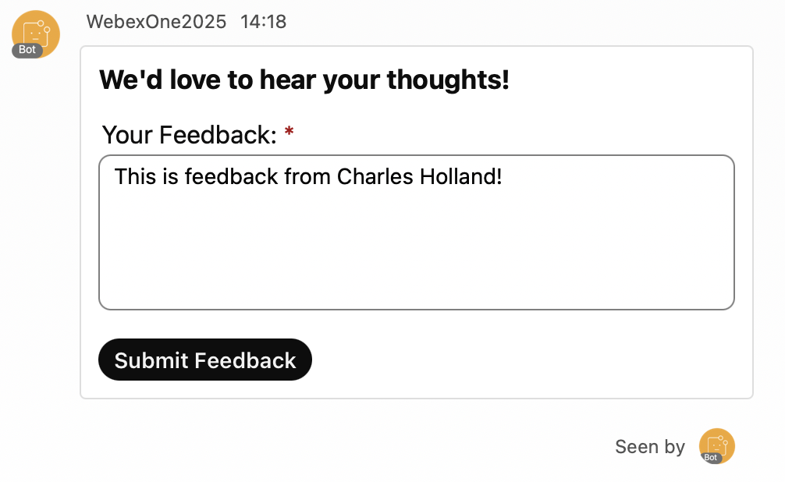{ width="850" style="display: block; margin: 0 auto; border: 1px solid lightgray; border-radius: 8px;" }
4. Once users submit their feedback, they will receive the following notification message:  
     
   { width="850" style="display: block; margin: 0 auto; border: 1px solid lightgray; border-radius: 8px;" }
5. At the same time, you, as an admin, will be notified with the user's feedback:  
     
   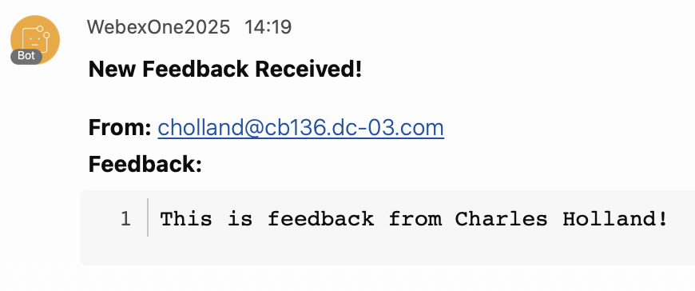{ width="700" style="display: block; margin: 0 auto; border: 1px solid lightgray; border-radius: 8px;" }

## Exercise 2: End-User Phone Provisioning Assistant

Create an interactive Webex bot that enables end-users to auto-provision their new phones by submitting the device’s MAC address. The bot will guide the user through the process using an Adaptive Card and interact with backend services to complete the provisioning.

Requirements:

1. Validate that the MAC address provided by the user follows the correct format (e.g., AA:BB:CC:DD:EE:FF or AABBCCDDEEFF).
2. Present an Adaptive Card to the user with:
   1. An input field for the MAC address.
   2. A choice set (dropdown) for selecting the phone model, with the following pre-defined options:
      * + DMS Cisco 8851
        + DMS Cisco 8861
        + DMS Cisco 8865
3. Use the submitted data (MAC address and selected phone model) to initiate device provisioning through the backend or relevant API.
4. Notify the user in Webex of the provisioning result (success or error).

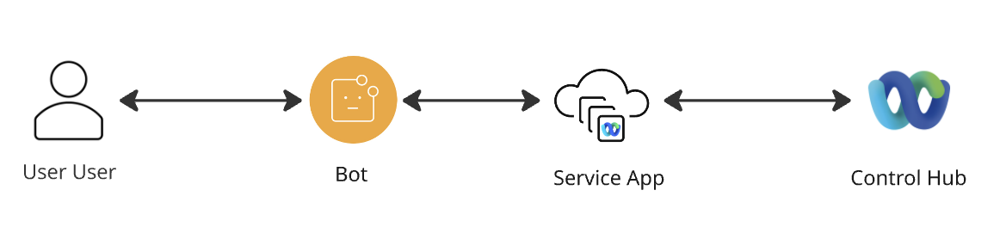{ width="850" style="display: block; margin: 0 auto; border: 1px solid lightgray; border-radius: 8px;" }

!!! Warning
    In this exercise, you will need to add the **spark-admin:devices_write** scope to your Service App. Please notify us to have your Service App rights approved.

### Solution

1. Navigate to 06-usecases/02_device.py and review the code.  
     
   These are the key points to understand how each requirement has been met:  
   1. **MAC address validation**  
      The **is_valid_mac_address** function uses regex to check the MAC format before API submission.
   2. **Adaptive Card presentation**  
      The **AutoProvisioning** command displays an Adaptive Card with MAC input and a phone model dropdown.
   3. **Device provisioning**  
      The **ProvisionCallback** extracts card data and POSTs it to the /v1/devices API for provisioning.
   4. **Provisioning result notification**  
      ProvisionCallback returns quote_info messages (success, duplicate, or error) based on the API's response status.
2. Execute the code with the following command and let it run:  
   * python 01_feedback.py

!!! Warning
    Wait until you see the message “WebSocket Opened.” appear in the console.

1. Send any message to your bot to get the following card:  
     
   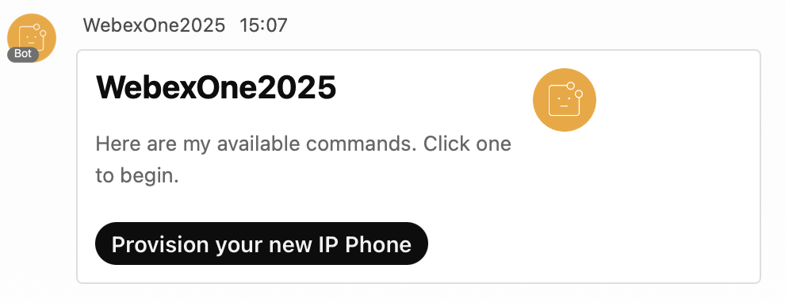{ width="850" style="display: block; margin: 0 auto; border: 1px solid lightgray; border-radius: 8px;" }
2. Click **Provision your new IP Phone** to get the following provisioning card:  
     
   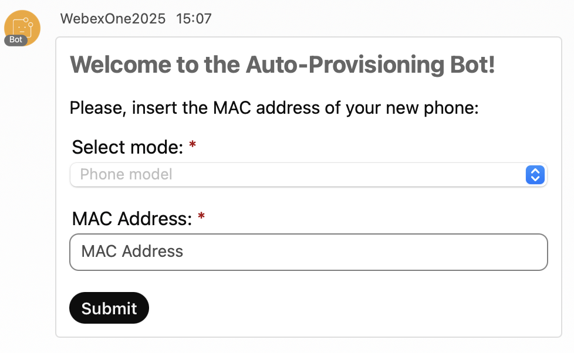{ width="850" style="display: block; margin: 0 auto; border: 1px solid lightgray; border-radius: 8px;" }
3. If you submit a MAC address in the wrong format, you will receive a notification about the error:  
     
   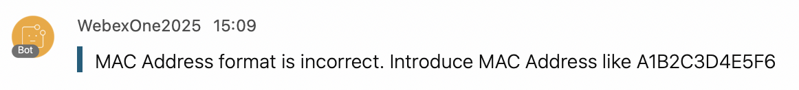{ width="850" style="display: block; margin: 0 auto; border: 1px solid lightgray; border-radius: 8px;" }
4. If you submit a duplicate MAC address, such as “54A3152300C8”, you will receive a notification about the duplication:  
     
   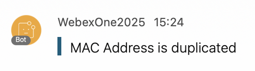{ width="700" style="display: block; margin: 0 auto; border: 1px solid lightgray; border-radius: 8px;" }
5. If you submit a valid MAC address, you will receive a message like the following:   
     
   { width="700" style="display: block; margin: 0 auto; border: 1px solid lightgray; border-radius: 8px;" }
6. You can verify the device registration in Control Hub:  
     
   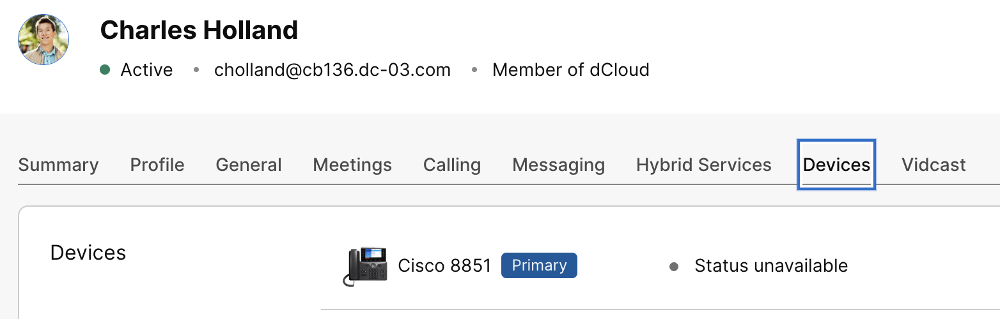{ width="850" style="display: block; margin: 0 auto; border: 1px solid lightgray; border-radius: 8px;" }
