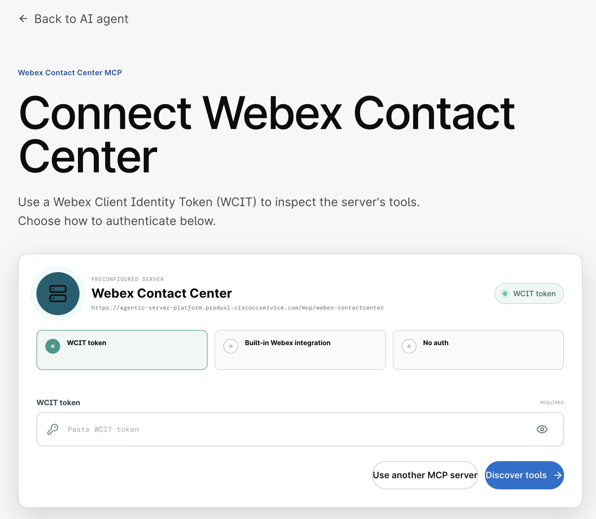
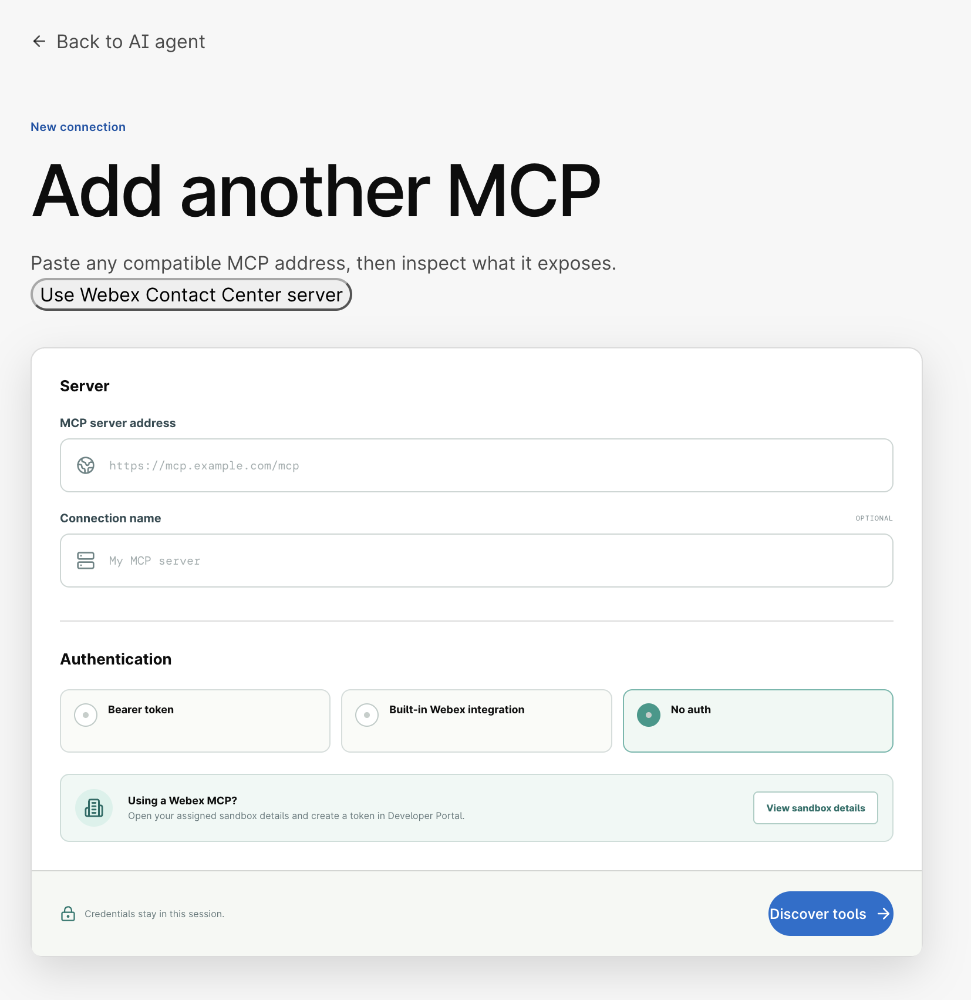

# Lab 6 – Webex MCP Servers

In this section, you will use **Webex MCP Servers** to work with Webex through an AI assistant. Instead of writing code, you will describe what you want in plain language, and the assistant will call the Webex APIs for you.

Upon completion of this section, you will be able to:

1. Explain what MCP is and how the Webex MCP Servers expose Webex to AI assistants.
2. Use the Webex Messaging MCP Server to work with spaces and messages.
3. Use the Webex Meetings MCP Server to find and schedule meetings.
4. Combine both servers in a single request.
5. Compare MCP with the bots and Service Apps you built in the previous labs.

### Prerequisites

You will quickly notice in the documentation that every official Webex MCP server includes this requirement:

!!! Warning "Prerequisites"
    This MCP server must be enabled by your organization's admin in Webex Control Hub before it can be used. See [Provisioning on Control Hub](https://developer.webex.com/mcp/docs/provisioning-on-control-hub){:target="_blank"} for details.

MCP servers are **NOT** enabled by default in your organization. An administrator needs to enable them before your users can use them.

??? Note "Reference: How to enable MCP servers in your organization"
    These steps have been completed before this lab, since you are all sharing the same organization, but they are relevant for your own organizations. The presenters will demonstrate this process.

    1. If you try to access MCP for the first time, you will see the message **No allowed MCP servers found**.

        { width="450" style="display: block; margin: 0 auto; border: 1px solid lightgray; border-radius: 8px;"}

    2. To enable them, go to **Collaboration Control Hub** -> **Apps** -> **Agentic Apps** and select the **Webex** tab:

        { style="display: block; margin: 0 auto; border: 1px solid lightgray; border-radius: 8px;"}

    3. To enable any of them, click **Allowed for all users** and save:

        { style="display: block; margin: 0 auto; border: 1px solid lightgray; border-radius: 8px;"}

    4. You are not done yet. You also need to allow specific tools for each MCP server. Go to the MCP server, select the **Tools** tab, and enable the tools you want your users to use. In this case, all of them are enabled:

        { style="display: block; margin: 0 auto; border: 1px solid lightgray; border-radius: 8px;"}

        After this change, users will be able to use the server.

## Step 6.1: Understand MCP and Webex MCP Servers

The **Model Context Protocol (MCP)** is an open standard that lets AI assistants use external tools. It has three parts:

- **MCP client:** the AI assistant you talk to. In this lab, it runs in the Webex MCP Lab website.
- **MCP server:** a service that offers a set of **tools** the assistant can call. Webex provides a **Messaging** server (spaces, messages, memberships) and a **Meetings** server (meetings, schedules, join links).
- **Tools:** single actions, such as *list spaces* or *create meeting*. Each tool calls the same Webex REST APIs you used in the previous labs.

When you send a request, the assistant decides which tools to call, calls them, and uses the results to answer you.

Webex MCP Servers act **on behalf of the signed-in user**. This is the main difference with what you built before:

| | Acts as | Permissions |
|---|---|---|
| **Bot** (Lab 3) | The bot itself | Only the spaces the bot is in |
| **Service App** (Lab 4) | The organization | Admin scopes approved in Control Hub |
| **Webex MCP Server** (Lab 6) | You | What you can do in Webex, limited to the tools your admin allowed in Control Hub |

!!! Warning
    The assistant can send messages and schedule meetings as you. Read what it plans to do before you confirm any action that creates, changes, or deletes something.

## Step 6.2: Generate your MCP tokens

Now that your users are allowed to use MCP, every user can generate a token for each server. As a user, the first thing you need is a token to access the MCP servers.

1. Log into [developer.webex.com](https://developer.webex.com/){:target="_blank"} with the credentials that were provided.
2. In the top right corner of the page, click your avatar and then select [Manage Webex Agentic MCP App token](https://developer.webex.com/agentic-token){:target="_blank"}.
3. Under **Generate token**, click **Generate now**:

    { style="display: block; margin: 0 auto; border: 1px solid lightgray; border-radius: 8px;"}

4. You need a separate token per MCP server. Start with **Webex Messaging**:

    { width="450" style="display: block; margin: 0 auto; border: 1px solid lightgray; border-radius: 8px;"}

5. You will now see the token:

    { width="600" style="display: block; margin: 0 auto; border: 1px solid lightgray; border-radius: 8px;"}

    !!! Warning
        Copy the token now, as you won't be able to see it again later. You will paste it in the Webex MCP Lab in the next step.

6. Repeat steps 3 to 5, this time selecting **Webex Meetings**, and copy that token too.

!!! Warning
    These tokens act as you. Do not share them or paste them anywhere other than the lab website.

## Step 6.3: Connect the MCP servers

The Webex MCP Lab website is an AI assistant that works as your MCP client, so you do not need VS Code or any configuration file for this section.

1. Open the [Webex MCP Lab](https://mcp-lab.webexdevs.com/){:target="_blank"} in your browser:

    { width="950" style="display: block; margin: 0 auto; border: 1px solid lightgray; border-radius: 8px;"}

2. Sign in using the key that was provided to you:

    { width="950" style="display: block; margin: 0 auto; border: 1px solid lightgray; border-radius: 8px;"}

3. In the **Connected MCPs** panel on the right, click **Add MCP**:

    { width="450" style="display: block; margin: 0 auto; border: 1px solid lightgray; border-radius: 8px;"}

4. The lab suggests a preconfigured Webex Contact Center server. You will not use it in this lab, so click **Use another MCP server**:

    { width="750" style="display: block; margin: 0 auto; border: 1px solid lightgray; border-radius: 8px;"}

5. Fill in the details for the **Webex Messaging** server and click **Discover tools**:

    - **MCP server address:** `https://mcp.webexapis.com/mcp/webex-messaging`
    - **Connection name:** `Webex Messaging`
    - **Authentication:** **Bearer token**, and paste your Webex Messaging token

    { width="750" style="display: block; margin: 0 auto; border: 1px solid lightgray; border-radius: 8px;"}

6. Repeat steps 3 to 5 for the **Webex Meetings** server:

    - **MCP server address:** `https://mcp.webexapis.com/mcp/webex-meeting`
    - **Connection name:** `Webex Meetings`
    - **Authentication:** **Bearer token**, and paste your Webex Meetings token

7. Check that both servers now appear in the **Connected MCPs** panel.

    !!! Info
        Your tokens are only kept in your lab session. If you click **Reset session**, you will need to add the servers again.

8. Ask the assistant what it can do:

    - Which Webex tools can you use? Group them by server and describe each one in one sentence.

    You will see the tools available in each server. Take a moment to notice how many of them map to the APIs you have already used: rooms, messages, memberships, and meetings.

!!! Tip
    Keep an eye on the **Tool activity** panel on the right during the next steps. It shows every tool the assistant calls and the parameters it sends, which is the same work you did in code in the previous labs.

## Step 6.4: Webex Messaging

In this step, you will repeat some of the actions from the previous labs, this time without code.

1. List your spaces, just like you did with the Rooms API in Lab 3:

    - List my 5 most recently active Webex spaces with their titles.

2. Look at the space your bot created in Step 3.3:

    - Who are the members of the space "WebexOne Room"?

    You should see yourself and your bot. If you joined the space again in Lab 5, Exercise 1, this is the same membership the bot created for you.

3. Read a conversation. Ask about your 1:1 space with your bot:

    - Summarize the last 10 messages in my 1:1 space with my bot WebexOne-USERNAME.

    The assistant reads the messages as you, so it can see the echo, commands, and cards you tested in Lab 3.

4. Send a message as yourself:

    - Send a message to the space "WebexOne Room" saying "Hello from the Webex MCP Lab!" in bold.

    Open Webex and check the space. Notice that the message was sent by **you**, not by your bot.

5. Create a space and invite your bot:

    - Create a space called "WebexOne MCP Space", add my bot WebexOne-USERNAME to it, and post a welcome message explaining that this space was created with MCP.

    This single request needs several tools: create the space, add the member, and send the message. Check which tools the assistant used and in what order.

## Step 6.5: Webex Meetings

In Lab 4, your Service App scheduled a meeting on your behalf. Now you will find and schedule meetings as yourself.

1. Find the meeting your Service App created:

    - List my upcoming Webex meetings for the next 7 days, with title, start time, and join link.

    You should see the meeting scheduled in Lab 4, with the title you chose in Step 4.4.

2. Get the details of that meeting:

    - Show me the meeting number and host of the meeting I scheduled with my Service App.

3. Schedule a new meeting:

    - Schedule a 30-minute Webex meeting tomorrow at 10:00 in my time zone, called "WebexOne MCP Meeting".

    !!! Tip
        Always mention the time zone. Without it, the meeting may be scheduled in UTC, just like the Service App script in Lab 4.

4. Open Webex and check that the meeting appears in your calendar.

## Step 6.6: Combine Messaging and Meetings

The real power of MCP is combining tools from different servers in a single request, something that would need several API calls and some code to glue them together.

1. Share your meeting with a space:

    - Post the join link of "WebexOne MCP Meeting" in the space "WebexOne MCP Space", with a short message inviting everyone to join.

2. Create a meeting from a conversation:

    - Read the last messages in "WebexOne MCP Space", schedule a 15-minute follow-up meeting for tomorrow at 11:00 in my time zone, and post the join link in the same space.

3. Clean up what you created in this lab:

    - Delete the meetings "WebexOne MCP Meeting" and the follow-up meeting you just created.

    The assistant should ask you to confirm before deleting. Check that it lists exactly the meetings you expect.

## Step 6.7: Explore the limits

MCP tools can only do what the signed-in user can do. Try these requests and compare the results with what you built in the previous labs:

1. Ask for something that required a Service App in Lab 5:

    - List all the users in my organization.

    Your lab user is not an administrator, so the assistant cannot list everyone like the feedback bot did with the `spark-admin:people_read` scope.

2. Ask for something that required a bot:

    - Reply automatically "Echo:" to every message I receive from now on.

    MCP tools run only when you ask the assistant. To react to events in real time, you still need a bot listening over WebSockets, like the one you built in Step 3.5.

!!! Info
    **When to use each approach**

    - **Bot:** always-on assistants that react to messages and cards, for any user.
    - **Service App:** organization-wide automation with admin permissions and no user signed in.
    - **Webex MCP Server:** on-demand tasks for a single user, described in plain language.
